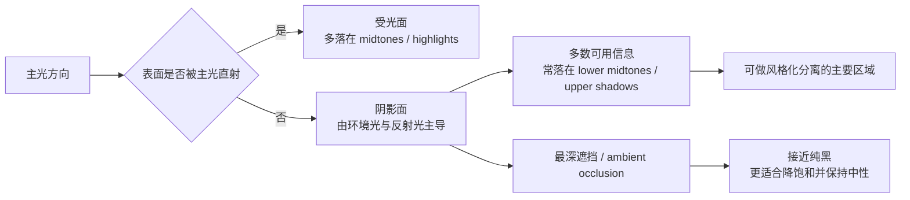
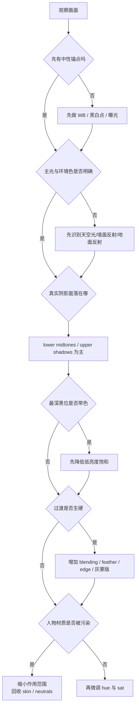
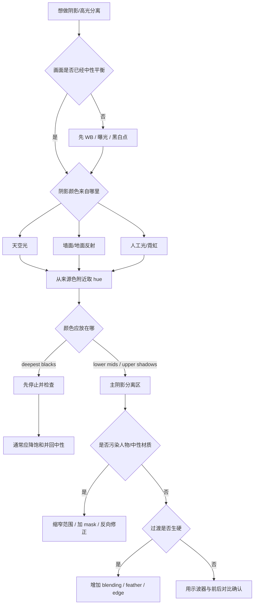

# 如何根据光线和色彩做好色调分离

## 执行摘要

这份研究的核心结论很简单：**好看的阴影与高光风格化调色，不是给“暗部加蓝、亮部加橙”这么机械，而是先判断画面里的主光、环境光、反射光分别在什么位置，再把色相推到正确的亮度区间里。**在软件里，`Shadows / Midtones / Highlights`本质上是**亮度分段**，不是“画面里所有你主观觉得是阴影的区域”；而真实拍摄中的“阴影面”通常仍然被环境光和反射光照亮，所以它们经常落在**lower midtones 到 upper shadows**，真正接近纯黑的往往只是遮挡最深处或 ambient occlusion，一般更应该保持中性并降低饱和度。这个认识能直接避免最常见的“蓝色塑料感”。citeturn17view2turn15view0turn11search0turn11search4turn19search15

所谓“蓝色塑料感”，通常不是“蓝色本身错了”，而是**范围选错、饱和过高、色相偏到 cyan/green 一侧、过渡太硬、黑白锚点丢失**这几个问题叠加出来的。官方文档和职业调色师/社区经验都指向同一件事：要么用更精确的范围工具（Resolve 的 HDR/Log wheels、Low/High Range、Lum vs Sat），要么用更柔和的过渡工具（Blending、Feather、Edge、灰阶蒙版），并且先把曝光、对比关系、白平衡、中性锚点定住，再谈风格色。citeturn15view0turn13view2turn12search5turn17view2turn13view8turn28view2turn17view1turn12search21

从软件角度看，**DaVinci Resolve**最适合做基于亮度分区、物体跟踪和节点分工的视频风格化；**Photoshop**适合把 Camera Raw 的三向色轮、Color Balance、Color Range 和图层蒙版组合成一个非破坏式照片工作流；**Lightroom / Lightroom Classic**的全局 Color Grading 很适合先建立整体冷暖关系，再用 AI Mask、Color Range、Point Color / Color Mixer 做局部收口；如果你需要“**在蒙版内部再做三向色轮**”，目前 Adobe 官方最明确支持的是 **Adobe Camera Raw 18.3.1 的 Masking 里的 Color Grading**。citeturn15view1turn31view0turn13view9turn13view7turn13view8turn28view0turn28view1turn27search4turn27search16turn28view2turn14search6

下面的内容会把这些结论拆成术语、误区、软件步骤、实战流程、资源和检查表，并把每条建议标注为**高 / 中 / 低**证据强度。说明一下：由于题目没有指定相机、场景和目标风格，文中的数值都按**起始范围**给出，实际必须随画面微调。

## 术语与成像逻辑

### 软件里的 Shadows 不是现实里的阴影

Adobe 在 Lightroom 的说明里明确把 Midtones、Shadows、Highlights 定义为图像的**luminance values**，也就是亮度值分区；Blackmagic 对 Resolve HDR palette 的官方说明也强调，它处理的是从 shadows / highlights 到 super blacks / specular whites 的**tonal ranges**，并且这些分区是可以按画面自定义的。换句话说，**软件术语说的是“像素亮度落点”，不是“物体是不是在背光面”**。这正是很多人第一次做 split toning 时最容易混淆的地方。**证据强度：高。** citeturn17view2turn15view0

| 概念 | 更准确的理解 | 常见误判 | 证据强度 |
|---|---|---|---|
| `Shadows` | 软件定义的暗亮度区间 | 把所有“背光面”都当成 shadows wheel 应该作用的区域 | 高；Adobe/Blackmagic 官方说明。citeturn17view2turn15view0 |
| 真实阴影面 | 主光不再直射、但仍受环境光/反射光影响的表面 | 误以为阴影面一定等于最黑区域 | 中；摄影/绘画照明实践一致。citeturn11search0turn11search4turn17view1 |
| 最深黑位 | ambient occlusion、深缝隙、最少受环境光影响的位置 | 也给它加明显彩色，导致“塑料感”或脏黑 | 中到高；官方工具与社区经验一致。citeturn19search13turn19search15turn15view0turn13view1 |

### 阴影颜色主要来自环境光与反射光

摄影和绘画的实操教学里，对阴影颜色的解释其实高度一致：**当主光不再直射时，画面仍会被环境光、天空光和邻近表面的反射光照亮**。Will Kemp 对 reflected light 的解释是，表面会把光反射回阴影侧；Draw Paint Academy 也强调反射光会让阴影中的一部分更亮；Fstoppers 在讲反光板时则直接说明，反光板颜色会改变回填光的颜色。Frame.io 关于 contrast ratio 的文章进一步把“key side vs fill side”说得很清楚：阴影侧的可见信息来自 fill side 的反射亮度。**因此，阴影色不是凭空长出来的滤镜色，而是环境色的结果。** **证据强度：高。** citeturn11search0turn11search4turn10search4turn10search14turn17view1

### 为什么自然阴影常常更像 lower midtones

如果阴影面被环境光、天空光、墙面或地面反射光抬起来，它在亮度分布上就**常常不会落到最底部黑位**，而会停在 lower midtones 或 upper shadows。Mixing Light 的实战文章指出，适度“压 midtones”反而会让画面的 light and shade 更明显，也更有立体感；这恰好说明很多我们视觉上认为是“阴影”的表面，在波形上并不是死黑，而是还有可塑空间的中低亮度区域。**这不是硬规则，但在自然光、人像、室内混光和大多数写实场景里是非常实用的判断。** **证据强度：中。** citeturn13view6turn17view1turn17view2

### 最深黑位通常应更中性、更低饱和

Blackmagic 官方说明 `Lum Vs Sat` 可以在不同亮度区域增减饱和度，并明确举例说可以“boost saturation in the midtones while reducing it in the shadows to add depth”。r/colorists 的实操建议也常常指向这一点：为了让黑保持黑，可以对 low-luminance areas 做去饱和，或用 `Lum Vs Sat`/低亮度控制收掉脏色；另一个帖子讨论电影修复时还特别指出，空间或背景可以允许带 tint，但物体、材质和人物的阴影往往更接近“purer shadow, most often pure black”。所以，**自然、干净的风格化调色，通常不是把最深黑位染得很蓝，而是把颜色主要留在 lower midtones / upper shadows，把真正的黑收回中性。** **证据强度：高。** citeturn15view0turn13view1turn17view0

下面这个示意图可以把“软件 shadows”和“真实阴影面”的关系看得更直观：它不是一一对应，而是一个“摄影成因 → 亮度落点”的映射。citeturn17view2turn11search0turn11search4turn19search15

## 常见误区与成因

### 蓝色塑料感到底是怎么来的

所谓“蓝色塑料感”，最常见的根源不是单一参数，而是以下五个错误叠加。

第一，**范围选错**。很多人用 broad shadows 控件去推一个本该只落在 lower midtones 的区域，于是蓝色不仅进入阴影面，也污染到中性材质、肤色边缘甚至黑位。Resolve 社区讨论里反复提到：Log wheels 比更宽的阴影/高光控制更独立，而且可以通过 `LR / HR` 定义它们影响的范围；Mixing Light 也专门强调 `Low Range / High Range` 能决定 shadows/midtones/highlights 的位置和重叠。**证据强度：高。** citeturn13view2turn12search5

第二，**饱和过高**。Blackmagic 官方建议在 shadows 降饱和可以增加 depth；社区里也能看到“too much purple saturated on shadows”“blue in the shadows is overdone and unnatural”这类典型反馈。低亮度区本来就承载较少色彩信息，若强行高饱和，材质会瞬间从“受环境光影响”变成“像被塑料染料涂了一层”。**证据强度：高。** citeturn15view0turn25search2turn25search4

第三，**色相偏到 cyan/green 一侧**。社区修复 green reflection 的建议，往往是用阴影 log wheel 往 magenta 拉回去，并同步收窄 low range；这说明很多“冷阴影不好看”并不是因为“冷”，而是因为**冷得太偏青绿**。当 cyan/green 混入肤色、发丝反射、白墙或灰材质时，最容易出现“数码、PVC、塑料、商业广告味”的质感。这里的结论更偏经验归纳，但在职业社区里非常常见。**证据强度：中。** citeturn13view1turn25search4

第四，**过渡硬**。Lightroom 的官方说明把 `Blending` 直接定义为 shadows/midtones/highlights 之间重叠程度的控制；Photoshop/Camera Raw 的蒙版文档则明确说明，灰阶蒙版、Feather 和 Edge 用来形成平滑过渡。如果蓝色与中性区域之间是“突然断开”的，眼睛会立刻把它读成后期涂抹，而不是光线渐变。**证据强度：高。** citeturn17view2turn13view8turn28view2

第五，**中性锚点丢失**。Adobe 建议用 White Balance Selector 先找中性灰区域；Blackmagic 的 vectorscope 说明则指出，如果视频有 color tint，黑位会偏离中心。也就是说，一旦画面里**没有一个可信的中性参考**，你就很容易在“冷阴影”的名义下，把整张图推向蓝青脏色，而自己还以为它只是“电影感”。**证据强度：高。** citeturn4view2turn26search1

### 快速诊断与修复清单

| 症状 | 最可能成因 | 首选修复动作 | 证据强度 |
|---|---|---|---|
| 阴影一推蓝就像塑料 | 作用范围太宽，打进 midtones 和黑位 | 改用 Resolve `Log/HDR` 而不是宽范围阴影控件；在 Lightroom 调低 `Balance` 偏移幅度并提高 `Blending`，在 Photoshop 缩小 `Color Range` 选区 | 高。citeturn13view2turn12search5turn17view2turn13view7 |
| 皮肤边缘、白墙、灰材质发青 | Hue 偏 cyan/green，且未做中性回锚 | 把阴影 hue 往更纯的 blue 或更偏 violet 方向拉一点；必要时在低亮度区补一点 magenta 抵消青绿污染 | 中。citeturn13view1turn25search4 |
| 黑位带明显彩边、脏黑 | 深黑位没有去饱和 | 用 `Lum Vs Sat` 压最低亮度饱和；或把低亮度 mask 的饱和度再降一档 | 高。citeturn15view0turn13view1 |
| 阴影色像被刷上去，没有光的因果关系 | 没先观察环境色/反射光来源 | 重新判断天空、墙面、地面或窗外色温，把阴影色相改为来源色的近邻，而不是默认“电影蓝” | 中。citeturn11search0turn11search4turn10search4turn17view1 |
| 蓝色进得太多但又不想完全取消冷调 | 饱和和亮度一起走得太猛 | 先减阴影饱和，再只保留少量 lower midtones 冷色；同时让黑保持黑 | 高。citeturn15view0turn17view0turn13view1 |
| 调完很“脏”，但不知问题在哪 | 先加色后定曝光/对比 | 退回：先做曝光与 ratio，再做 split tone，最后才定 saturation | 高。citeturn17view1turn12search21 |

## 软件实操

下面这张表以“**先中性、后分区、再风格、最后收口**”为主线，把 DaVinci Resolve、Photoshop、Lightroom 的关键控件、典型步骤和无指定场景时的起始参数放在一起。需要强调：**可引用的高强度证据主要能支持“工具做什么、为什么这么做”，而不能替代具体镜头的主观判断；因此数值范围是起始点，不是标准答案。** citeturn15view0turn15view1turn31view0turn13view9turn28view0turn28view1

| 软件 | 推荐入口与顺序 | 关键控件 | 起始设置示例 | 蒙版 / 跟踪技巧 | 证据与强度 |
|---|---|---|---|---|---|
| **DaVinci Resolve** | `Node A` 白平衡/曝光；`Node B` 对比与 ratio；`Node C` `HDR Wheels` 或 `Log Wheels` 做分区色调分离；`Node D` 局部修正；`Node E` 收口去脏色 | `HDR palette`、`Log wheels`、`Low/High Range`、`Lum Vs Sat`、`Qualifier`、`Power Windows`、`Tracker`、`Split Screen / Image Wipe` | 阴影/下中间调冷色：**小幅**推动，优先控制在“轻微可见”而不是明显染色；高光暖色同样小幅。`Lum Vs Sat` 最低亮度点常见可先压 **约 -5% 到 -30%**；若黑位脏，`Key Output` 或节点混合可先回收 **约 0.85–0.98**。以上全为视情况起始值。 | 先用 `Qualifier` 依色相/亮度选区，再用 `Power Window` 限定空间位置；跟踪时勾选最符合镜头运动的 `pan/tilt/zoom/rotation/perspective`，再 track forward；人物或局部修饰可用自动面部/对象工具节省时间 | 官方明确支持 HDR 分区、可自定义 tonal ranges、`Lum Vs Sat` 阴影降饱和、Qualifier、Power Windows 与 Tracker；社区与教程支持用 `Low/High Range` 精细控制范围。**工具：高；参数：低。** citeturn15view0turn15view1turn13view2turn12search5turn13view1 |
| **Photoshop** | 先把底图转 `Smart Object` → `Filter > Camera Raw Filter` → `Color Grading` 做三向色轮；需要更准的局部时，再叠 `Color Balance` / `Photo Filter` / `Selective Color` 调整层 | `Camera Raw Filter` 的 `Color Grading`、`Color Balance`、`Preserve Luminosity`、`Select > Color Range`、`Layer Mask`、`Blend Mode/Opacity` | `ACR` 阴影/高光饱和常可先从 **4–12** 的轻量强度起步；`Color Balance` 单向滑块多从 **±3 到 ±15** 做微推；图层不透明度常先试 **10%–40%**；`Color Range` 的 `Fuzziness` 可从 **20–60** 起步，视画面精细度再收窄 | 不要直接 destructive 调；优先 `Smart Object + Camera Raw Filter`。用 `Color Range` 按颜色或 tonal range 选区，再交给灰阶蒙版细修；边缘过硬时靠羽化、柔边和灰笔刷过渡。Camera Raw 新版 Masking 还支持在**所选 mask 内部**做三向 Color Grading | Adobe 官方确认 `Color Balance` 可按 Shadows/Midtones/Highlights 调整且可保留亮度，`Color Range` 可按颜色或 tonal range 建选区，灰阶蒙版能形成平滑过渡；PHLEARN 给出 Smart Object → Camera Raw → 调整过滤器混合强度的非破坏式流程。**工具：高；参数：低。** citeturn13view9turn13view7turn13view8turn31view0turn28view2 |
| **Lightroom / Lightroom Classic** | 先 `WB + Basic` 定中性和大关系，再用 `Color Grading` 做全局冷暖分离，最后用 `Masking`、`Color Range`、`Point Color / Color Mixer` 修局部 | `Color Grading` 的 H/S/L、`Blending`、`Balance`、`Masking`、`Color Range`、`Refine`、`Point Color / Color Mixer`、Histogram clipping indicators | 全局 split tone 常见起点：阴影 Sat **4–12**、高光 Sat **3–10**、`Blending` **40–70**、`Balance` **-20 到 +20**、单个 tonal range 的 Luminance **-10 到 +10** 内微调；若蓝太假，先回收 Blue/Aqua 的 Sat，再看是否需要把 Balance 拉回中性 | Lightroom 官方文档最明确的是：全局三向色轮在 `Color Grading` 面板，局部校正靠 `Masking`、`AI masks`、`Color Range` 和 `Point Color`。如果你要“在局部 mask 里再做三向色轮”，Adobe 目前明确写在 **Camera Raw 18.3.1** 的 `Masking > Color Grading` 里 | Adobe 官方对 `Blending`/`Balance` 的定义非常直接；Lightroom 支持 AI mask、Color Range 与 Refine；Point Color 可对样本色做精修；ACR 18.3.1 已把三向色轮放进 Masking。**工具：高；参数：低。** citeturn4view2turn17view2turn28view0turn28view1turn27search4turn27search16turn28view2turn14search6 |

### Resolve 更偏视频摄影语法的实战提示

在 Resolve 里，最值得优先学会的是：**别把 split tone 写死在 Primaries 的大笔刷里。**Blackmagic 官方明确区分了 broad wheels、曲线、Lum Vs Sat、Qualifier、Power Windows、Tracker 和 HDR zones；职业教程和社区经验则一再强调更窄范围的 `Log/HDR`、`Low/High Range` 才更容易把色推到你真正想推的“lower mids / upper shadows”，而不是把黑位与中性材质一起染走。**证据强度：高。** citeturn15view0turn15view1turn13view2turn12search5

### Photoshop 更适合照片里的非破坏式分层控制

Photoshop 最实用的路线不是一上来堆很多 LUT，而是：**Smart Object → Camera Raw Filter → Color Grading → 图层级回收**。PHLEARN 的新教程把这个流程说得很清楚：先在 Camera Raw 里设三向色轮，再通过 Photoshop 图层里的 Opacity 或 Blend Mode 收敛强度；如果还不够精准，就继续叠 `Color Range + Layer Mask + Color Balance`。这条路的优点是：**全局风格化与局部修正是分离的**，不容易一次性做脏。**证据强度：中到高。** citeturn31view0turn13view7turn13view8turn13view9

### Lightroom 更适合作为整体风格器而不是复杂合成器

Lightroom 的 `Color Grading` 面板对“整体冷暖关系”“照片统一风格”“快速 AB 测试”非常高效，Adobe 对 `Blending / Balance` 的说明也非常清楚；但如果你想做得像 Resolve 一样精细，真正的关键还是它的 **Masking + Color Range + Point Color**。这意味着 Lightroom 更像是**先铺气氛，再局部收边**；需要进阶到“mask 内三向色轮”时，再切到 ACR 会更顺手。**证据强度：高。** citeturn17view2turn28view0turn28view1turn27search4turn28view2

## 实战工作流

### 从光线因果出发的推荐顺序

下面这套流程是对现有职业教程、官方文档和社区经验的综合压缩版。每一步后面都标了建议强度。

**先读光，而不是先套色。**先判断主光是什么、来自哪里、是硬还是软；再看环境色是谁在回填阴影——天空、墙面、地面、窗外绿植、室内木地板、霓虹灯或路灯。阴影色应该是这些来源色的结果，而不是你预设好的 `teal`。**建议强度：高。** citeturn11search0turn11search4turn10search4turn17view1

**先建立中性锚点。**在照片里先找一块应该中性的灰/白；在视频里看 vectorscope、RGB parade 或黑位是否跑偏。Adobe 的白平衡与 clipping 文档、Blackmagic 的 vectorscope 说明都支持这一点：如果你一开始没有可信的中性锚点，后面的 split tone 很容易失控。**建议强度：高。** citeturn4view2turn26search1turn28view4turn28view5

**先曝光和 contrast ratio，再定风格色。**Cullen Kelly 在 Frame.io 的流程里把 exposure 摆在最前面，然后才用 contrast / pivot 去贴近现场的摄影对比关系；Mixing Light 也明确说，通常不要在阴影、高光、中间调位置没坐稳之前就急着定 saturation。**建议强度：高。** citeturn17view1turn12search21

**把色主要放进 lower midtones / upper shadows，而不是最黑位。**如果你要一个偏冷的阴影氛围，优先把冷色放在“还能看见材质与反射关系”的阴影面，而不是把最深黑也涂蓝。这一步最容易让画面从“电影蓝”转回“摄影蓝”。**建议强度：高。** citeturn15view0turn13view1turn17view0

**用中间调保护材质。**Graham Hunt 在 split toning 视频的描述里直接说，split toning 的目标之一就是**保护 midtones**，同时把互补或对比色分别推入 shadows 与 highlights。实战里这通常意味着：人物肤色、灰材质、白墙、黑布料的主体层次不要被阴影色吃掉。**建议强度：中到高。** citeturn22search0

**让背景和空间吃更多色，让人物和关键材质吃更少色。**社区讨论修复和商业片时反复提到，空间/背景可以承受更多 tint，但人物和主要材质的 shadow 往往应该更纯、更黑。这能明显减少“塑料感”。**建议强度：中。** citeturn17view0

**最后才决定要不要“电影蓝”。**Reverse split toning、紫阴影、暖阴影、蓝高光、雾灰阴影都是真实存在的实践。你不需要默认“冷阴影=高级”。更准确的说法是：**画面需要一个与拍摄光线、场景色和叙事一致的阴影色。** **建议强度：中。** citeturn12search22turn12search25turn30search4

### 前后对比思路

这不是具体参数模板，而是一个可以直接用于看图判断的“前后对比逻辑”。

| 观察项 | 失败版常见表现 | 更成熟的修正版 | 证据强度 |
|---|---|---|---|
| 阴影面 | 一片统一蓝青，材质没区别 | 不同材质仍保有反射差异；冷色主要在 lower mids，不堵死黑 | 高。citeturn11search4turn15view0turn17view0 |
| 黑位 | 黑发蓝、黑衣发蓝、边角泛色 | 最深黑更中性，色主要停留在可见阴影层 | 高。citeturn15view0turn13view1 |
| 皮肤 | 边缘发青，血色消失 | 皮肤仍留在合理暖中性范围，冷色更多留给环境或阴影边缘 | 中。citeturn13view1turn25search1 |
| 高光 | 暖色一推就发橙、发黄 | 高光暖色更像光源色，不把白高光整体染黄 | 中。citeturn17view2turn9search15 |
| 空间感 | 只看见“颜色效果” | 能感到主光方向、环境回填和材质深浅层次 | 高。citeturn17view1turn13view6 |

下面这张流程图适合放在你每次调色开始前，用来决定“到底该往哪里推颜色”。citeturn17view1turn11search0turn15view0turn17view2

## 资源精选

下面这些资源优先选了**职业调色师、官方文档、官方直播/培训、社区高信号帖子**。每一项都尽量说明它更适合哪个软件、哪个场景，以及为什么值得看。标题后的引文就是可点击链接。

| 资源 | 类型 | 软件 / 方向 | 适用场景 | 简短评注 |
|---|---|---|---|---|
| **Graham Hunt — “DON'T Ignore This Color Grading Technique! \| Split Toning Resolve 20”** citeturn22search0turn22search12 | 视频 | DaVinci Resolve | 想快速理解 split toning 的核心逻辑 | 这条视频的描述就点出了重点：**保护 midtones，再把对比/互补色推进 shadows 与 highlights**。非常适合把“电影蓝”从套路拉回照片逻辑。**证据强度：高。** |
| **Darren Mostyn — “The HDR Tool explained”** citeturn21search1turn21search5 | 视频 | DaVinci Resolve HDR Wheels | 想学更精确的阴影/高光分区 | Darren Mostyn 是 UK broadcast colorist；这条内容适合解决“为什么 broad wheels 一推就脏”的问题。**证据强度：高。** |
| **Cullen Kelly — “Log Wheels Look Creation \| DaVinci Resolve Tutorial”** citeturn20search1 | 视频 | DaVinci Resolve Log Wheels | 想用更摄影化的方式做 look | 适合把阴影/中间调/高光的色相分配做得更可控，尤其适合 lower midtones 处理。**证据强度：中到高。** |
| **Cullen Kelly — “How Lift-Gamma-Gain Differs from Shadows-Mids-Highlights in DaVinci Resolve”** citeturn21search3 | 视频 | DaVinci Resolve / 术语辨析 | 卡在“为什么同样推阴影，结果不一样” | 对理解“软件 shadows 是亮度区间，不是物体阴影”特别有帮助。**证据强度：高。** |
| **Darren Mostyn — “NEW to DaVinci Resolve? Color Grading - Tutorial”** citeturn29search1turn29search5 | 视频 | DaVinci Resolve 全流程 | 想补齐基础并搭建稳定流程 | 适合作为 Resolve 初学者的总入口，尤其适合和上面几条配合看。**证据强度：高。** |
| **Darren Mostyn — “How I ACTUALLY Read My Scopes - Pro Colourist Techniques”** citeturn29search2turn29search9 | 视频 | Scopes / Neutral anchor | 你总感觉“看着差不多”，但成片总偏色 | 这条最适合建立 neutral anchor 与可复现判断标准。**证据强度：高。** |
| **Adobe Live — “Adobe Lightroom: How to Color Grade with Aaron Nace”** citeturn29search0turn29search3 | 视频 | Lightroom | 想把照片 split tone 做得更快、更稳 | 对 Lightroom 全局三向色轮的上手很友好，适合照片工作流。**证据强度：高。** |
| **PHLEARN — “How to Color Grade in Photoshop using Camera Raw”** citeturn31view0turn29search16 | 文章 / 视频 | Photoshop + Camera Raw | 想在 Photoshop 里做非破坏式三向调色 | 把 `Smart Object → Camera Raw Filter → Color Grading → Photoshop 图层混合回收` 讲得很直接，尤其适合照片后期。**证据强度：中到高。** |
| **Mixing Light — “Three Strategies for Increasing Color Separation”** citeturn30search2turn30search7 | 文章 / 视频 | Color separation | 想研究“分离感”而不是一味加饱和 | 对“怎么让颜色更分离而不是更脏”有很高参考价值。**证据强度：高。** |
| **Mixing Light — “Building A Subtractive Saturation Node Tree”** citeturn13view5turn30search6 | 文章 / 视频 | Resolve / saturation strategy | 想解决数码味、塑料味 | 如果你发现“加色=更假”，这条正好解释为什么很多职业调色师更喜欢 subtractive 路线。**证据强度：中到高。** |
| **Blackmagic Design — Resolve Color 官方页面** citeturn15view0turn15view1 | 官方文档 | Resolve 官方工具说明 | 需要核实 HDR、Qualifier、Window、Tracker、Lum vs Sat 等工具行为 | 所有 Resolve 相关建议里，工具能力的最高优先级参考。**证据强度：高。** |
| **Adobe 官方 Camera Raw / Lightroom / Photoshop 文档合集** citeturn4view3turn4view2turn13view7turn13view8turn13view9turn28view2 | 官方文档 | ACR / Lightroom / Photoshop | 需要确认 `Blending`、`Balance`、`Color Range`、`Masking`、`Color Balance` 定义时 | 所有 Adobe 相关建议里，最高优先级参考。**证据强度：高。** |
| **Bilibili — “实例讲解 Camera Raw 新版颜色分级和旧版色调分离功能的使用及区别说明”** citeturn18search2 | 中文视频 | Camera Raw / Photoshop | 想看中文讲解、对比新旧面板差异 | 对中文用户很友好，适合补全术语迁移。**证据强度：中。** |
| **Bilibili — “DaVinci Resolve 达芬奇18零基础入门教程”** citeturn18search0 | 中文视频合集 | Resolve | 想系统补课节点、窗口、范围、平衡 | 目录里直接覆盖高光/中音/阴影、控制窗口、范围类型、高级跟踪等基础模块。**证据强度：中。** |

## 可复制清单与决策树

### 调色检查清单

你可以把下面这份清单直接复制到自己的 note、Notion 或项目模板里。每个条目都按“做 / 不做”的方式设计。

**开调前**

- **[高]** 我已经判断主光方向、主光色温、环境色和主要反射来源，而不是默认把阴影做成蓝色。citeturn11search0turn11search4turn10search4turn17view1
- **[高]** 我已经找到画面里应当保持中性的锚点，并用白平衡/示波器确认没有整体偏色。citeturn4view2turn26search1turn28view4
- **[高]** 我先定了曝光、黑白点和 contrast ratio，再开始加风格色。citeturn17view1turn12search21

**分离时**

- **[高]** 我把主要阴影色放在 lower midtones / upper shadows，而不是把 deepest blacks 一起染掉。citeturn15view0turn13view1turn17view0
- **[高]** 我保留了中间调和肤色的可识别材质，没有让冷色跨到所有中性区域。citeturn22search0turn17view0
- **[高]** 我用 `Blending`、灰阶蒙版、Feather 或 Edge 保持过渡，而不是硬切色块。citeturn17view2turn13view8turn28view2
- **[中]** 我检查过 shadow hue 是否偏到 cyan/green 一侧；若偏了，我会先回 hue，再回饱和，不会继续加蓝。citeturn13view1turn25search4

**收口时**

- **[高]** 黑位保持黑：最低亮度区如有脏蓝、脏紫、脏青，我会先降饱和。citeturn15view0turn13view1
- **[中]** 人物、皮肤、主要材质的 shadow 比背景和空间更克制；背景允许更多 atmosphere tint。citeturn17view0
- **[高]** 我用 split screen / before-after / scopes 或直方图检查，而不是只凭主观适应。citeturn15view1turn26search3turn28view5

### 常见问题快速修复

- **[高] 画面一冷就“商业广告塑料蓝”**：先把最低亮度去饱和，再把蓝色范围从 darkest blacks 往上抬到 lower midtones；如还不自然，先回收 hue，避免停在 cyan/green。citeturn15view0turn13view1turn25search4
- **[高] 皮肤边缘开始发青**：缩小阴影色的亮度作用范围；对 skin 区域加 mask 排除，或用局部反向修正把青绿拉回中性。citeturn13view1turn15view1turn28view2
- **[高] 画面“有颜色但没空间感”**：说明你只加了色，没有处理 ratio。回去先定 exposure/contrast，必要时压 midtones 让 light/shade 重新出现。citeturn17view1turn13view6
- **[高] 高光一暖就脏黄**：优先让高光色更接近光源色，而不是把整个亮部染黄；保留白高光与 specular 的中性。citeturn15view0turn9search15
- **[中] 过渡看起来像调色蒙版痕迹**：在 Lightroom 提高 `Blending`；在 Photoshop 增加 Feather / 灰笔刷过渡；在 Resolve 使用更软的 Window 与 Tracker 后再微调。citeturn17view2turn13view8turn28view2turn15view1

### 调色决策树

### 最后的直接回答

如果把你的问题压缩成一句最可执行的话，那就是：

**先判断“阴影为什么有这个颜色”，再判断“这个颜色应该落在哪个亮度层”，最后才决定“它要多强”。**现实中的阴影通常不是纯黑，而是**主光消失后由环境光和反射光定义的 lower midtones / upper shadows**；最深黑位通常更应保持中性并去饱和。只要你守住这条因果链，阴影与高光的风格化调色就会更像摄影，更不像滤镜。citeturn11search0turn11search4turn17view1turn15view0turn13view1