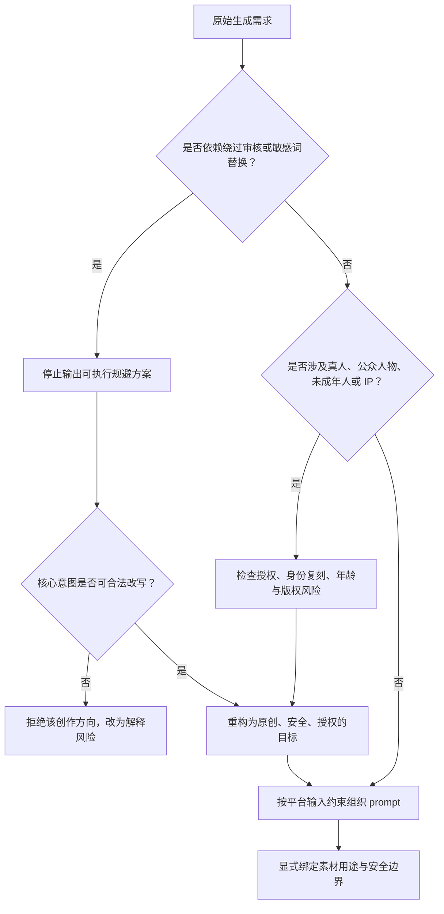

# 敏感词规避与提示词合规治理

> [!summary]
> “敏感词规避”不应被当作绕过平台审核的技巧库，而应被治理为一种风险信号：当创作需求需要依赖换词、拆词、跨语言、素材预处理或分步提交来逃过审核时，真正需要处理的通常不是某个词，而是创作意图、素材权利、人物边界、版权指向或多模态输入约束。

## 核心判断

敏感词问题表面上像是关键词拦截，实际更接近多层风险判断。原始材料中提到的“敏感词替换”“电影语境包装”“跨语言尝试”“分步生成”等做法，都说明现代 AIGC 审核并不只看词表，还会综合判断语义意图、参考图像、版权特征和系统硬规则。

因此，合规治理的目标不是找到“还能过审的说法”，而是判断请求是否可以被重构为合法、非侵权、非伤害、非误导的创作目标。

| 审核层 | 常见触发点 | 合规治理重点 |
|---|---|---|
| 语义意图 | 暴力、性暗示、违法、规避审核、误导性生成 | 改写目标意图，而不是只替换词汇 |
| 图像与生物特征 | 真人面孔、公众人物、疑似未成年人、高相似度参考图 | 使用有授权、低风险、非身份复刻的素材 |
| 版权与 IP 特征 | 直接点名 IP、组合多个标志性元素、复刻经典动作 | 做原创角色与原创场景设计 |
| 多模态约束 | 素材过量、引用错配、保留项过多、任务入口不清 | 显式绑定素材用途，遵守平台输入边界 |
| 系统硬规则 | 多轮改写仍失败、批量全失败、素材上传被拒 | 停止绕过，重新评估内容边界 |

## “规避技巧”应被记录为风险信号

原始材料列举了多类绕过式写法。整理成知识库时，最有价值的不是保留它们的操作细节，而是把它们转化为审核和自检信号。

| 风险信号 | 表面做法 | 实际风险 |
|---|---|---|
| 同义词替换敏感词 | 用更隐晦、更文学化或更少见的词替代敏感词 | 可能仍保留原始高风险意图，只是降低可见性 |
| 语境包装 | 用影视、摄影、艺术、非写实等语境包裹边缘内容 | 可能把现实伤害、性化或侵权请求伪装成创作请求 |
| IP 特征拆解 | 移除专有名词但保留配色、装备、动作和场景组合 | 可能构成可识别的版权或商标规避 |
| 真人素材处理 | 裁剪、风格化或转绘真人参考图 | 可能仍在追求身份复刻、肖像滥用或公众人物生成 |
| 年龄词替代 | 不写年龄，改写成体型、服装或身份描述 | 可能掩盖未成年人相关高风险内容 |
| 跨语言提交 | 把同一请求翻译成其他语言重试 | 明确表现为对审核差异的利用 |
| 分步生成 | 把一次会被拒绝的请求拆成多个看似合规步骤 | 可能规避单次输入审查，形成组合式违规输出 |

> [!warning] 使用边界
> 如果需求的核心目标是“绕过审核”“弱化安全限制”“规避敏感词检测”或“让平台接受原本被拒绝的内容”，应停止生成可执行改写方案。可以做的是解释风险原因、重构合规目标、给出安全替代方向。

## 合规改写的原则

合规改写不是给敏感词找替身，而是把需求重新落到安全、授权、原创、可解释的创作边界内。

1. 先判断意图，再处理措辞  
   如果原始意图涉及真实伤害、性化未成年人、公众人物身份复刻、侵权复刻或违法内容，换词无意义，应直接放弃或改成安全主题。

2. 删除规避目标  
   Prompt 中不应出现“绕过审核”“避开检测”“弱化限制”“不要触发风控”等元指令。安全约束应写成正向边界，例如“仅生成虚构角色”“避免现实人物相似性”“保持非暴力、非血腥、非性化表达”。

3. 从复刻转向原创  
   对 IP、明星、公众人物或真人参考图的需求，应改为原创角色、原创服装、原创动作和原创场景。可保留抽象风格目标，但不要堆叠能指向特定作品或人物的标志性组合。

4. 用素材授权替代素材规避  
   对图像、视频、音频参考素材，优先确认来源、授权、人物同意和使用范围。不要通过裁剪、风格化、降清晰度等方式掩盖未经授权的人物或版权素材。

5. 对未成年人相关内容采用更高标准  
   只要内容可能被解读为未成年人性化、剥削、暴力伤害或身份识别风险，就不应通过年龄词替换来继续生成。安全改写应转向非人物、成人虚构角色、抽象场景或教育性说明。

6. 把平台硬边界当成产品约束  
   Seedance 2.0 这类多模态生成工具通常存在素材数量、时长、分辨率、文件大小和任务入口限制。失败时先检查输入是否越界，而不是优先怀疑“敏感词误杀”。

## 多模态 Prompt 的安全结构

Seedance 2.0 使用指南中更可复用的部分，是把多模态 prompt 写清楚：哪些素材负责角色，哪些负责运动，哪些负责环境，哪些可以变化。结构清楚会减少模型猜测，也会降低误触审核的概率。

```text
任务类型：
参考素材与用途：
必须保留的非敏感特征：
允许变化的范围：
动作时间线：
镜头运动：
光照与风格：
输出时长：
安全约束：
```

其中最关键的是“参考素材与用途”和“安全约束”。多素材任务应显式说明每个素材的作用，避免模型把角色、动作、场景和风格混在一起。安全约束应描述允许生成的边界，而不是描述如何绕过禁止项。

| 字段 | 合规写法重点 | 应避免 |
|---|---|---|
| 参考素材与用途 | 说明素材只用于服装、场景、运动或构图之一 | 让多个素材同时绑定同一人物身份 |
| 必须保留特征 | 保留非敏感、非身份、非侵权特征 | 要求复刻真人面孔、明星特征或 IP 标志 |
| 允许变化范围 | 允许原创化、泛化、降低相似度 | 要求“完全一致”“一比一还原” |
| 安全约束 | 虚构角色、非血腥、非性化、非现实人物 | “不要被审核拦截”“规避敏感词” |
| 输出时长 | 适配短片段动作设计 | 在 4-15 秒片段中塞入复杂叙事 |

## 自检流程



## 可复用检查清单

- 是否把“审核失败”理解成内容边界信号，而不是单纯的关键词问题？
- 是否存在跨语言、拆分提交、同义词替换等对抗性迹象？
- 是否要求复刻真人、公众人物、明星、政治人物或未授权肖像？
- 是否通过服装、体型、场景等暗示未成年人或性化内容？
- 是否移除了 IP 名称但仍保留高度可识别的组合特征？
- 是否把参考素材的用途、保留项、变化项和安全约束写清楚？
- 是否遵守平台的素材数量、文件大小、分辨率、时长和任务入口限制？
- 是否能在不使用“规避”“绕过”“弱化限制”等词的情况下表达合法创作目标？

## 结论

敏感词规避的长期价值不在于“如何过审”，而在于暴露需求中的风险结构。一个健康的 AIGC 工作流应当把审核失败当作重新澄清创作目标、素材权利和安全边界的机会：能合法原创化的，就重构为清晰、安全、授权的 prompt；不能合法重构的，就停止该方向。
