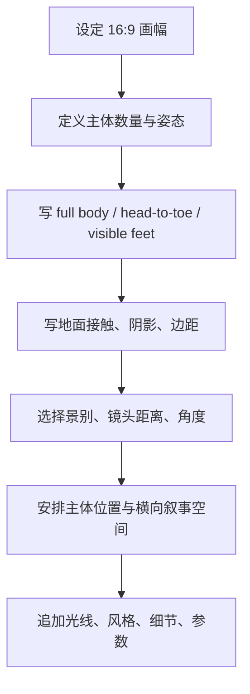

# Midjourney 16_9 全身构图提示词指南

> [!summary]
> 在 Midjourney 里，`--ar 16:9` 只决定画布比例，不会自动解决构图。想稳定生成横幅全身照，需要同时约束画幅、景别、身体完整性、地面接触、主体位置和环境负空间。

16:9 横幅天然强调横向空间，而人物全身照强调纵向比例，两者会争夺画面面积。模型还常受训练数据和审美倾向影响，默认更容易生成半身、近景、肖像或主体被裁切的画面。因此，全身角色构图不能只写 `full body`，而要把“完整身体可见”拆成多个可观察锚点。

## 核心构图控制

| 控制层 | 作用 | 常用写法 | 失败症状 |
|---|---|---|---|
| 画幅 | 定义画布比例 | `--ar 16:9`, `16:9 cinematic wide composition` | 只是横幅，人物仍被裁切 |
| 景别 | 控制主体占比 | `wide shot`, `full-body shot`, `full shot` | 变成半身、近景、肖像 |
| 身体完整性 | 锁定头到脚 | `full body`, `head-to-toe`, `entire figure in frame` | 头、脚、手或轮廓缺失 |
| 脚部可见 | 防止裁脚 | `visible feet`, `feet fully visible`, `standing on visible ground` | 脚被画幅边缘切掉 |
| 地面接触 | 给模型空间锚点 | `standing on ground`, `floor visible`, `ground contact shadow` | 身体漂浮、脚部不清楚 |
| 安全边距 | 避免边缘裁切 | `full body framed with margins`, `margin around body` | 武器、披风、翅膀或四肢贴边 |
| 主体位置 | 稳定画面重心 | `centered full-body hero subject`, `left third`, `right third` | 人物过小、位置随机 |
| 空间层次 | 填充横向叙事 | `foreground`, `midground`, `background depth`, `leading lines` | 画面空洞或背景无意义 |

> [!warning] 互斥词会抵消目标
> `portrait`、`headshot`、`close-up`、`bust shot` 会把模型拉向近景肖像。全身照主目标明确时，不要把这些词和 `full body` 混用。

## 推荐提示词顺序

构图控制词要放在风格词之前。先让模型理解主体、景别和身体完整性，再追加光线、风格、材质和参数。

```text
subject;
full body from head to toe;
visible feet and hands;
pose and ground contact;
16:9 cinematic wide composition;
camera distance and angle;
subject position;
foreground, midground, background depth;
lighting;
style;
parameters
```

可复用的 16:9 全身角色骨架：

```text
[subject], full body from head to toe, visible feet and hands, standing on visible ground, entire figure in frame, full body framed with margins, [pose], [centered / left third / right third] full-body hero subject, 16:9 cinematic wide composition, [camera distance and angle], foreground framing, midground subject, background depth, [lighting], [style] --ar 16:9
```

## 生成流程



执行时可以按这个顺序检查：

1. 先确定主体数量，避免多人或复杂道具让身体结构失控。
2. 写清 `wide shot` / `full-body shot` / `full shot`，不要只写抽象构图词。
3. 把 `full body` 拆成 `head-to-toe`、`visible feet`、`visible hands`、`entire figure in frame`。
4. 加入 `standing on visible ground`、`floor visible`、`ground contact shadow` 等空间锚点。
5. 指定主体在画面中的位置，例如居中、左三分之一或右三分之一。
6. 用前景、中景、背景、动作方向、对角线和 leading lines 填充横向叙事，而不是增加无关物体。
7. 最后再写风格词和参数，避免风格词挤占构图控制。

## 镜头与角度选择

| 镜头语言 | 适合用途 | 注意点 |
|---|---|---|
| `eye-level` | 稳定、自然、变形少的全身角色 | 适合默认优先选择 |
| `low angle` | 强化英雄感、压迫感、纪念碑式构图 | 容易夸张腿部和透视 |
| `high angle` | 表现脆弱、俯视、场景关系 | 容易削弱角色存在感 |
| `wide shot` | 展示人物和环境关系 | 人物可能过小，需要 `hero subject` |
| `long lens` / `moderate lens` | 减少广角变形，压缩空间 | 需要补充背景层次 |
| `wide-angle` | 强化空间、速度和夸张透视 | 容易导致肢体变形，慎用于全身照 |
| `Dutch angle` | 增加不稳定、动作感、戏剧张力 | 不适合需要干净结构的角色设定图 |

> [!tip]
> 全身照失败时，优先调景别和相机距离，再调风格参数。很多裁切问题不是风格问题，而是镜头语言和主体占比问题。

## 16:9 横幅的叙事用法

16:9 不只是“把人物放进更宽的画布”。如果只是把人物缩小居中，画面容易空洞。横幅更适合用环境和动作方向扩展叙事：

- 让人物朝负空间方向移动或看去，形成方向感。
- 用武器、披风、道路、光束、建筑线条引导视线，但不要让延伸物贴住画幅边缘。
- 用前景遮挡、中景主体、背景深度形成层次。
- 通过 `leading lines`、对角线、地面阴影和背景透视强化画面组织。
- 保留头、手、脚、武器和关键轮廓周围的安全区，避免边缘裁切。

## 常见失败与修正

| 失败问题 | 优先修正 | 可加入的词 |
|---|---|---|
| 裁脚 | 强化脚部可见和地面 | `visible feet`, `feet fully visible`, `standing on visible ground`, `floor visible` |
| 裁头或贴边 | 加安全边距和完整轮廓 | `entire figure in frame`, `full body framed with margins`, `clear silhouette` |
| 人物太小 | 明确主体是画面主角 | `full-body hero shot`, `centered full-body hero subject`, `occupying center frame` |
| 半身或近景 | 移除肖像词，强化景别 | `wide shot`, `full-body shot`, `full shot`, `camera pulled back` |
| 肢体错乱 | 降低动作复杂度 | `simple standing pose`, `visible hands`, `balanced stance`, `clear limb placement` |
| 透视变形 | 降低广角强度 | `moderate lens`, `eye-level framing`, `natural perspective` |
| 横幅空洞 | 增加空间层次和叙事方向 | `foreground framing`, `midground subject`, `background depth`, `leading lines` |
| 道具遮挡四肢 | 限制延伸物和边缘占位 | `weapon not covering body`, `cape behind body`, `clear outline` |

## 避免事项

- 不要只依赖 `--ar 16:9`，参数只决定画布，不决定构图。
- 不要同时使用多个互斥景别，例如 `close-up portrait` 与 `full body`。
- 不要把 `full body` 放在提示词末尾，让它排在大量风格词之后。
- 不要用过多风格词挤占主体、景别、脚部、地面和边距信息。
- 不要让武器、披风、翅膀、长发等延伸物同时占满画幅边缘。
- 不要通过增加对象数量解决画面空洞，优先增加空间层次和动作方向。

## 快速检查清单

- [ ] 是否写了 `--ar 16:9` 或等价横幅约束？
- [ ] 是否写了明确景别，如 `full-body shot` 或 `wide shot`？
- [ ] 是否写了 `head-to-toe`、`visible feet`、`entire figure in frame`？
- [ ] 是否写了地面接触、地面可见或阴影？
- [ ] 是否给头、手、脚、武器和轮廓留出边距？
- [ ] 是否移除了 `portrait`、`headshot`、`close-up`、`bust shot` 等冲突词？
- [ ] 是否用前中后景、动作方向或 leading lines 解释横向空间？
- [ ] 是否把风格词放在主体和构图控制之后？

## Related

- [[Midjourney 提示词工程实践手册]]
- [[midjourney-parameters-guide]]
- [[midjourney-prompt-donot-guide]]
