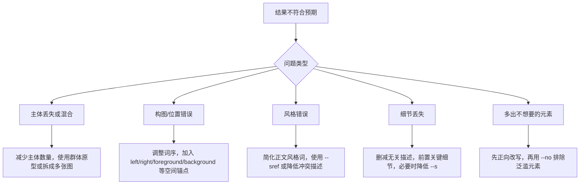

# Midjourney 提示词工程实践手册

> [!summary]
> Midjourney prompt 的核心不是堆关键词，而是把目标画面写成清楚、可视化、可解析的单帧描述：先锁定主体，再给环境和风格，最后用参数控制画幅、风格强度、参考图权重和排除项。

这批来源文档高度重叠，主要围绕同一件事：如何让 Midjourney 更稳定地理解主体、构图、姿态、细节、风格和参考图。因此更适合整理成一篇统一的实践手册，而不是拆成多篇。

## 版本基线

本手册以 V7 及之后的 Midjourney 提示词范式为主。官方文档显示，V8.1 已在 2026-04-30 发布，但当前默认版本仍为 V7；V8.1 需要 Global V7/V8 Personalization Profile，并增加了更快渲染、HD、Raw 等能力。实际使用时，先确认当前账号与任务所在界面的默认版本，再决定是否显式追加 `--v 7` 或切换到 V8.1。

> [!warning] 版本差异
> 旧材料里有些 V6/V6.1 技巧不应直接迁移到 V7/V8.1。尤其是多重提示权重、Character Reference、Omni Reference、Style Reference、Draft、HD、Raw 等功能的兼容性会随版本变化。遇到参数报错时，优先查官方参数和版本文档。

## Prompt 的基本骨架

一个可复用的 Midjourney prompt 通常由三层组成：

```text
[参考图像或 image URL] [文本画面描述] [参数]
```

文本画面描述可以继续拆成：

```text
[媒介/风格] + [主体] + [动作/状态] + [环境] + [光影] + [色彩] + [构图]
```

最小可用结构：

```text
[主体描述]. [环境/背景描述]. [风格描述]. --ar [比例] --v [版本]
```

示例：

```text
A man stands in a dark cyberpunk alleyway holding a glowing sword. Neon lights reflect on the rainy street. Dramatic side lighting. --ar 16:9 --v 7
```

> [!tip]
> 参数总是放在 prompt 末尾。不要在参数后继续写画面描述，也不要在参数值后加逗号或句号。

## 有效 Prompt 的写法原则

### 写画面，不写命令

Midjourney 更像图像生成器，不是执行自然语言命令的助理。prompt 应描述最终画面，而不是告诉它“画一个”“添加一个”“生成一个”。

| 低效写法 | 更好的写法 |
|---|---|
| Draw a man standing on a mountain. | A man stands on a mountain ridge under a cloudy sky. |
| Add a red scarf to the woman. | A woman wears a red scarf around her neck. |
| Make it look mysterious. | Dense fog covers the forest floor, with twisted trees blocking dim moonlight. |

### 用自然句，不堆标签

V6+ 和 V7 之后，关键词堆叠的收益下降。更可靠的写法是短句、完整句、视觉关系清晰。

| 低效写法 | 更好的写法 |
|---|---|
| cyberpunk, glowing light, broken wall, rain | A broken concrete wall glows under blue neon light in a rainy cyberpunk street. |
| girl, red dress, forest, cinematic, 8K | A girl in a red dress walks through a pine forest at golden hour. |

### 把抽象词翻译成视觉特征

抽象词会让模型调用不可控的默认联想。更稳定的做法是把抽象词拆成形状、材质、光线、姿态、空间关系。

| 抽象目标 | 可视化改写 |
|---|---|
| mysterious forest | fog-covered forest floor, twisted roots, dim moonlight, dense canopy |
| beautiful sunset | golden-orange sky, scattered clouds, warm reflection on calm water |
| iconic building | tall structure with distinctive spires and ornate stone details |
| premium product | clean white background, brushed metal surface, precise edges, soft studio shadow |

### 少用否定句，多用正向替代

在正文描述里写 `no`、`not`、`without` 容易让被否定对象仍然进入画面。优先把“不要什么”改写成“要看到什么”。

| 不稳定写法 | 正向替代 |
|---|---|
| no beard | clean-shaven jaw |
| without hat | bare head with visible hair |
| no logo | plain unmarked surface |

如果确实要排除背景或泛滥元素，用官方参数 `--no`，例如：

```text
A full-length dancer stands on a wooden stage under warm spotlights. --ar 2:3 --no hats, logos, cropped
```

### 避免用途说明

不要写 `for a logo`、`for my app`、`as a wallpaper`。这些是用途，不是画面。改成视觉风格。

| 用途说明 | 视觉描述 |
|---|---|
| for a logo | minimalist vector icon with clean geometric shapes |
| as a wallpaper | wide landscape composition with open negative space |
| for a product poster | studio product photography with centered composition and soft shadow |

## 语序与构图控制

Midjourney 对词序敏感。越靠前的实体越容易成为视觉焦点；越靠后的元素更容易成为背景、附属物或气氛。

| 目标 | 写法 |
|---|---|
| 主体成为焦点 | `A mermaid statue rises from the center of a stone fountain.` |
| 环境成为焦点 | `A stone fountain fills the courtyard, with a small mermaid statue at its center.` |
| 把人物推到边缘 | `A giant crystal orb glows in the center of the throne room while a red king stands beside it.` |

空间关系要用明确介词，而不是让模型猜：

| 关系 | 可用表达 |
|---|---|
| 左右 | `on the left`, `on the right`, `beside`, `adjacent to` |
| 前后 | `in the foreground`, `in the background`, `behind`, `in front of` |
| 上下 | `above`, `below`, `beneath`, `underneath` |
| 包含 | `inside`, `within`, `containing`, `surrounded by` |
| 路径 | `through`, `across`, `along`, `near`, `against` |

## 环境原型

环境原型是模型对常见场景的默认视觉包。`Victorian library` 会自动带出木质书架、古典家具、暖色灯光；`junkyard` 会自动带出生锈金属、废车、杂物。利用环境原型可以节省 prompt 长度。

> [!tip]
> 先调用强环境原型，再只补充偏离默认值的关键差异。不要重复描述原型已经包含的细节。

示例：

```text
A white grand piano stands in a junkyard at sunset. Rusted cars surround it, and warm light reflects on the polished surface. --ar 16:9
```

这里不需要额外堆叠 “trash, rust, broken metal, old cars”，因为 `junkyard` 已经提供了大部分背景原型。

## 细节强调与注意力预算

模型的注意力是有限资源。某个细节反复丢失时，常见原因不是描述不够多，而是竞争元素太多。

处理顺序：

1. 删除无关环境、气氛、质量词。
2. 把目标细节提前。
3. 用同义词或短语重组强化目标细节。
4. 降低风格化强度，例如尝试更低的 `--s`。
5. 对背景泛滥元素用 `--no`。

> [!example]- 牛铃法则示例
> 原始目标：
> ```text
> a sleeping cat
> ```
>
> 强化后：
> ```text
> a cat sleeps lying down with its head down, closed eyes, napping, slumbering, snoozing
> ```
>
> 这种写法通过重复同一视觉状态来增加注意力权重，但不能无节制堆叠。堆叠过多会牺牲其他细节。

不建议把 `--no luxabiddleprok` 这类“乱码降权”写入正式工作流。它不是稳定、可解释、可维护的官方方法；正式笔记里只保留为“曾见于旧材料但不采用”的策略。

## 全身角色图

全身图的主要问题是模型默认偏向半身肖像或近景。要让角色从头到脚完整出现，需要同时约束主体、顶部、底部、地面和画幅。

```text
Photograph of a full-length female elf with blue hair walking through a sunny forest.
Her bare feet step on lush green moss.
A small blue bird flies above her head.
--ar 2:3 --v 7
```

检查清单：

- 首句写明媒介或风格，例如 `Photograph of`、`Illustration of`。
- 使用 `full-length`，避免只写 `portrait`。
- 描述头部或顶部特征，例如发型、帽子、头顶空间。
- 描述脚、鞋或地面接触点。
- 使用竖向比例，例如 `--ar 2:3`、`--ar 9:16`。
- 如果仍被裁切，可加入 `--no close-up, cropped`。

> [!warning]
> 过多脸部细节会把镜头拉近。全身图里，脸部只保留最关键特征，把更多 token 留给姿态、服装、脚部、地面和画幅。

## 多主体场景

多个独立主体会显著增加混乱概率。超过 4 个核心主体时，优先把它们压缩成一个群体原型，再用空间锚点分配个体特征。

```text
A group of five small animals sits on a sofa.
On the left are a dog and a cat.
In the center is a small bird.
On the right are a mouse and a rabbit.
--ar 16:9 --v 7
```

关键点：

- 先用 `a group of...` 把多个对象打包为群体。
- 再用 `left / center / right` 分配差异。
- 附属物不算主体，但如果写得太靠前，可能被模型误判为焦点。
- 多主体图应降低无关风格词和背景复杂度。

## 姿态与表情

优先使用可视化的姿态词，再补充与姿态相关的情绪和面部细节。

| 目标 | 姿态词 | 表情/动作锚点 |
|---|---|---|
| 侧面 | `profile shot` | face turned sideways, nose silhouette visible |
| 三分之四 | `three-quarter view` | one cheek closer to camera, both eyes visible |
| 害羞 | `head tilted down` | averted gaze, blushing cheeks, hands close to chest |
| 强势 | `hands-on-hips pose` | intense gaze, raised chin, squared shoulders |
| 放松 | `leaning pose` | soft eyes, loose posture, relaxed shoulders |

示例：

```text
A bashful girl stands beside a window with her head tilted down.
Her cheeks are flushed, and her eyes avoid the camera.
Soft morning light falls across her face.
--ar 2:3
```

## 参考图系统

Midjourney 的参考图不是一个功能，而是多个不同意图的入口。先判断你要控制的是内容、风格还是具体对象。

| 目标 | 优先使用 | 作用 |
|---|---|---|
| 影响内容、构图、颜色 | Image Prompt | 用图像作为灵感来源，通常配合文本描述 |
| 迁移整体视觉风格 | Style Reference `--sref` | 迁移颜色、媒介、纹理、光线等风格，不复制人物或物体 |
| 放入某个角色、物体、车辆或生物 | Omni Reference `--oref` | V7 中用于把参考对象带入新图 |

### Image Prompt

Image Prompt 适合引导内容、构图和颜色。Discord 中通常把图片 URL 放在 prompt 开头；如果使用 `--iw`，数值越高，参考图影响越强。官方文档列出的 V7 `--iw` 范围为 `0-3`，默认值为 `1`。

```text
[image URL] A red sports car drives along a wet mountain road at night. Reflections from streetlights appear on the asphalt. --iw 1.5 --ar 16:9
```

### Style Reference

Style Reference 用于匹配“视觉气质”，不是复制参考图里的对象。文本 prompt 应描述目标内容，不要写“copy this style”这类指令。

```text
A detailed portrait of a white dog sitting beside a window. --sref [style image URL] --sw 120
```

使用原则：

- 文本 prompt 保持简单，避免和参考图风格冲突。
- 如果特定风格难以出现，再补充少量风格词。
- V7 中可用 `--sv` 切换 Style Reference 版本；默认是 `--sv 6`。

### Omni Reference

Omni Reference 用于把一个参考人物、物体、车辆或生物带入新图。官方文档说明它兼容 V7，并用 `--oref` 加一个图片 URL；`--ow` 控制参考图细节影响强度，范围为 `1-1000`，默认 `100`。

```text
A portrait in the style of Teen Magazine photography.
Jo is a young woman with blue curly hair, pink sunglasses, and a colorful scarf around her neck.
She stands on a sidewalk on a busy city street.
--oref [image URL] --ow 100 --v 7
```

使用原则：

- 一个 Omni Reference 只能使用一张图。
- 文本 prompt 仍然重要，要明确新场景、动作和需要保留的特征。
- 需要高度还原时提高 `--ow`；需要创意变形时降低 `--ow` 并用文本重新锚定特征。
- 过高的 `--ow` 可能带来不可预测结果；除非有强理由，避免长期依赖极高权重。
- 如果同时使用高 `--s` 或 `--exp`，它们会和 `--oref` 争夺影响力，需要重新平衡。

## 常用参数速查

| 参数 | 作用 | 使用建议 |
|---|---|---|
| `--ar` / `--aspect` | 画幅比例 | 全身图用 `2:3`、`9:16`；横向场景用 `16:9` |
| `--v` / `--version` | 模型版本 | 需要固定行为时显式指定 |
| `--s` / `--stylize` | 风格化强度 | 低值提高依从性，高值增加审美风格 |
| `--chaos` / `--c` | 结果发散度 | 探索阶段提高，定稿阶段降低 |
| `--seed` | 固定随机种子 | 对比改动、复现构图时使用 |
| `--no` | 排除元素 | 用于排除背景泛滥元素或裁切倾向 |
| `--iw` | Image Prompt 权重 | V7 范围 `0-3`，默认 `1` |
| `--sref` | Style Reference | 控制整体视觉风格 |
| `--sw` | Style Reference 权重 | 默认 `100`，范围 `0-1000` |
| `--sv` | Style Reference 版本 | V7 image style reference 默认 `--sv 6` |
| `--oref` | Omni Reference | V7 中用于参考对象、角色或物体 |
| `--ow` | Omni Reference 权重 | 范围 `1-1000`，默认 `100` |
| `--raw` | Raw Mode | 降低默认美术风格，增强 prompt 控制感 |
| `--draft` | Draft Mode | V7 中以更低 GPU 成本生成草稿 |

> [!warning]
> 参数兼容性随版本、Web/Discord 入口、图像/视频模式变化。正式模板里不要写自造参数，也不要把旧版本参数当成当前可用参数。

## 迭代排错流程



推荐的迭代顺序：

1. 先只写主体、环境、风格三要素，跑出基础方向。
2. 固定画幅与版本，例如 `--ar 2:3 --v 7`。
3. 每次只改一个维度：主体、构图、风格、参考图、参数。
4. 用 `--seed` 做对照实验。
5. 当问题稳定复现，再把修复写入模板。

## 可复用模板

### 通用图像

```text
[Subject] [action or state] in [environment].
[Lighting or color condition].
[Medium or style].
--ar [ratio] --v [version]
```

### 全身角色

```text
Photograph of a full-length [character] with [top feature], [action] in [environment].
[Character] wears [footwear] on [ground surface].
[Top-space element] appears above [character].
--ar 2:3 --v 7
```

### 多主体

```text
A group of [number] [group archetype] [action] in [environment].
The one on the left [feature A].
The figure in the center [feature B].
The one on the right [feature C].
--ar 16:9 --v 7
```

### Style Reference

```text
[Target content described clearly].
--sref [style image URL] --sw [0-1000]
```

### Omni Reference

```text
[New scene and action].
[Important traits from the reference restated in text].
--oref [image URL] --ow [1-1000] --v 7
```

## 最终检查清单

- [ ] 是否写的是最终画面，而不是命令或用途说明？
- [ ] 是否包含主体、环境、风格三个基础层？
- [ ] 是否把抽象词替换成可见的形状、材质、光影、姿态？
- [ ] 是否避免了关键词堆叠和过长从句？
- [ ] 是否把核心主体和关键细节放在前面？
- [ ] 是否使用了明确空间介词？
- [ ] 是否用 `--ar` 控制画幅，而不是在正文里写尺寸？
- [ ] 是否只使用当前版本支持的官方参数？
- [ ] 是否为参考图选择了正确入口：Image Prompt、Style Reference 或 Omni Reference？
- [ ] 是否保留了足够少的变量，便于下一轮迭代定位问题？

## Sources

- [Midjourney Prompt Basics](https://docs.midjourney.com/docs/prompts)
- [Midjourney Parameter List](https://docs.midjourney.com/docs/parameter-list)
- [Midjourney Version](https://docs.midjourney.com/hc/en-us/articles/32199405667853-Version)
- [Midjourney Image Prompts](https://docs.midjourney.com/docs/image-prompts)
- [Midjourney Style Reference](https://docs.midjourney.com/hc/en-us/articles/32180011136653-Style-Reference)
- [Midjourney Omni Reference](https://docs.midjourney.com/hc/en-us/articles/36285124473997-Omni-Reference)
