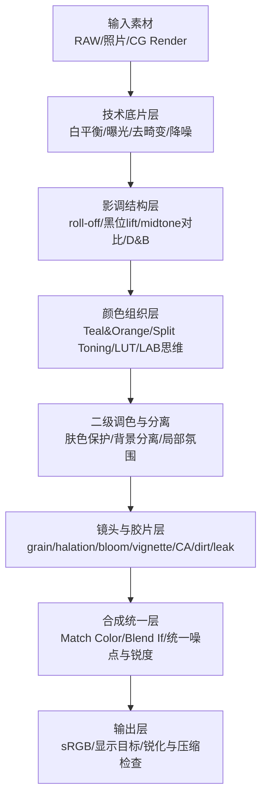
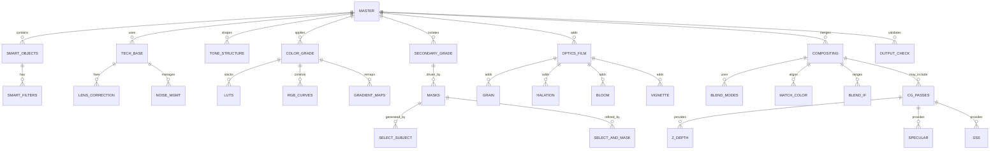

# Photoshop 电影感与CG/原画感实现方法大全

相关笔记：[[Photoshop 电影感思路|方法总纲]]

核心标签：#AIGC/Photoshop #color-grading #film-look

## 执行摘要

“电影感（电影化）”与“CG感/原画感（更像渲染/概念设定图）”在 Photoshop 里都不是单一滤镜，而是**一组可控的视觉线索（visual cues）**叠加：色彩分级（Color Grading）、影调映射（Tone Mapping / Contrast Shaping）、胶片与光学缺陷（Film/Optical Artifacts）、空间深度线索（Depth Cues）、运动线索（Motion Cues）、以及合成分层与材质/光照设计（Compositing + Material/Lighting Design）。其中，“电影感”常强调**自然记录的质感 + 受控的风格化**；“CG/原画感”更强调**结构化光影、材质可读性、形体/色块层级**与“可设计性”。

> [!tip] 核心工作流
> 建立稳定风格的关键，不是“把对比拉高/饱和拉满”，而是把流程拆成可回滚的 Pass。
> 1. 先用非破坏式工作方式保留可迭代空间（Smart Objects / Smart Filters / Adjustment Layers）。
> 2. 再做影调结构（高光 roll-off、黑位 lift、midtone 对比、局部塑形）。
> 3. 然后做颜色组织（Teal & Orange、Split Toning、LUT 堆叠、LAB/Log 思维）。
> 4. 最后加“真实世界/镜头系统”与“电影工艺”痕迹（grain / halation / bloom / vignette / CA / lens dirt / light leaks）并把合成收口。

下文给出一个尽量全面的“方法库”，每条包含：概念/原理、Photoshop 操作关键词、参数指导（定性或范围）、适用场景与常见坑；并提供对比表、10 个代表性风格配方、以及工作流与图层关系图。

---

## 研究框架与关键前提

> [!tip] 非破坏式优先
> 电影感 / CG 感都高度依赖反复迭代与局部修正。Smart Objects 允许无损缩放变形；滤镜用 Smart Filters 以便随时回调；用 Adjustment Layers 避免直接改像素。#workflow/pass-based

**色彩管理与“场景”/“显示”思维**：影视/CG 常区分 scene‑referred（场景线性/场景参考）与 display‑referred（显示参考）。ACES 作为一套色彩管理与交换体系，强调从采集/合成到输出变换的统一框架；而 Log 编码用于把更宽的曝光信息“更有效地装进有限的码值”，画面通常呈现“发灰”，需要后期分级。
在 Photoshop 中你通常不会完整跑 ACES 管线，但**可以借用其思路**：先把影调做成更“场景宽容”的形态（压高光、抬黑位、保护肤色中间调），再做输出风格。

> [!warning] 高光 roll-off 是“电影感”的硬指标之一
> 高端电影机语境里常强调 “filmic highlight roll-off”，本质是高光在接近剪切时仍保留柔和过渡，而不是直接炸成白洞。
> Photoshop 里通常用曲线、亮部压缩、柔光 / 泛光来模拟这种过渡。#highlight-rolloff

> [!danger] 避免 8-bit 断层（banding）
> 渐变天空、皮肤柔光、雾化最容易出现 banding。Add Noise 可以缓解羽化或渐变填充中的断层，但更稳妥的办法仍然是尽量用 16-bit 工作，尤其在重度调色、雾化、渐变场景下。#bit-depth

---

## 技术方法库

下面按“电影感/CG感”常用维度整理。表中“PS 操作关键词”尽量保持 1–2 步提示，重点放在概念与使用时机。#Photoshop/workflow

### 色彩分级与色彩空间方法库

| 技术/方法 | 概念与原理（为什么有效） | PS 操作关键词（极简） | 参数/定性指导 | 用例与常见坑 |
|---|---|---|---|---|
| Teal & Orange（橙青对比） | 以互补色带来强色彩分离：常把阴影/环境推向 teal，把肤色/高光保持偏暖，以提升主体分离度与“商业电影”氛围。 | Curves（RGB 分通道）/ Color Balance / Selective Color | 先保证肤色在中性区，再推背景阴影偏青；幅度宁小勿“染色片”。 | 适合城市夜景、人像、动作风格；坑：全图一刀切导致肤色发灰/发绿、白色被染。 |
| Split Toning（阴影冷/高光暖） | 把不同色调分配到不同明度区间，是影视“三向色轮（three‑way）”的核心思想之一。 | Color Balance（Shadows/Midtones/Highlights） | Shadows 加冷色，Highlights 加暖色；Midtones 只做轻微校正。 | 适合夜景、情绪片；坑：暗部彩噪被放大、黑位脏。 |
| LUT（Color Lookup）整体造型 | LUT 把多层调整的结果“映射”为查表变换，便于复用与一致性控制。 | Adjustment Layer → Color Lookup；必要时 Export LUT | LUT 叠加用 Opacity/Blend Mode/Mask 控强度；导出可为 CUBE 等 3D LUT 格式。 | 适合批量统一风格；坑：不同曝光/白平衡素材直接套 LUT 会崩，需先做基础校正。 |
| LUT 堆叠（LUT Stacks） | 多个 LUT 以低不透明度叠加，可把“色相结构”“对比结构”“胶片偏色”分开管理。Mask 可实现局部 LUT。 | 多个 Color Lookup 调整层 + Mask | 每个 LUT 10–40% Opacity 起步；优先分工而非重复。 | 适合电影级二级调色；坑：叠太多导致色彩不可预测、肤色崩坏。 |
| Curves 分通道（RGB Channel Curves） | 通道曲线可分别塑造 R/G/B 在不同明度区间的偏色，是高级调色最常用“硬工具”之一。 | Curves → 选择 R/G/B 通道 | 高光区轻推暖、阴影区轻推冷；避免在极暗/极亮处拉出“断点”。 | 适合任何风格；坑：曲线点过多导致色彩“打结”、出现色带。 |
| Levels（黑白场与中间调） | Levels 用黑场/灰场/白场快速确立画面 key（高调/低调）与对比结构。 | Levels 调整层 | 先定黑白场，再动中间调；保留高光细节。 | 适合快速定调；坑：推白场/压黑场过度导致剪切、后续调色空间变小。 |
| Selective Color（颜色分区微调） | 通过对特定颜色范围（Reds/Neutrals/Blacks 等）进行 CMY 方向微调，适合做“肤色保护/环境偏色纠正”。 | Selective Color 调整层 | 优先动 Neutrals/Blacks 做整体偏色，再动 Reds 做肤色；幅度小而精。 | 适合人像与合成；坑：过量调整让中性灰偏色、画面“脏”。 |
| Gradient Map（影调着色） | Gradient Map 把暗到亮映射为一条颜色渐变，等价于“用明度驱动色调”，在原画/概念设计中非常常用。 | Gradient Map 调整层；Blend Mode: Soft Light/Color | 用于快速统一色调：暗部给环境色、亮部给光源色；Opacity 控强度。 | 适合 CG/原画感与统一氛围；坑：破坏真实肤色、容易“滤镜味”。 |
| LAB 思维（L* 与 a*/b* 分离） | CIELAB 把“感知明度 L*”与对立色轴 a*/b*分离，便于做“明度不动只动色相/饱和”或反之。 | Image Mode → Lab（谨慎）；或用通道/混合模拟 | 适合做“饱和增强但不改明度”类操作；尽量避免频繁来回转换。 | 适合需要精细色彩分离；坑：模式转换与色域差异会引入不可逆变化（建议备份/智能对象）。 |
| Log 观念（“先灰后彩”） | Log 曲线/Log 编码用于保留更宽明暗信息，画面会“发灰”，需要后期再加对比与风格。 | 用 Curves/Exposure 做“压对比、保高光” → 再二次拉回 | 先做“宽容影调”，再做风格；避免一开始就对比拉满。 | 适合模拟电影机后期流程；坑：在 8‑bit 下极易 banding（必要时加噪点）。 |
| ACES 借鉴（统一输入→输出变换） | ACES 强调不同输入先归一到统一色彩编码，再输出到目标显示。 | 在 PS 中以“前置基础校正 + 后置输出 Look”分层模拟 | 把“技术校正层（白平衡/曝光）”与“风格层（LUT/偏色）”分组。 | 适合大型项目一致性；坑：把创作色调写死在早期步骤导致后续难改。 |
| Match Color（跨图/跨层对齐色调） | Match Color 可在 RGB 模式下匹配两张图或两层的 luminance、color intensity、色偏，适合合成统一。 | Image → Adjustments → Match Color | 先小幅匹配 luminance，再匹配强度；可用 Neutralize 去色偏。 | 适合合成/替换背景；坑：不同光照结构强行匹配会“假”，需先处理光向与阴影逻辑。 |


### 曝光与影调控制方法库

| 技术/方法 | 概念与原理 | PS 操作关键词（极简） | 参数/定性指导 | 用例与常见坑 |
|---|---|---|---|---|
| Highlight roll‑off（高光柔和过渡） | “电影机感”常见特征：高光接近剪切时平滑过渡，避免白洞；真实摄影中常被描述为“平滑过渡到几乎剪切”。 | Curves（高光压缩）、柔光 bloom | 让亮部进入“软削顶”，但保留局部对比；高光细节不应全消失。 | 适合窗边人像/夜景霓虹；坑：压过头变“灰”，层次塌陷。 |
| Lift blacks（抬黑位） | 轻抬黑位让阴影不纯黑，营造胶片/电影低对比底色，并给后续偏色留空间。 | Curves（黑点抬起）/ Levels（黑场上移） | 只抬最暗 0–10% 区间，避免整体发雾。 | 适合情绪片/复古；坑：暗部脏、噪点可见、画面“没力”。 |
| Midtone contrast（中间调对比塑形） | 电影常通过局部与中间调塑形而非全局硬对比；“清晰度/局部对比”本质是增强局部边缘对比。 | Camera Raw（Clarity/Texture）或局部曲线 | 先小幅全局，再局部蒙版；Texture 更偏细节，Clarity 更偏中尺度对比。 | 适合塑造面部结构/服装质感；坑：过度产生“脏边/硬皮/光晕”。 |
| Dodge & Burn（局部明暗塑形） | 经典暗房逻辑：dodge 变亮、burn 变暗，用于引导视线、塑造体积。 | Dodge/Burn 工具；或 50% Gray 层 + Soft Light | Brush 低流量多次叠加；优先塑造大形体，再细化。 | 适合人像轮廓/电影级塑形；坑：局部出现脏块、肤色被破坏、过度“磨皮感”。 |
| Shadow/Highlight（阴影/高光细节） | 用于回收阴影或高光细节；官方建议在“总体曝光已好”的情况下，Shadows Amount 与 Tonal Width 可尝试 0–25% 范围。 | Image → Adjustments → Shadow/Highlight（或作智能滤镜） | Tonal Width 与 Radius 决定影响范围与过渡；过高会产生 halo。 | 适合快速救片；坑：边缘 halo、画面“HDR 味”。 |
| Curves S‑curve（对比曲线） | 经典增对比方式：压暗暗部、提亮亮部；曲线图右上代表高光、左下代表阴影。 | Curves（RGB） | 更推荐“中段微 S + 高光温柔削顶 + 黑位轻抬”而非大 S。 | 适合建立基础对比；坑：剪切、肤色变脏、后续调色空间变小。 |
| Sharpening（锐化作为“质感”） | 锐化本质是提高不同色调交界处的对比，让细节更清晰。 | High Pass + Overlay/Soft Light；或 Smart Sharpen | High Pass 半径常从 2–3px 起做“质感锐化”。 | 适合增强 CG/原画的边缘决断；坑：噪点被锐化、出现边缘白边。 |
| Noise to hide banding（噪点抗色带） | Add Noise 可减少渐变/羽化选择的 banding，并可模拟高感胶片颗粒。 | Filter → Noise → Add Noise | Uniform 更细腻、Gaussian 更“斑点”；Monochromatic 更像亮度颗粒。 | 适合天空/雾化/大面积渐变；坑：噪点强度与分辨率不匹配，观感廉价。 |
| Exposure（曝光/Offset/Gamma） | Adjustment Layers 提供 Exposure（曝光）、Offset、Gamma 等，用于更“摄影逻辑”的明暗控制。 | Exposure 调整层 | 作为“技术层”优先于风格层；避免在末端大幅改变曝光。 | 适合先定曝光再上 LUT；坑：后期再修正会影响所有风格层。 |

### 胶片仿真与光学缺陷方法库

| 技术/方法 | 概念与原理 | PS 操作关键词（极简） | 参数/定性指导 | 用例与常见坑 |
|---|---|---|---|---|
| Film Grain（胶片颗粒） | 颗粒来自胶片感光颗粒/随机结构；Camera Raw 的 Grain 用于模拟特定胶片颗粒风格。 | Camera Raw Filter → Effects → Grain | Size 与 Roughness 共同决定颗粒观感；需多倍率查看。 | 适合复古/电影化；坑：输出缩放后颗粒变怪、肤色显脏。 |
| Add Noise（数字噪点模拟颗粒） | Add Noise 也被官方描述为模拟高感胶片，并可减少 banding。 | Filter → Noise → Add Noise | Uniform（更均匀） vs Gaussian（更斑点）+ Monochromatic（更像亮度颗粒）。 | 适合轻量颗粒/抗色带；坑：颗粒“太尖锐”，常需配合轻微模糊/混合模式做软化（经验）。 |
| Halation（红橙色高光晕） | 胶片高光在亮边发生光线反射/散射，会在高亮边缘形成红橙 halo；反卤化层用于抑制此效应。 | 亮部提取（Luminosity Mask）→ 模糊 → 偏红橙 → Screen/Add | 只作用于“接近剪切的高亮边缘”，并用 Mask 限制范围。 | 适合夜景灯源/逆光轮廓；坑：全图泛红、边缘像“描边”。 |
| Bloom/Glow（高亮泛光） | Bloom 用来模拟真实镜头/成像系统在极亮区域发生的“发光/光扩散”伪影，是常见 HDR 渲染后期效果。 | 高亮阈值提取 → Gaussian Blur → Screen | 大光源用大半径，小高光用小半径；分两层更像真实。 | 适合梦幻/科幻/大片；坑：过度会“糊”、丢细节。 |
| Lens Dirt（镜头污渍衍射） | Bloom 常可叠加 Lens Dirt 纹理，模拟灰尘/油渍导致的光散射；Unity 文档明确 bloom 可用 dirt texture。 | Dirt 纹理层 → Screen/Overlay → 绑定高亮 | Dirt 应只在强光处可见（通过高亮 Mask）；纹理分辨率需匹配输出。 | 适合镜头感与氛围；坑：脏点固定在画面上不随镜头变化会显假（静帧可接受）。 |
| Vignette（暗角/中心聚焦） | 暗角可让注意力回到中心；也是真实镜头常见现象。Unity 文档描述 vignette 会让边缘更暗、中心更亮。 | Camera Raw → Vignette；或 Curves+Mask | “轻、软、广”为主；尽量不让人一眼看出人为暗角。 | 适合电影感人像/叙事镜头；坑：边缘压黑导致构图拥挤、暗部细节全没。 |
| Chromatic Aberration（色散/色边） | 镜头无法把所有波长聚到同一点，会出现边缘色边；Camera Raw 可校正紫/绿等色差，Unity 也将其定义为 RGB 分离的镜头缺陷。 | RGB 轻微位移（通道/图层）或 Lens Correction 反向模拟 | 只在画面边缘与高反差边界出现；中心尽量保持干净。 | 适合 CG→实拍融合、赛博/复古镜头感；坑：全局 RGB 分离会显廉价、字幕边缘脏。 |
| Lens Distortion（桶形/枕形畸变） | Lens Correction 可修复桶形/枕形畸变、暗角与色差。 | Filter → Lens Correction | 轻微畸变能更“镜头”，但要与焦段逻辑一致。 | 适合 CG 合成/虚拟镜头；坑：人物边缘被拉伸、建筑线条歪。 |
| Light Leak（漏光） | 漏光是相机非密闭导致额外光进入，造成雾化/彩色光带；在某些复古风格中被当作“特色”。 | 渐变色块/纹理 → Screen/Lighten → Blur | 用低不透明度、大面积渐变；配合颗粒更像。 | 适合复古/胶片边缘氛围；坑：位置与光向不一致、过饱和造成假的“贴纸感”。 |
| Lens Flare/Ghosting（炫光/鬼影） | 强光入镜会产生 flare；反射形成 ghosting。 | flare 素材/光斑层 → Screen/Add → 透视/遮罩 | flare 应服从镜头位置与光源方向；亮度与对比需融进画面。 | 适合叙事性强光源镜头；坑：光斑与光源不对齐、过锐利显合成。 |
| Anamorphic streak（横向拉丝炫光） | Anamorphic 相关的横向 streak flare 是常见电影化特征之一。 | 横向条纹光层 → Linear Dodge(Add) → Mask 绑定高光 | 只在亮点/反光处出现；宽度与强度要克制。 | 适合大片/科幻；坑：无处不在会“俗”。 |

### 深度、景深与运动线索方法库

| 技术/方法 | 概念与原理 | PS 操作关键词（极简） | 参数/定性指导 | 用例与常见坑 |
|---|---|---|---|---|
| Z‑depth 模拟（深度图驱动） | 利用深度图让不同距离获得不同模糊/雾化强度，接近 3D 渲染流程。Blender 明确把 depth/normal 作为可提取 pass 数据。 | 深度图（灰阶）→ Lens Blur/雾化 Mask | 深度图需平滑且与边缘一致；对焦面要清晰定义。 | 适合合成/伪景深/雾；坑：边缘穿帮（头发、半透明物）。 |
| Lens Blur（真实镜头景深/bokeh） | Lens Blur 用于模拟相机镜头景深与 bokeh。 | Filter → Blur → Lens Blur | 用 mask/alpha 做 Depth Map（常见做法）。 | 适合人像与“镜头感”；坑：深度图粗糙导致断层、边缘光晕。 |
| Blur Gallery（Iris/Field/Tilt‑Shift） | Blur Gallery 提供交互式局部模糊：Iris 可模拟浅景深，Tilt‑Shift 可模拟移轴效果。 | Filter → Blur Gallery → Iris/Field/Tilt‑Shift | Iris 做主次焦点；Tilt‑Shift 要遵守透视与地平线逻辑。 | 适合快速控制焦点/移轴氛围；坑：不符合景深物理导致“玩具感”。 |
| Atmospheric/Aerial perspective（空气透视） | 距离越远：对比下降、饱和下降、偏冷、细节变少，这是大气散射造成的经典深度线索。 | 远景：降低对比/饱和、加雾；近景保细节 | 用渐变 Mask 做分层：前景硬、远景软；颜色往背景色靠。 | 适合环境概念图/ matte painting；坑：把远景“涂白”导致空间假、层次丢。 |
| Motion Blur（运动模糊） | Motion Blur 通过方向性模糊制造速度、镜头运动感；Adobe 指出可通过 Angle 与 Distance 控制。 | Filter → Blur → Motion Blur | Angle 对齐运动方向；Distance 逐步叠加，避免一次拉满。 | 适合动作/车辆/风吹布料；坑：主体边缘与背景不一致、出现“抠图边”。 |
| Camera shake（镜头抖动/手持感） | 电影手持感来自微小角速度与位移变化；静帧可用轻微 Transform + 运动模糊暗示。 | 轻微 Transform/Warp + 局部 Motion Blur | 抖动应“微而随机”，优先影响背景边缘与高频细节。 | 适合纪实/战争感；坑：抖动过大变“手机视频”。 |
| Shake Reduction（反向：去抖变清晰） | Photoshop 的 Shake Reduction 可减少多种相机运动导致的模糊（线性/旋转/锯齿轨迹等）。 | Filter → Sharpen → Shake Reduction | 用于“救片”或作为 CG 合成后“收口锐化”。 | 合成后统一锐度；坑：过度会产生伪影、边缘撕裂感。 |

### 合成、分层与“VFX/原画管线”方法库

| 技术/方法 | 概念与原理 | PS 操作关键词（极简） | 参数/定性指导 | 用例与常见坑 |
|---|---|---|---|---|
| Blend modes（混合模式） | Multiply/Screen/Color Dodge/Linear Dodge 等是合成的基础算子；Adobe 给出了多种模式的效果描述。 | 叠加层设 Blend Mode | Screen 适合光，Multiply 适合阴影，Linear Dodge(Add) 适合能量感发光。 | 适合光效/烟雾/能量；坑：Add 轻易剪切，需配合 Mask 与 Opacity。 |
| Opacity + Layer mask（不透明度+遮罩） | 合成可回滚的核心：用遮罩做局部分级/局部特效，避免全局污染。 | Adjustment layer 自带 mask | 遮罩边缘用 Feather/Refine；光效遮罩要“软”。 | 适合二级调色/局部氛围；坑：硬边遮罩导致“贴纸感”。 |
| Select Subject（自动主体选择） | 一键选取主体，用于快速人物/物体分离。 | Select → Select Subject | 作为起点，再进 Select and Mask 精修。 | 适合快速出遮罩；坑：复杂头发/透明材质仍需手工。 |
| Select and Mask（边缘精修/头发） | Refine Edge Brush/Refine Hair 等用于毛发边缘优化。 | Select and Mask → Refine Hair/Refine Edge Brush | 先局部 refine，再全局 smooth/feather；避免“helmet hair”。 | 适合人像合成；坑：过度平滑导致头发边缘假。 |
| Blend If（亮度范围融合） | Underlying Layer 滑块可让下层特定亮度范围透出，实现快速“按亮度合成”。 | Layer Style → Blend If | 分裂滑块（Alt/Option）获得柔过渡；优先用于光效/纹理融合。 | 适合快速合成灰尘/光斑/纹理；坑：边缘断层、在压缩输出后出现台阶。 |
| Match Color（跨层统一） | 多层合成中最常见问题是“色温不一致”；Match Color 可以按 luminance/强度/色偏做对齐。 | Image → Adjustments → Match Color | 先匹配亮度，再匹配颜色；必要时用 Neutralize。 | 适合背景替换/拼接；坑：光向不一致时只调色无法救。 |
| Vanishing Point（透视平面编辑） | 在透视平面上克隆/粘贴/绘制，让纹理遵守透视。 | Filter → Vanishing Point | 先设 plane 再操作；适合墙面/地面贴图。 | 适合 matte painting 与贴图合成；坑：错误平面导致“漂浮”。 |
| Perspective Warp（透视变形） | 通过定义平面进行透视校正/变形，便于让合成元素与场景透视一致。 | Edit → Perspective Warp | 用 Smart Object 做非破坏；先布局再 warp。 | 适合建筑/道具合成；坑：过度 warp 导致比例怪。 |
| Apply Image/Calculations（通道级运算） | Apply Image 可把源图层/通道以混合方式作用到目标通道，用于高级遮罩、频率/明度分离、质感提取。 | Image → Apply Image / Calculations | 常用于制作 Luminosity Mask 或材质细节层（经验）。 | 适合高阶合成与质感工程；坑：8‑bit 易出现断层，注意位深。 |
| Alpha compositing（alpha/遮罩代数） | 数字合成依赖 alpha matte；经典 OVER 关系与 premultiplied alpha 概念来自 Porter‑Duff 等工作。 | PS 层与 mask（概念层） | 处理半透明边缘要关注“黑边/白边”与 gamma；必要时用去边/重新预乘（经验）。 | 适合烟雾/头发/半透明；坑：边缘颜色污染、缩放插值带出底色。 |
| Pass/AOV 合成思维（CG 多通道） | CG 渲染常把 diffuse/specular/SSS/Z/normal 等拆成 pass 单独调；Blender 文档将 pass 视为可提取的中间信息。 | 在 PS 中以“分组+混合模式”模拟：Diffuse/Spec/SSS 组 | Spec 用 Screen/Add，Diffuse 用 Normal，AO 用 Multiply（经验）；Z 用于景深/雾。 | 适合将 CG 融入摄影或做原画级可控渲染；坑：不同色彩空间/伽马混合导致能量不守恒（经验）。 |

### 材质与光照“可设计化”方法库（CG感/原画感核心）

| 技术/方法 | 概念与原理 | PS 操作关键词（极简） | 参数/定性指导 | 用例与常见坑 |
|---|---|---|---|---|
| Rim Light（轮廓光） | Rim light 放在主体后方强调轮廓，是三点布光中用于分离主体与背景的关键。 | 轮廓选择 → 画光（Soft Light/Screen） | 贴轮廓但要有断续与强弱变化；先大形后细节。 | 适合 CG/原画“形体可读性”；坑：均匀描边显廉价。 |
| Specular highlight 设计（高光形状） | CG 感往往来自“高光可读、形状明确”；PBR 中 roughness 控制反射锐利度。 | Dodge & Burn/曲线局部提亮 + 高光 mask | 高光遵守光源方向与材质；金属更强、更镜面；布料更软。 | 适合让皮革/金属/湿润质感更“渲染”；坑：高光方向错就全假。 |
| Roughness/Gloss 视觉化（粗糙度/光泽） | roughness 低→反射锐；高→反射散。 | 对高光做模糊半径差异 + 局部对比 | “硬材质”用更小模糊、更高对比；“软材质”反之。 | 适合道具/产品 CG 风；坑：统一处理导致材质都像塑料。 |
| Subsurface Scattering（SSS 皮肤通透） | SSS 指光进入半透明物体内部散射再射出，是皮肤/蜡/叶子真实感关键；经典模型见 Jensen 等工作。 | 选皮肤亮部 → 加红/橙柔光层（Screen/Soft Light） | 只在薄区域（耳朵、鼻翼、手指边缘）明显；强度要克制。 | 适合人像 CG 感“通透”；坑：全脸发红像过敏。 |
| Three‑point lighting 拆解（主光/辅光/背光） | 三点布光通过主/辅/背分离塑造空间与形体。 | 用 3 组局部曲线/颜色分别模拟 Key/Fill/Back | Key 决定方向与对比；Fill 控制阴影信息；Back 用于分离。 | 适合把普通照片“电影布光化”；坑：同时把所有区域提亮，体积感反而消失。 |
| Value grouping / Notan（明暗分组） | Notan 强调黑白关系与形体组织，是绘画/原画构图与可读性的底层结构。 | Threshold/Posterize 做值域检查；D&B 重组明暗 | 先把画面压到 2–4 个明度层级检查结构；再回到连续明度细化。 | 适合概念图与强叙事画面；坑：只做“黑白对比”而不考虑焦点与节奏。 |
| Limited palette（限制色盘） | 限制色盘可提升整体和谐度与风格统一性，是原画常见策略。 | Gradient Map/Selective Color 把颜色收敛到 2–4 主色 | 先定“主色–辅色–点缀色”；饱和度层级要明确。 | 适合 CG/原画统一风格；坑：把颜色限制成“脏灰”，丢失材质差异。 |
| Matte Painting 分层（前/中/后景） | 数字 matte painting 强调分层组织（foreground/midground/background）以便控制空间与气氛；Adobe 也建议清晰分组。 | 图层组：FG/MG/BG + 空气透视 + 雾层 | 每层有独立对比、色温、细节频率；远景更软更冷。 | 适合环境扩展/概念场景；坑：所有层细节同等锐导致“贴平”。 |

### 隐蔽/高级技巧方法库（常用于“质感工程”与“风格收口”）

| 技术/方法 | 概念与原理 | PS 操作关键词（极简） | 参数/定性指导 | 用例与常见坑 |
|---|---|---|---|---|
| Frequency Separation（频率分离） | 把低频（颜色/明暗大形）与高频（纹理细节）拆开独立处理；官方解释其可让纹理与色调互不干扰。 | 建 Low/High 两层（模糊/计算）→ 分别修复 | 高频只修纹理缺陷，低频修色斑/阴影不均；避免把人修成塑料。 | 适合皮肤与材质控制；坑：过度平滑导致“蜡像”。 |
| Fake HDR / Tone mapping 风格 | HDR 味常来自局部对比增强与动态范围压缩；Reinhard 等提出“摄影式”tone reproduction 处理高动态范围到低动态范围显示。 | Shadow/Highlight + 局部对比（Clarity）+ 曲线压缩 | 先压动态范围，再决定对比；别把所有细节都“抠出来”。 | 适合游戏概念图/超现实；坑：halo、脏边、廉价“HDR滤镜感”。 |
| Channel operations（通道雕刻） | 高阶遮罩与“材质提取”常通过通道计算完成；Apply Image 允许混合源/目标通道。 | Apply Image/Channels 生成 mask | 用于生成高光 mask、皮肤 mask、天空 mask（经验）；再做局部分级。 | 适合专业合成/调色；坑：mask 粗糙导致边缘过渡假。 |
| Smart Filters（可回滚滤镜栈） | Smart Filters 允许随时调整/隐藏/删除滤镜，适合“叠多层效果但保持可控”。 | Convert to Smart Object → Filter | 把“镜头/胶片类效果”放在靠后滤镜栈；保留开关。 | 适合复杂工程；坑：滤镜顺序错误导致效果不物理。 |

---

## 对比与选择策略

### 技术效果、复杂度与“摄影路径 vs CG路径”对比表

> 复杂度为经验评级（Low/Med/High），实际取决于素材质量、mask 难度与输出要求。

| 方法族 | 主要视觉效果 | 复杂度 | 更偏摄影路径 | 更偏 CG/原画路径 | 关键选择建议 |
|---|---|---|---|---|---|
| 基础影调校正（Levels/Curves/Exposure） | 定 key、控制对比与动态范围 | Low–Med | 强（先做干净底片） | 中 | 先把曝光与白平衡打稳，再上风格层。 |
| 通道调色（RGB Curves / Selective Color） | 精准偏色与肤色保护 | Med | 强 | 强 | 人像优先保证肤色区间；环境色可更大胆。 |
| LUT（Color Lookup） | 快速统一风格/批量一致 | Low–Med | 强（统一套装 Look） | 强（统一项目风格） | LUT 当“风格层”，不要替代基础校正。 |
| 胶片颗粒/噪点 | 胶片质感、抗 banding | Low | 强 | 中 | 颗粒要与分辨率/缩放匹配；输出前再检查。 |
| Halation/Bloom/Flare | 镜头与胶片光学伪影 | Med | 强（真实镜头感） | 中（偏风格化） | 让伪影“服从高光与光源”，别全图乱加。 |
| DOF/Z‑depth/空气透视 | 空间深度、焦点引导 | Med–High | 中 | 强（环境/概念图） | 深度图与边缘质量决定上限；先解决抠图再做景深。 |
| 合成工具链（Select&Mask/Blend If/Match Color） | 多素材一致性与融合 | Med–High | 强 | 强 | 合成优先统一光向与影子，再统一颜色。 |
| CG Pass/AOV 思维（Diffuse/Spec/SSS/Z） | 把“渲染感”拆成可调组件 | High | 中 | 强 | 适合把照片“渲染化”或让 CG 更可控；注意色彩空间与 blend 的物理一致性（经验）。 |
| 材质/光照设计（Rim/SSS/Roughness） | 形成 CG/原画式“可读材质” | Med–High | 中 | 很强 | “材质差异”靠高光形状/柔硬/颜色来讲清楚。 |
| 原画结构化（Notan/值域分组/限制色盘） | 强风格、强可读性 | Med | 弱 | 强 | 适合概念图；摄影素材需注意别破坏真实感。 |

### 常见失败模式速查

> [!danger] High 风险误区
> - **先上 LUT 后救曝光**：LUT 会放大曝光 / 白平衡问题，导致肤色崩或高光剪切；应先做基础校正，再做风格层。
> - **高光没处理就硬加 bloom / halation**：会把“白洞”扩大成“白糊”，应先做 roll-off 再加光学伪影。
> - **全局 RGB 分离 / 暗角 / 漏光**：缺乏镜头逻辑（位置、强度、边缘），立刻显廉价；应局部、边缘、绑定高光或光源。
> - **过度 Clarity / Sharpen**：容易出 halo、皮肤脏、噪点被强化；应局部化并配合降噪 / 颗粒平衡。
> - **合成只调色不调光**：Match Color 能帮你匹配色偏，但光向、阴影与反射逻辑不一致时仍会假。#compositing

---

## 代表性风格配方

> [!tip] 使用方式
> 每个配方用 3–5 行“关键词步骤”，默认采用非破坏式（Smart Object + 调整层 / 智能滤镜）。

### Teal & Orange 电影人像
```text
基础：Exposure/Levels 定黑白场 → Curves 做轻柔 roll-off + 抬黑位
分离：Color Balance（Shadows→Teal, Highlights→Warm）+ Selective Color 保护肤色
局部：Dodge & Burn 塑形（脸部/颧骨/下颌）→ 轻微 Vignette
收口：Grain（Camera Raw）+ 轻 bloom（高光提取→Blur→Screen）
```

### Moody Film Noir（黑白电影 noir）
```text
去色：Black & White/Channel Mixer（控制肤色与背景灰阶分离）
影调：Curves 强化中间调对比 + 深阴影（但避免一片死黑）
光效：局部 burn 做“百叶窗光”/硬阴影；加轻微胶片颗粒
瑕疵：少量 dust/scratch（Overlay/Soft Light）增强年代感
```

### Bleach Bypass（漂白旁路感：高对比+去饱和）
```text
影调：Curves 提对比，压阴影但保高光 roll-off
色彩：降低 Saturation/Vibrance；保留一点冷暖差
质感：增强颗粒与微锐化（High Pass 低强度）
氛围：局部冷阴影 + 暖高光（Split Toning 轻量）
```

### 70s Warm Film（暖复古胶片）
```text
影调：抬黑位 + 压高光（低对比底）
色彩：整体偏暖（Highlights 暖、Midtones 微暖），阴影略偏绿/青
瑕疵：Grain + 轻 Light Leak（边缘渐变→Screen）
收口：少量 halation（高光边缘红橙）绑定灯光
```

### Cold Cyberpunk Night（冷赛博夜景）
```text
基础：压高光、保霓虹（Curves roll-off），暗部保细节
色彩：阴影推青蓝/紫；高光保品红/青；用 Selective Color 控霓虹颜色
镜头：轻 CA（边缘 RGB 微分离）+ bloom（霓虹高亮）
空间：远景加雾与对比下降（空气透视）
```

### “ARRI-like” 柔高光纪录片（更自然的电影机风）
```text
影调：Curves 做柔和高光 roll-off（避免白洞）+ 轻抬黑位
颜色：轻微 Split Toning（阴影略冷），肤色保持自然
质感：细颗粒（Camera Raw Grain 低强度）+ 极轻 vignette
注意：不追求强对比与强偏色，强调“宽容与自然”
```

### Blockbuster Anamorphic（大片横向炫光）
```text
影调：中等对比 + 高光保护（roll-off）
镜头：横向 streak flare（Add）绑定高光点；少量 lens distortion
光学：bloom + lens dirt（仅强光处可见）
构图：边缘暗角轻微；保持中心信息清晰
```

### Gritty War/Doc（粗粝纪实）
```text
影调：压饱和、抬黑位但保对比；局部 Clarity（选择性）
颜色：偏冷/偏绿的阴影，肤色不过度美化
质感：更粗颗粒 + 轻微锐化（但避免 halo）
运动：轻微方向 blur 或微抖动暗示手持
```

### CG Stylized Character（角色概念渲染感）
```text
结构：Notan/值域分组检查（Threshold/Posterize）→ 重塑明暗层级
材质：高光形状设计（specular）+ roughness 对应软硬材质
光照：Rim light 分离轮廓；局部 SSS（薄处更暖更透）
色彩：Gradient Map 统一氛围 + 限制色盘（主/辅/点缀）
```

### Matte Painting Environment（环境 matte painting）
```text
分层：FG/MG/BG 分组；每层独立对比/饱和/锐度频率
空间：空气透视（远景更冷更淡更软）+ 雾层渐变
透视：Vanishing Point/Perspective Warp 对齐建筑与贴图
收口：统一颗粒/噪点与轻微镜头瑕疵，让拼贴更“同一镜头”
```

---

## 工作流图与图层关系图

下面两张图把“电影感/CG感”在 Photoshop 的典型工程化做法抽象成：**从素材到输出的时间线**与**图层/Pass 的关系结构**。其中非破坏式（Smart Objects / Smart Filters / Adjustment Layers）可保持迭代；合成逻辑可借鉴 alpha compositing 与 CG passes 的“拆分—重组”思想。#compositing #lookdev

### 工作流时间线示意



### 图层与 Pass 的实体关系图（Layer/Pass ER）



### 为什么这种结构更容易稳定出“电影感/CG感”

1) **把“技术校正”与“风格创作”分离**：Match Color、Curves、Exposure 等更像“技术底片”；LUT、Split Toning、Gradient Map 等更像“风格层”。LUT 可导出复用（CUBE/3DLUT），适合做项目一致性。
2) **把“镜头/胶片伪影”放在后段**：grain/halation/bloom/vignette/CA 依赖亮度结构与高光位置；在影调与颜色稳定后做更可控。
3) **合成靠遮罩与融合逻辑，而不是全局滤镜**：Select Subject/Select and Mask 提供高效率遮罩起点；Blend If 提供按亮度融合；Vanishing Point/Perspective Warp 解决“透视不服”的硬伤。
4) **CG/原画感可借用渲染 Pass 思维**：把“光照（rim/spec/SSS）”与“材质（roughness）”拆开管理，更像渲染器的可控结构；roughness 与 SSS 的物理含义也有明确文献支撑。

（全文检索与撰写基于截至 2026-04-02 可公开访问的 Adobe 官方帮助、影视/色彩管理资料、CG 渲染/合成文档与相关学术论文。）

## 相关笔记

- [[Photoshop 电影感思路|Photoshop 电影感思路：总纲版]]
- [[Photoshop 电影感思路#Consolidated Principles|关键原则速览]]
