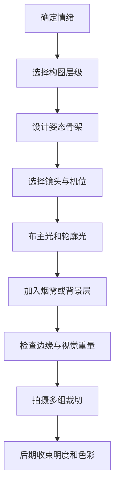

# LoL 原画风格摄影转译与高级人像构图

> [!summary]
> 摄影转译的重点不是复刻 LoL 角色、服装或官方视觉资产，而是把原画里的英雄视角、动态构图、体积光、材质分离、冷暖对冲和裁切可读性转成真实拍摄与后期流程。

## 方法总论

摄影里的“原画感”来自拍摄阶段的结构控制，而不是后期叠光效：

- **姿态和镜头先决定英雄感**：低机位、广角、对角线、动态三角和手/道具位置，比后期特效更基础。
- **光影先建立空间**：主光、轮廓光、背景光、烟雾和体积介质要让人物从背景里分离。
- **材质要可读**：皮肤、布料、金属、皮革、道具和发光物要有不同高光行为。
- **裁切是叙事工具**：环境、半身、极紧特写分别改变信息密度和情绪强度。
- **视觉重量比居中更重要**：画面是否稳定，取决于明暗、面积、位置、锐度、饱和度和细节密度如何分布。

## 从原画到摄影的转译

| 原画语言 | 摄影转译 | 检查点 |
|---|---|---|
| 动态横向姿态 | 让身体、手臂、道具、衣摆沿横向或对角线展开 | 姿态是否填满画幅，而不是站直 |
| 广角英雄视角 | 低机位、适度广角、近大远小 | 面部是否变形过强，近端手脚是否抢主体 |
| 体积光与史诗感 | 烟雾、逆光、侧逆光、背景光束 | 光是否参与空间，而不是只照亮脸 |
| 材质分离 | 金属打硬边、皮革控反光、布料保纹理、皮肤保层次 | 服装是否黑成一团 |
| 技能核心 | 道具、发光物、手势或眼神成为主焦点 | 是否只有一个核心 |
| 冷暖对冲 | 暖肤色/主光对冷背景/边缘光 | 色彩是否服务主体分离 |
| 裁切安全 | 同一套姿态拍横幅、半身、头像局部 | 裁切后脸、手、道具是否仍可读 |

## 高级人像构图底层

人像构图的关键不是增加元素，而是更精确地控制边界、轴线、群组关系、视觉重量和人体姿态。

### 画面边界

摄影首先是在画面边缘做选择：什么被包含，什么被排除。边缘越靠近主体，心理张力越强。

- 宽构图：保留事件、环境、关系。
- 半身构图：保留表情、手、道具和身体语言。
- 极紧特写：压缩为表情、皮肤、眼神和光影符号。

### 轴线与视觉重量

画面可被理解为一个视觉质量分布系统。元素越大、越亮、越暗、越锐、越饱和、越靠边，视觉重量越强。

快速检查：

1. 脸是否是最高对比或最清晰区域。
2. 四象限中是否存在无意义高亮点。
3. 主重量是否靠近水平、垂直或对角轴。
4. 如果画面失衡，是否有明确叙事理由。

### 三角与对角线

- **三角结构**：用头、手、肘、膝、道具形成稳定骨架，适合庄重、权力、肖像感。
- **对角线结构**：用肩线、脊柱、腿线、楼梯、窗光、道具制造动势，适合冲突、时尚、战斗感。
- **动态三角**：保留三角稳定性，同时让其中一条边倾斜或被道具拉长。

### 负空间与边缘张力

负空间给视线速度和情绪留余量。主体贴边、不按视线方向留空间、边缘出现强高光，都可能制造张力。

使用前先问：这次贴边是为了孤独、压迫、对抗、窥视，还是只是构图失误？

## 现场工作流

### 拍摄前

- 明确关键词：力量、庄重、冲突、孤独、压迫、脆弱、神秘。
- 选择结构：静态、三角、对角线、边缘张力、负空间。
- 准备道具：道具必须参与构图，不只是占位。
- 预设裁切：横幅、半身、极紧特写至少想好两套。

### 拍摄中

- 边缘扫描：四角是否切到手指、脚尖、发际线、关节、道具尖端。
- 轴线检查：脸、手、道具是否构成明确路径。
- 光线检查：脸部是否比背景更可读，边缘是否有逃逸高光。
- 姿态检查：肩线、胯线、脊柱线是否有方向。
- 材质检查：黑色服装、金属、皮革和皮肤是否分得开。

### 拍摄后

- 同一张保留至少两个裁切版本：信息多/信息少。
- 先压背景和边缘干扰，再强化脸部与主道具。
- 用 Dodge & Burn 做局部权重，而不是用一层 LUT 代替结构。
- 光效只能加强已有动作和空间，不应遮挡真实姿态与表情。

## 技法与参数

| 技法 | 目的 | 姿态/取景 | 镜头倾向 | 光线倾向 | 失败症状 |
|---|---|---|---|---|---|
| 有意识身体裁切 | 控制信息密度 | 环境、半身、极紧三套版本 | 中长焦更可控 | 脸部最高层次 | 手指、关节被含糊截断 |
| 动态三角 | 稳定中带冲击 | 头、手、道具形成三点 | 50-135 等效 | 短光或侧光塑形 | 三点同高同距，画面僵 |
| 对角线构图 | 制造动势 | 肩线、躯干、腿线倾斜 | 35-85 等效 | 侧光、硬边阴影 | 线条被背景打断 |
| 边缘张力 | 制造压迫或悬置 | 主体贴边或留巨大负空间 | 视叙事而定 | 控制边缘高光 | 看起来像裁切失误 |
| 视觉重量平衡 | 让复杂画面可控 | 四象限重量对冲 | 任意 | 脸部层次高于背景 | 背景亮点偷走注意力 |
| 英雄视角 | 放大力量感 | 低机位、前景肢体、道具延展 | 适度广角 | 轮廓光、体积光 | 手脚抢脸、面部变形 |
| 材质强化 | 增加原画完成度 | 服装和道具露出高光面 | 任意 | 边缘光、偏振控制 | 黑成一团或质感同质 |

起步参数：

- 极紧特写：1/160-1/250，f/2-f/4，ISO 100-800；景深不足时收至 f/3.2-f/5.6。
- 边缘张力需要硬边界时：适当增加景深到 f/4-f/8。
- 对角线和环境人像：35-85 等效更容易收进结构线。
- 稳定三角肖像：50-135 等效更容易压缩三点关系。
- 英雄低机位：先保护脸部透视；面部变形过强时后退机位或改用更长焦段。

## 模型口令

用于现场指导：

- “身体沿这条线倾斜，肩膀不要正对镜头。”
- “离镜头近的手抬一点，但不要挡脸。”
- “左手扶道具，右手靠近脸，头回到我这边。”
- “把重心压到一只脚，另一只脚放松向前。”
- “眼睛看向画面边缘，不给视线方向留太多空间。”
- “披风/外套向这个方向甩，和身体动作线一致。”

用于后期判断：

- 脸是否仍是第一注意力。
- 画面边缘是否有逃逸高光。
- 裁切是否改变了叙事主语。
- 道具是否在引导视线，而不是抢视线。
- 烟雾、粒子、光束是否服务空间层次。

## 常见问题

| 问题 | 修法 |
|---|---|
| 后期很重但没有原画感 | 回到姿态、镜头、光影和材质，不要继续叠特效 |
| 人像变形过强 | 后退、换更长焦、降低广角夸张程度 |
| 裁切尴尬 | 要么更大胆进入符号层，要么放宽回到肖像层 |
| 张力没出来 | 明确贴边动机，并同步控制视线方向和负空间 |
| 画面歪但不高级 | 检查主重量是否有轴线支撑，压掉边缘杂物 |
| 材质不读 | 增加边缘光、偏振控制或局部 Dodge & Burn |
| 背景抢戏 | 降低背景饱和、锐度和局部亮点 |

## 参考来源

以下外部来源来自原始材料中保留的参考线索，用于继续核查案例与构图理论：

- [NGA - Outside the Frame: How Dorothea Lange Created Her Iconic Photographs](https://www.nga.gov/stories/articles/outside-frame-how-dorothea-lange-created-her-iconic-photographs)
- [NGA - Korean Child](https://www.nga.gov/artworks/224794-korean-child)
- [NGA - Korean Child, tighter crop variant](https://www.nga.gov/artworks/225080-korean-child)
- [NGA - Portrait of a Ballet Dancer, Paris](https://www.nga.gov/artworks/103750-portrait-ballet-dancer-paris)
- [NGA - Portrait of a Tailor](https://www.nga.gov/artworks/227382-portrait-tailor)
- [NGA - Portrait of a Woman](https://www.nga.gov/artworks/169338-portrait-woman)
- [Library of Congress - Genthe Collection: The Negative and the Print](https://www.loc.gov/pictures/collection/agc/technique.html)
- [MoMA Press Archive - The Photographer's Eye](https://www.moma.org/docs/press_archives/3800/releases/MOMA_1966_July-December_0106_150.pdf)

## Related

- [[LoL 现代原画风格系统]]
