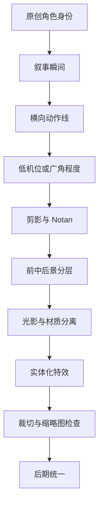

# LoL 现代原画风格系统

> [!summary]
> LoL 现代原画感不是某个颜色、特效或角色符号，而是“原创角色身份 + 清晰剪影 + 动态叙事姿态 + 激进但可信的透视 + 分层光影材质 + 实体化特效 + 裁切可读性”的组合系统。

## 总原则

这个系统适合做原创角色图像生成、概念设计、视觉风格拆解和图像审核。它只抽象视觉语言，不复刻官方角色、皮肤、阵营标志、专属武器或受保护视觉元素。

核心判断：

- **先原创身份，后风格控制**：角色职业、性格、能力、材质、动作动机必须先成立，再套用原画语言。
- **剪影优先于细节**：缩略图中看不清脸部、身体方向、主武器或技能核心时，后续渲染都失效。
- **叙事瞬间优先于静态展示**：画面应像战斗、施法、冲刺、抵挡或转身的关键一帧，而不是普通设定图。
- **构图、透视、光影、材质和特效必须服务同一动作**：不要让多个主光源、多个技能核心和多个动作方向互相抢戏。
- **视觉冲击必须保持可信**：低机位、广角、短缩、夸张比例可以强化英雄感，但不能破坏脸部、手脚和武器的结构可信度。

## 风格主控层

| 控制层 | 作用 | 实操判断 | 常见失败 |
|---|---|---|---|
| 原创身份 | 防止变成 IP 复刻 | 能否不用官方英雄名也说明角色是谁 | 直接套英雄、皮肤、阵营符号 |
| 叙事瞬间 | 让画面有事件感 | 角色正在做什么、为什么此刻重要 | 站桩、摆拍、无动作动机 |
| 剪影与 Notan | 建立第一可读性 | 黑白缩略图仍能看清主体 | 细节很多但大形糊 |
| 动作线 | 制造速度和张力 | 身体、披风、武器、特效是否形成方向 | 动作线断裂或互相冲突 |
| 英雄视角 | 放大力量感 | 低机位、广角、近大远小是否指向主焦点 | 近端手脚抢脸 |
| 材质分离 | 增加完成度 | 皮肤、金属、布料、皮革、能量是否有不同高光 | 所有材质糊成一层 |
| 实体化特效 | 让魔法进入空间 | 特效是否有体积、光源、遮挡、投影 | 平面粒子堆叠 |
| 后期统一 | 收束画面 | Bloom、锐化、色差、调色是否只做统一 | 后期掩盖结构问题 |

## 构图系统

LoL 原画常服务横向展示、客户端裁切、缩略图、局部头像等多种观看方式，因此构图不能只为单张完整大图服务。

### 双重裁切

- 先确定完整横幅中的主体占位。
- 再检查局部头像、移动端缩略图和安全区。
- 面部、胸腔、主武器、技能核心应落在可被裁切保留的位置。
- 手脚、披风、粒子可以延展到边缘，但不能让关键识别信息卡在危险边界。

### 动态横向姿态

横向画幅天然需要角色沿宽度展开。有效方式包括：

- 身体、披风、武器、能量束沿横向或对角线延伸。
- 肩线和胯线倾斜，避免正面垂直站姿。
- 用肢体和武器形成 X 形、三角形或强对角骨架。
- 让背景建筑、烟雾、光束继续推动同一个方向。

### 武器骨架与视觉路径

武器、硬表面道具、披风边缘和特效不只是装饰，它们应承担构图功能：

1. 从画面边缘引入视线。
2. 指向脸部、胸腔或技能核心。
3. 与身体动作线形成交叉张力。
4. 在裁切后仍保留方向感。

### 负空间与可读性

负空间不是空白，而是给动作、裁切和阅读留呼吸区。背景复杂时尤其要保留：

- 主体轮廓外的明度反差。
- 技能特效运动方向上的空间。
- 面部附近的清晰边界。
- 横幅边缘的裁切余量。

## 视觉演变逻辑

LoL 原画可以粗略理解为从“识别图”走向“电影化叙事镜头”：

1. **功能性肖像期**：角色识别优先，姿态直接，背景相对弱。
2. **动态叙事期**：动作、镜头和背景开始讲述能力与世界观。
3. **电影化沉浸期**：强调广角近景、短缩、体积光、空间层级、区域色彩和叙事瞬间。

这个演变不是简单的“画质提升”，而是从“看清角色”升级为“在一个高张力瞬间看清角色”。

## 色彩与区域语义

区域色彩可作为情绪和世界观的语义参考，但不能当作固定色卡或可复制标识。色彩最终仍要服从光源、空间和主体可读性。

| 语义方向 | 常见色彩倾向 | 使用方式 |
|---|---|---|
| 高贵、秩序、正义 | 白、金、蓝 | 适合明亮主光、清晰金属、稳定构图 |
| 军事、压迫、权力 | 黑、红、铁灰 | 适合硬边阴影、重型材质、低饱和背景 |
| 污染、实验、街巷 | 毒绿、紫、脏黄 | 适合环境雾、局部荧光、材质腐蚀感 |
| 幽暗、亡灵、诅咒 | 青绿、黑、冷白 | 适合逆光、体积雾、低明度环境 |
| 科技、发明、秩序 | 金铜、蓝、白 | 适合硬表面、边缘高光、几何背景 |
| 异域、虚空、危险 | 紫、洋红、电蓝 | 适合非自然光、边缘辉光、空间扭曲 |

## 执行流程



可执行顺序：

1. 定义原创角色身份：职业、能力、性格、材质、弱点。
2. 选择叙事瞬间：攻击、防御、施法、坠落、冲刺、转身、召唤。
3. 设计横向动作线：身体、武器、披风、特效共用一个主方向。
4. 选择镜头：低机位、广角、近景、短缩，但优先保护脸部。
5. 建立 Notan：先看大明暗和剪影，再做局部纹理。
6. 区分材质：金属硬边、布料柔边、皮肤半透、皮革低光、能量自发光。
7. 添加特效：给魔法厚度、投影、遮挡和环境反光。
8. 检查裁切：横幅、缩略图、头像局部都要保留核心识别。
9. 最后统一：用大气透视、焦点、色调和轻量后期收束。

## 生成与审核提示

### 正向控制词思路

不要直接写官方英雄名。用抽象视觉层描述：

```text
original fantasy champion-like character, cinematic splash art composition, dynamic diagonal pose, low-angle wide lens perspective, readable heroic silhouette, strong Notan value design, layered rim light and volumetric light, distinct metal fabric leather skin and magical energy materials, one clear skill core, atmospheric perspective, high readability thumbnail
```

可替换字段：

| 字段 | 替换方向 | 示例 |
|---|---|---|
| identity | 原创身份 | storm-forged duelist, lunar artificer, desert oathbreaker |
| action | 叙事动作 | lunging forward, casting a shield, landing from a leap |
| camera | 镜头 | low angle, wide lens, dramatic foreshortening |
| composition | 构图 | X-shaped pose, diagonal weapon line, triangular focus path |
| lighting | 光影 | rim light, split complementary lighting, volumetric backlight |
| material | 材质 | polished metal, worn leather, embroidered fabric, glowing crystal |
| effect | 特效 | volumetric magic, energy arc, smoke trail, reflected glow |

### 负向控制

```text
no official hero name, no skin replica, no faction logo, no trademarked weapon, no copied costume, no unreadable silhouette, no flat particle effects, no multiple competing skill cores, no excessive bloom, no broken anatomy
```

## 故障排除

| 症状 | 优先修法 |
|---|---|
| 画面不像现代原画 | 强化动作线、低机位、轮廓光、材质分离和叙事瞬间 |
| 像普通奇幻插画 | 增加广角空间冲击、技能核心、裁切安全区和电影化光影 |
| 像官方复刻 | 删除英雄名、阵营标志、专属武器和可识别服装，只保留抽象风格原则 |
| 画面杂乱 | 回到三层空间、一个主焦点、一个动作方向 |
| 特效平面 | 增加厚度、光源、遮挡、投影和环境反光 |
| 武器抢脸 | 降低武器明度或让武器线条导回脸部 |
| 缩略图不可读 | 提高剪影反差，减少背景细节，强化面部和胸腔焦点 |

## 禁区

- 不要复刻官方英雄、皮肤、阵营标志、专属武器或标志性服装。
- 不要用“高饱和 + 粒子 + Bloom”代替构图和光影。
- 不要在未建立 Notan 和剪影前堆细节。
- 不要让多个技能核心同时争夺视觉焦点。
- 不要让背景世界观信息压过主体动作。
- 不要牺牲解剖可信度来追求广角冲击。

## Related

- [[LoL 原画风格摄影转译与高级人像构图]]
