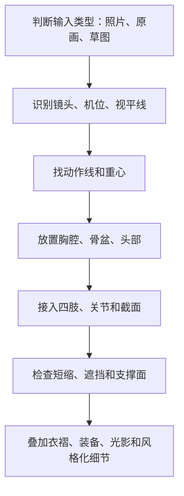

# 人体结构、素体与透视拆解

> [!summary]
> 人体结构分析的核心不是临摹外轮廓，而是先建立可受力、可旋转、可透视的体块系统。无论输入是照片、角色原画还是设计草图，都应先判断镜头与空间，再还原胸腔、骨盆、头颈、四肢和重心。

## 核心判断

人体结构可以被理解为一组互相嵌入、互锁和受力的三维体块。George Bridgman 式的建构解剖并不追求医学命名完整，而是把胸腔、骨盆、头、四肢概括成盒、楔、柱、球等可透视形体。

关键不是“画得像”，而是能回答这些问题：

- 胸腔朝向哪里，骨盆朝向哪里？
- 两者之间是压缩、拉伸、扭转还是对抗？
- 重心垂线是否落在支撑面内？
- 肢体是否真实挂接在胸腔和骨盆上？
- 透视短缩是否通过截面、重叠和体积表达，而不是简单缩短线段？
- 服装、衣褶、装备、光影是否服从内部体块？

## 从轮廓回到体块

| 层级 | 关注点 | 常见错误 | 修正方式 |
|---|---|---|---|
| 动作线 | 身体主要能量方向 | 只画漂亮曲线，没有结构落点 | 让动作线落到胸腔、骨盆和支撑脚 |
| 胸腔 | 上身朝向、肩线、肋骨体积 | 上身像平面剪影 | 用盒体或卵形标出朝向和截面 |
| 骨盆 | 腰臀支撑、腿部挂接、重心 | 只画外部腰臀线 | 先建立骨盆盒或楔形，再画曲线 |
| 关节 | 体块转换、压缩、互锁 | 把关节画成折点 | 增加关节体块、压缩面和过渡 |
| 四肢 | 方向、短缩、截面 | 肢体漂浮或像管子 | 用柱体截面、重叠和端点透视检查 |
| 手脚 | 受力终端、比例终端 | 当作附属细节 | 用手脚判断透视、重心和动作可信度 |

> [!tip]
> 如果姿态僵硬，优先检查胸腔与骨盆是否形成对抗；如果肢体漂浮，优先检查关节体块和挂接点；如果轮廓不可信，回到盒体透视和截面方向。

## 摄影图像的结构还原

照片不是人体比例的直接证据。二维照片会受到焦段、机位、透视压缩、镜头畸变和遮挡影响；直接按画面长度重画人体，容易把透视短缩误判为比例错误。

摄影逆向分析的顺序：

1. 判断镜头倾向：广角会增强近大远小和边缘拉伸，长焦会压缩空间。
2. 定位视平线和机位：用背景线、椭圆开口、人物眼高和地面接触点判断观者高度。
3. 找骨骼地标：锁骨、胸骨、髂前上棘、膝盖、踝、肘等点比衣褶和表面轮廓更可靠。
4. 建立内部透视网格：在胸腔、骨盆、四肢上标轴线和截面方向。
5. 还原素体：先放胸腔和骨盆，再接入头颈、四肢和手脚。
6. 检查重心：重心垂线必须落在支撑面内，除非画面明确表现动态失衡。

> [!warning] 摄影分析的误区
> 不要把照片外轮廓当成真实解剖边界；不要忽略广角造成的头、手、脚放大；不要用平均人体比例覆盖极端机位下的透视变化；被遮挡结构应标注推断性质，不要写成确定事实。

## 角色原画的虚拟镜头

角色原画不是照片，但常常模拟虚拟镜头：焦距、机位、视角、空间压缩、近大远小和边缘拉伸都会参与画面冲击力。分析原画时，应先拆镜头，再拆人体。

角色原画结构拆解可以分成五层：

1. **虚拟焦距与机位**：判断画面是广角冲击、常规视角还是长焦压缩。
2. **视平线与消失方向**：不必机械套单一消失点，但空间倾向必须可解释。
3. **胸腔、骨盆、头部**：这三组体块决定姿态可信度。
4. **四肢短缩与关节**：短缩应通过截面、重叠、明暗和端点大小表达。
5. **衣褶、装备和光影**：表面元素必须服从挂点、厚度、遮挡、重力和张力。

| 问题症状 | 优先检查 | 处理方向 |
|---|---|---|
| 动作夸张但不可信 | 重心、支撑点、短缩截面 | 先修体块关系，再修线条 |
| 装备像贴纸 | 厚度、搭接、投影、挂点 | 让装备包裹或压在体块上 |
| 透视混乱 | 背景透视与人体局部透视 | 分开分析，不用一个消失点强解所有结构 |
| 角色不立体 | 体块明暗、边缘重叠、前后层次 | 强化体块转面与遮挡关系 |
| 衣褶混乱 | 支撑点、拉伸点、受压点 | 让衣褶服从身体体块和重力 |

## 素体重建工作流

执行时不要让“动作线”替代体块。动作线只负责方向和节奏，真正让姿态成立的是胸腔、骨盆、关节、截面和重心。

## 结构原则

- **先观念，后轮廓**：先建立三维体块观念，再处理表面线条。
- **先骨架，后修饰**：先让素体成立，再叠加服装、装备、风格化比例和光影。
- **先整体，后局部**：胸腔、骨盆、头部方向优先于手指、衣褶和装饰。
- **先空间，后长度**：短缩、广角和压缩会改变画面长度，不能只按二维长度判断比例。
- **先受力，后韵律**：韵律线必须服务重力和结构，不能变成装饰曲线。

## 检查清单

- [ ] 是否判断了镜头、焦距倾向、机位和视平线？
- [ ] 胸腔、骨盆和头部是否有明确朝向？
- [ ] 胸腔与骨盆之间是否有压缩、拉伸、扭转或对抗？
- [ ] 重心垂线是否落在支撑面内？
- [ ] 四肢是否真实挂接到胸腔和骨盆？
- [ ] 关节是否作为体块转换区，而不是简单折点？
- [ ] 短缩是否有截面、重叠、明暗和端点透视？
- [ ] 衣褶和装备是否有挂点、厚度、受力和遮挡关系？
- [ ] 光影是否服务体块转面，而不是覆盖结构问题？

## 边界

不要直接复制受保护角色设计；不要把装饰细节当成结构依据；不要用 3D 模型机械描摹导致动作僵硬；不要把医学精确度误当作艺用结构的目标。

相关主题：[[漫画身材比例美学与风格化边界]]、[[照片身材风格化修饰工作流]]
