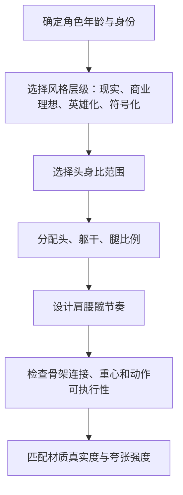

# 漫画身材比例美学与风格化边界

> [!summary]
> 漫画身材不是现实人体的复制，而是把成熟、力量、速度、优雅、可爱或时尚感编码进比例。比例夸张可以有效，但必须保留骨骼连接、重心逻辑、角色年龄定位和风格一致性。

## 风格化现实主义

风格化现实主义是在真实解剖基础上选择性夸张比例，使角色仍然能被理解为可信人体。它不是“越长越美”或“越细越好”，而是通过头身比、肩腰髋、腿部占比、姿态张力和材质真实度之间的协调，制造特定角色感。

常见审美信号包括：

- 小脸：让身体显得更高、更成熟或更时尚。
- 长腿：强化速度、优雅、舞台感和商业吸引力。
- 腰臀差：制造曲线节奏，但必须依赖胸腔、腹部和骨盆过渡。
- 肩颈线：决定成熟度、力量感和姿态气质。
- 姿态张力：比单点夸张更能制造吸引力。

## 头身比光谱

| 头身比倾向 | 视觉感受 | 常见用途 | 风险 |
|---|---|---|---|
| 约 6 头身 | 现实、亲和、重心较低 | 写实摄影、生活化角色 | 商业理想化不足时可能显普通 |
| 约 7-7.5 头身 | 商业理想、成熟、自然修饰 | 写实插画、时尚化角色 | 需要控制小脸和腿长的平衡 |
| 约 8 头身 | 经典理想化、英雄化 | 角色原画、海报、时装感 | 真实材质过强时容易违和 |
| 8.5 头身以上 | 超现实、符号化、强插画感 | 英雄、神性、舞台化设计 | 结构不成立时进入恐怖谷 |

头身比变化不是连续写实尺度，而是风格层级的切换。越接近真实照片，夸张幅度应越克制；越接近插画和符号化设计，可夸张空间越大。

## 比例心理

漫画比例利用的是观众对某些身体信号的高敏感度。腿长、小脸、腰臀差和肩颈线会被心理放大，形成所谓超常刺激。但超常刺激必须被风格容器承接，否则容易产生恐怖谷。

恐怖谷通常来自冲突：

- 真实皮肤材质搭配不真实骨架。
- 极端小脸搭配照片级五官和真实头颈。
- 长腿拉伸破坏膝盖位置、脚踝接地和骨盆高度。
- 细腰没有肋骨、腹部和骨盆之间的体积过渡。
- 成人性感比例与幼态符号、未成年人身份或模糊年龄混合。

> [!warning] 风格化边界
> 性化比例不得与幼态符号、未成年人身份或模糊年龄结合。风格化身体也不应被写成现实身体优劣标准，尤其不要把商业化比例当作医学或现实评价。

## 肩腰髋与躯干节奏

漫画身材的曲线不是外轮廓收放，而是胸腔、腰部和骨盆之间的连续转折。

- 胸腔决定上半身体积、肩线和呼吸感。
- 腰部是胸腔与骨盆之间的过渡，不是单独向内收的一段线。
- 骨盆决定腰臀线支撑、腿部挂接和重心。
- 腹部体积决定腰臀曲线是否可信。
- 大腿根部和髋部连接决定腿长是否自然。

如果曲线显假，通常不是曲线不够大，而是缺少体积过渡。

## 腿长感的真实来源

腿长视觉不是简单拉长大腿。更稳定的做法是组合调整：

| 杠杆 | 作用 | 失败症状 |
|---|---|---|
| 腰线 | 改变腿部起点感 | 腰线过高导致躯干断裂 |
| 骨盆高度 | 决定腿部挂接位置 | 髋部与大腿根不连贯 |
| 膝盖位置 | 影响大小腿比例 | 膝盖过低或过高导致假肢感 |
| 脚踝线 | 延展腿部终点 | 脚踝与鞋型不接地 |
| 鞋型 | 延长视觉轴线 | 鞋像贴片，没有体积 |
| 相机裁切 | 放大纵向比例 | 背景和透视不一致 |

## 风格化决策流程

## 可执行原则

- 比例夸张前先确定角色年龄、类型和风格层级。
- 小脸、长腿、细腰和大髋不能孤立处理，必须放回整体头身比。
- 腰部曲线来自胸腔与骨盆关系，不是简单向内收线。
- 膝盖位置和小腿长度对腿长感知影响大于单纯拉伸大腿。
- 视觉吸引来自节奏和对比，不是所有部位同时夸张。
- 商业比例应服务角色定位，不应追求单一极限比例。

## 自检问题

- 这个比例是现实、商业理想、英雄化还是超现实符号？
- 材质真实度是否匹配比例夸张强度？
- 腰臀曲线是否有肋骨、腹部和骨盆支撑？
- 长腿是否通过腰线、膝盖、脚踝、鞋型和姿态共同完成？
- 是否出现真实皮肤和不真实骨架的冲突？
- 是否误把风格化比例写成现实身体标准？

相关主题：[[人体结构、素体与透视拆解]]、[[照片身材风格化修饰工作流]]
