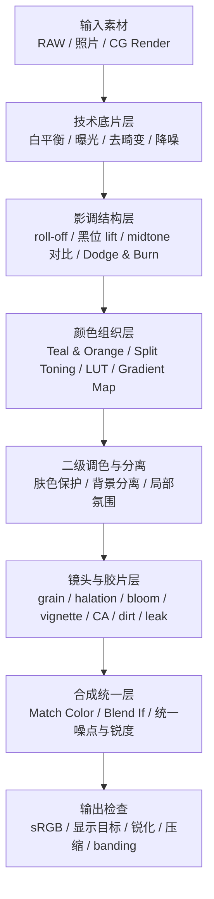

# Photoshop 电影感与 CG 原画感后期方法

电影感和 CG/原画感都不是一个滤镜或一个 LUT，而是一组视觉线索的协同结果。电影感偏向“真实镜头 + 介质痕迹 + 受控风格化”；CG/原画感偏向“结构化光影 + 材质可读性 + 空间分层 + 可设计性”。两者可以结合，但主导逻辑不同：先让画面结构成立，再叠加镜头、胶片和风格痕迹。

> [!summary]
> 稳定出效果的关键顺序是：非破坏式底片 → 影调结构 → 色彩组织 → 局部分离 → 镜头/胶片痕迹 → 合成统一 → 输出检查。不要先堆 LUT、暗角、颗粒、Bloom、Halation，再回头补曝光、光向和材质结构。

## 核心判断

### 电影感为什么成立

电影感来自对真实摄影系统的重建，而不是单纯把画面调暗或调成某种颜色。可被感知的线索包括：

- **Highlight Roll-off**：高光接近白时仍有柔和过渡，不是突然剪切成白洞。
- **Lift Blacks**：黑位轻微抬起，暗部不死黑，但仍保留重量。
- **Midtone Contrast**：主要靠中间调和局部对比塑形，而不是全局暴力 S 曲线。
- **Color Separation**：通过 Teal & Orange、Split Toning、通道曲线、Selective Color 等手段，把主体、肤色、环境和光源分开。
- **Optical / Film Artifacts**：颗粒、Bloom、Halation、Chromatic Aberration、Vignette、Lens Dirt、Light Leak、Flare 等痕迹让数字图像不再过于干净。

### CG/原画感为什么成立

CG/原画感来自更强的结构、材质与空间可读性：

- **Value Grouping / Notan**：先把画面压成 2-4 个明度层级，看大明暗块是否成立。
- **AO 思维**：强化接触阴影、缝隙遮蔽和落地感，让物体有重量。
- **Z-Depth / 空气透视**：距离越远，对比、饱和、锐度越低，色温更贴近环境。
- **Specular / Roughness 设计**：高光形状和边缘软硬决定材质类别，不能所有材质都被处理成同一种塑料感。
- **Rim Light / SSS**：用轮廓光分离主体，用局部透光强化皮肤、耳朵、手指、叶片等半透明材质。

> [!tip] 结合方式
> 先用 CG/原画逻辑把结构、空间和材质做清楚，再用电影逻辑把镜头、胶片、高光行为和色彩做有机。结果可以是“结构清晰的电影感”，也可以是“带镜头媒介痕迹的 CG 感”。

## Pass 化工作流



### 1. 技术底片层

目标是建立干净、可迭代、动态范围尽量充足的底片。

- 用 **Smart Objects / Smart Filters / Adjustment Layers** 保持非破坏式流程。
- 先处理白平衡、曝光、镜头畸变、基础降噪和明显瑕疵。
- 如果要做重度调色、雾化、柔光、天空渐变或肤色过渡，优先用 16-bit，降低 banding 风险。
- LUT 不应承担“救曝光”和“救白平衡”的职责，它应该作为后置风格层。

### 2. 影调结构层

这一层决定画面的“电影底子”。

| 目标 | 常用方法 | 判断标准 | 常见失败 |
|---|---|---|---|
| 高光柔和 | Curves 压高光、亮部压缩、轻 Bloom | 高光仍有层次，接近白时过渡自然 | 高光被压灰，画面失去亮点 |
| 暗部有呼吸 | Curves 抬黑位、Levels 调黑场 | 暗部不死黑，但仍有重量 | 全图发雾、黑位脏 |
| 体积可读 | Midtone Contrast、Dodge & Burn、局部曲线 | 脸部、服装、道具、空间有明确起伏 | Clarity 过度、脏边、皮肤硬 |
| 细节收口 | High Pass、Smart Sharpen、Texture | 材质更清楚但边缘不炸 | 噪点被锐化、出现白边 |

### 3. 颜色组织层

颜色不是装饰，而是叙事和分离工具。

| 方法 | 适合解决 | 使用要点 | 风险 |
|---|---|---|---|
| Teal & Orange | 主体与环境分离、商业电影氛围 | 阴影/环境偏 teal，高光/肤色偏暖 | 全图染色，肤色发灰发绿 |
| Split Toning | 情绪片、夜景、冷暖关系 | Shadows 冷、Highlights 暖，Midtones 轻动 | 暗部彩噪和脏黑被放大 |
| RGB Channel Curves | 精准偏色与高级调色 | 高光轻推暖，阴影轻推冷，少放曲线点 | 曲线打结、色带、白色被染 |
| Selective Color | 肤色保护、环境偏色纠正 | 先 Neutrals/Blacks，再 Reds | 中性灰偏色，画面脏 |
| Gradient Map | CG/原画统一气氛 | 暗部给环境色，亮部给光源色，用 Opacity 控强度 | 滤镜味、肤色被破坏 |
| LUT / LUT Stacks | 项目一致性和批量风格 | 每个 LUT 低不透明度，分工明确 | 曝光白平衡不稳时直接崩 |
| Log / ACES 思维 | 先保留宽容影调，再输出风格 | 技术校正层与风格层分开 | 在 8-bit 中易 banding |

### 4. 二级调色与局部分离

局部分离决定风格是否高级。全局处理只能建立方向，不能解决主体、背景、肤色、材质之间的关系。

- 人像先保护肤色，再大胆处理背景和阴影。
- 用 Select Subject / Select and Mask 作为遮罩起点，但头发、透明材质和复杂边缘必须继续修。
- 用 Blend If 做亮度范围融合时要拆分滑块，避免硬台阶。
- 合成素材优先统一光向、影子、透视和景深，再统一色彩；只 Match Color 通常不够。

### 5. 镜头与胶片层

这一层负责让画面从“数字图像”变成“通过镜头和介质观看的图像”。所有伪影都应该服从高光、边缘、光源位置和镜头逻辑。

| 伪影 | 作用 | 放置逻辑 | 失败症状 |
|---|---|---|---|
| Film Grain / Add Noise | 胶片质感、抗 banding | 按输出尺寸和观看倍率调整 | 颗粒太尖、肤色显脏 |
| Halation | 高亮边缘红橙侵蚀 | 只作用于接近剪切的亮边 | 全图泛红，像描边 |
| Bloom / Glow | 极亮区域向外扩散 | 高亮阈值提取后模糊，Screen/Add | 白糊、细节丢失 |
| Vignette | 中心聚焦和镜头感 | 轻、软、广 | 边缘死黑，构图拥挤 |
| Chromatic Aberration | 边缘色散和镜头缺陷 | 只在边缘和高反差边界轻微出现 | 全局 RGB 分离，廉价感 |
| Lens Dirt | 强光下的污渍散射 | Dirt 纹理绑定强光高亮 | 污点固定且突兀 |
| Light Leak / Flare | 复古或强光入镜感 | 服从光源方向和镜头位置 | 像贴纸，过饱和 |
| Anamorphic Streak | 大片/科幻横向炫光 | 只绑定亮点和反光 | 到处都有，显俗 |

### 6. 合成统一层

最后收口不是再加一个总 LUT，而是统一整张图的物理与输出关系：

- 统一噪点频率：不同来源素材的颗粒、锐度、压缩感要接近。
- 统一锐度层级：主体可以更锐，远景和雾化区域应更软。
- 统一透视和焦点：Perspective Warp / Vanishing Point 解决平面和建筑贴合问题。
- 统一光学缺陷：同一张图中的 Bloom、CA、Vignette、Grain 应像来自同一镜头系统。
- 输出前检查 sRGB、压缩、缩放后的颗粒观感和大面积渐变 banding。

## 方法选择速查

| 方法族 | 主要效果 | 复杂度 | 更偏摄影路径 | 更偏 CG/原画路径 | 选择建议 |
|---|---|---:|---|---|---|
| Levels / Curves / Exposure | 定 key、控制动态范围 | Low-Med | 强 | 中 | 先把曝光和白平衡打稳，再上风格层 |
| RGB Curves / Selective Color | 精准偏色、肤色保护 | Med | 强 | 强 | 人像先保肤色，环境色可更大胆 |
| LUT / Color Lookup | 快速统一风格 | Low-Med | 强 | 强 | LUT 是风格层，不是基础校正层 |
| Grain / Noise | 胶片质感、抗色带 | Low | 强 | 中 | 颗粒按输出尺寸调，最后复查 |
| Bloom / Halation / Flare | 镜头与胶片光学伪影 | Med | 强 | 中 | 绑定高光和光源，不要全图乱加 |
| DOF / Z-Depth / 空气透视 | 空间深度和焦点 | Med-High | 中 | 强 | 深度图与边缘质量决定上限 |
| Select & Mask / Blend If / Match Color | 多素材融合 | Med-High | 强 | 强 | 先统一光向、影子和透视，再统一颜色 |
| CG Pass / AOV 思维 | 拆分 Diffuse / Spec / SSS / Z | High | 中 | 强 | 适合照片渲染化或 CG 可控收口 |
| Rim / SSS / Roughness | 材质和光照可读性 | Med-High | 中 | 强 | 用高光形状和软硬解释材质 |
| Notan / Value Grouping / Limited Palette | 原画结构和大关系 | Med | 弱 | 强 | 先检查大明暗块，再细化连续明度 |

## 风格配方

> [!tip]
> 配方默认使用 Smart Object + Adjustment Layers + Mask。每一步都应该可回滚，强度用 Opacity、Blend Mode 和 Mask 控制。

### Teal & Orange 电影人像

```text
基础：Exposure / Levels 定黑白场
影调：Curves 做柔和 roll-off + 轻抬黑位
分离：Color Balance 阴影推 teal，高光保暖
保护：Selective Color 保护肤色和中性灰
收口：轻 Bloom + Camera Raw Grain + 轻 Vignette
```

### Moody Film Noir

```text
去色：Black & White / Channel Mixer 控制灰阶分离
影调：Curves 强化中间调对比，保留高光层次
光效：局部 Burn 做硬阴影或百叶窗光
质感：轻颗粒、少量 dust/scratch，避免全黑死块
```

### Bleach Bypass

```text
影调：提高对比，压暗阴影但保高光 roll-off
色彩：降低 Saturation / Vibrance，保留一点冷暖差
质感：High Pass 低强度 + 较明显 Grain
氛围：冷阴影 + 暖高光的轻量 Split Toning
```

### 70s Warm Film

```text
影调：抬黑位 + 压高光，建立低对比底色
颜色：高光和中间调整体偏暖，阴影略偏绿/青
瑕疵：Grain + 边缘 Light Leak
收口：少量 Halation 绑定灯源和高亮边缘
```

### Cold Cyberpunk Night

```text
基础：压高光但保霓虹细节，暗部不过死
颜色：阴影推青蓝/紫，高光保品红/青
局部：Selective Color 控制霓虹颜色和肤色污染
镜头：霓虹高光 Bloom + 边缘轻 CA
空间：远景加雾，对比、饱和、锐度下降
```

### ARRI-like 柔高光纪录片

```text
影调：柔和高光 roll-off + 轻抬黑位
颜色：轻 Split Toning，肤色保持自然
质感：低强度细颗粒 + 极轻 Vignette
注意：不追求强偏色，重点是宽容、自然和不过硬
```

### Blockbuster Anamorphic

```text
影调：中等对比，高光保护
镜头：横向 streak flare 绑定亮点和反光
光学：Bloom + Lens Dirt 只在强光处可见
收口：少量 Lens Distortion，中心信息保持清晰
```

### Gritty War / Doc

```text
影调：压饱和，抬黑位但保留局部对比
颜色：阴影偏冷或偏绿，肤色不过度美化
质感：较粗颗粒 + 选择性锐化
运动：轻方向 Blur 或轻微抖动暗示手持
```

### CG Stylized Character

```text
结构：Threshold / Posterize 检查 Notan 和值域分组
材质：重新设计 specular 形状和 roughness 软硬
光照：Rim Light 分离轮廓，薄处加轻 SSS
颜色：Gradient Map 统一气氛，Limited Palette 控主辅色
收口：轻电影颗粒或 Bloom，让渲染感不太硬
```

### Matte Painting Environment

```text
分层：FG / MG / BG 分组，每层独立对比、饱和、锐度
空间：远景更冷、更淡、更软，加入雾层渐变
透视：Vanishing Point / Perspective Warp 对齐建筑和贴图
统一：Match Color + 统一颗粒、锐度和镜头瑕疵
```

## 失败模式与修正

> [!warning] 高风险误区
> - **先上 LUT 后救曝光**：LUT 会放大曝光、白平衡和肤色问题。先做基础校正，再做风格层。
> - **高光没处理就加 Bloom / Halation**：白洞会被扩大成白糊。先做 roll-off，再做光学伪影。
> - **全局 RGB 分离、暗角、漏光**：缺乏镜头位置和光源逻辑，会立刻廉价。只在边缘、高反差边界、强光附近或镜头边缘出现。
> - **过度 Clarity / Sharpen**：容易 halo、皮肤脏、噪点被强化。改用局部 mask，并平衡降噪与颗粒。
> - **合成只调色不调光**：光向、阴影、透视、景深、锐度和噪点频率不一致时，Match Color 也救不了。
> - **为了电影感把高光压死、暗部抬灰**：高光仍需层次，黑位仍需力量。
> - **忽视 bit depth 和 banding**：重度渐变、雾化、柔光、天空和肤色过渡尽量用 16-bit；必要时用细噪点缓解。

### 因果诊断

| 症状 | 优先检查 | 修正方向 |
|---|---|---|
| 亮部过硬、白洞明显 | Highlight Roll-off | 曲线压高光，保留局部对比，再加轻 Bloom |
| 画面数字味太重 | 受控瑕疵 | 细颗粒、轻 CA、局部 Bloom、轻 Vignette |
| 画面太平 | 体积与空间 | Dodge & Burn、AO、景深、空气透视 |
| 材质都像塑料 | Specular / Roughness | 按材质重做高光形状、软硬和颜色 |
| 风格不稳定 | Pass 分层 | 技术层、影调层、颜色层、伪影层拆开 |
| 肤色脏或发绿 | 色彩分离 | 先保护 Reds / Midtones，再处理阴影和背景 |
| 合成元素假 | 物理一致性 | 光向、影子、透视、边缘、噪点、锐度逐项统一 |

## 输入材料

- Photoshop Cinematic and CG Look Guide（已合并入本笔记）
- Photoshop Cinematic Look Principles（已合并入本笔记）
