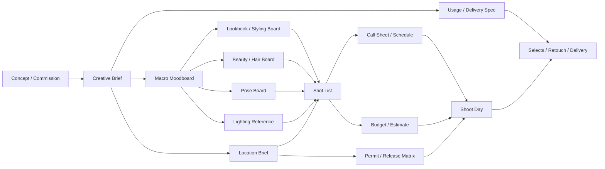

# 专业人像写真与 Fashion Editorial 前期策划执行模板

> [!summary]
> 核心不是把 moodboard 做漂亮，而是把概念拆成一组可签核、可排期、可预算、可落地的生产文件。最少要完成四层：`Creative Brief -> 部门板 -> Production 文件 -> Legal / Delivery 文件`。

专业人像写真、Fashion Editorial 与偏商业的人像项目，前期真正决定成败的，通常不是灵感本身，而是团队有没有把灵感翻译成明确的执行文档。一个成熟的前期包，至少要回答三件事：

- 为什么拍：主题、受众、目标、边界。
- 拍成什么：人物状态、造型、妆发、动作、光线、空间。
- 谁在什么时候、以什么条件完成：镜头优先级、现场节奏、预算、许可、交付和签核。

## 一页理解整套工作流



这张图的重点不是线性顺序，而是父子关系。`Creative Brief` 是母文件，后面的 boards 和 production 文件都应该能追溯回 brief。

## 四个强制签核点

| 关口 | 必签文件 | 主要签核人 | 目标 |
|---|---|---|---|
| Brief Lock | Creative Brief、Macro Moodboard | Photographer / Creative Lead、Client 或 Editor、Producer | 锁定题目、受众、预算级别、视觉大方向 |
| Department Lock | Lookbook、Styling Board、Beauty Board、Pose Board、Lighting Board、Location Shortlist | Stylist、HMU、Photographer、Producer | 锁定各部门怎么执行 |
| Production Lock | Shot List、Call Sheet、Budget、Permit Matrix、Releases | Producer、Photographer、Client/Editor | 锁定拍摄日 logistics、法务和资源 |
| Delivery Lock | Selects、Retouch Note、Usage Memo、Naming / Export Spec | Producer、Post、Client/Editor | 锁定交付范围、版本和发布合法性 |

> [!warning] 常见失控点
> 很多项目的问题不是没想法，而是没有明确的冻结点。只要没有版本号、owner 和 freeze date，文件就还是灵感碎片，不是生产文件。

## 文档栈：每份文件分别解决什么问题

| 文件 | 解决的问题 | owner | 最晚冻结时点 |
|---|---|---|---|
| Creative Brief | 为什么拍、给谁看、成败怎么判断 | Photographer / Creative Director / Producer | Moodboard v1 前 |
| Macro Moodboard | 这组片子的世界观与审美边界是什么 | Creative Lead | Department boards 前 |
| Lookbook | 每套 look 的轮廓、顺序和镜头适配 | Stylist | Fitting 后 |
| Styling Board | 单品、配饰、替补件、尺码、借样状态是否可执行 | Stylist | 开拍前 48 小时 |
| Beauty / Hair Board | 妆发如何稳定复现，哪些效果不能碰 | HMU Lead | Test 或 prep day 后 |
| Pose Board | 人体语言和动作节奏如何服务概念 | Photographer / Movement Director | Shot List 前 |
| Lighting Reference | 灯位与修光如何被他人复现 | Photographer / Gaffer / 1st Assistant | Prelight 后 |
| Location Scout Pack | 地点是否同时满足画面与物流 | Producer / Location Manager | Production Lock 前 |
| Shot List | 当天必须完成什么，优先级如何排 | Photographer / Producer / AD | Call Sheet 前 |
| Call Sheet | 谁何时到、做什么、联系谁 | Producer / Coordinator / AD | 开拍前一天 |
| Budget / Estimate | 计划如何变成资源配置 | Producer / EP | Production Lock 前 |
| Permit / Release Matrix | 地点、人物、财产、使用权是否能合法落地 | Producer / Client / Legal | 开拍前 |
| Delivery Spec | 拍完交什么、怎么命名、怎么找得到 | Producer / Digi Tech / Retoucher | 开拍前 |

## 最实用的执行原则

### 1. 一张总板不够，至少拆成五张部门板

总 moodboard 只定义世界观，不解决全部执行问题。更稳妥的做法是：

- `Macro Moodboard`：色温、材质、空间、人物气质、整体压力感。
- `Lookbook`：look 顺序、轮廓、整组节奏。
- `Styling Board`：单品、配饰、替补、借样与退样。
- `Beauty / Hair Board`：皮肤、眼唇、发丝、禁忌项。
- `Pose Board`：动作词、身体角度、手部语法、眼神方向。
- `Lighting Board`：灯位图、修光器、背景处理、镜头和功率范围。

### 2. 每张参考图都要有用途

参考图最好标清它在定义什么：

- 轮廓
- 姿态
- 肤感
- 光比
- 发丝状态
- 道具关系
- 空间尺度
- 构图张力

### 3. 现场优先级必须写进 Shot List

Shot List 不是按“想拍什么”排序，而是按“超时后还必须拿到什么”排序。最简单有效的办法，是给每个 shot 标 `A / B / C`：

- `A`：必须交付，任何情况下优先完成。
- `B`：关键补充，有时间必须做。
- `C`：加分项，只在现场顺利时执行。

## Creative Brief 模板

| 字段 | 填写规则 | 示例 |
|---|---|---|
| Project Title | 项目名 + 版本号 | `Glass City Faces v03` |
| Background / Problem | 只写为什么拍，不写拍法 | 为秋冬刊建立一组冷感城市肖像，用于封面和专题内页 |
| Objective | 可衡量、可验收 | 交付 8 张 final selects，其中 1 张 cover、2 张 opener、5 张 story pages |
| Audience | 写清读者或受众 | 25-40 岁，关注 designer fashion 与独立影像的都市读者 |
| Core Message | 压成一句判断 | 城市冷感不是疏离，而是自我防御后的锋利优雅 |
| Visual Keywords | 5-8 个词即可 | `reflective / severe / intimate / asymmetry / metallic` |
| Deliverables | 写张数、比例、用途 | cover 1、opener 2、story pages 5、web crops 8 |
| Constraints | 写不能碰的边界 | 不出现明显 logo；不使用暖金光；妆面不走 glossy beauty ad |
| Schedule | 写关键里程碑 | brief lock、board lock、fitting、prelight、shoot、selects、delivery |
| Budget Level | 写范围或级别 | mid-range |
| Approval Chain | 写谁能拍板 | Photographer -> Fashion Director -> Producer -> Editor |

## 部门板怎么拆

### Lookbook

Lookbook 不负责讲完整概念，只负责两件事：

- 每套 look 穿什么
- 这些 look 以什么顺序进入镜头

建议至少带这些字段：

| 字段 | 说明 |
|---|---|
| Look 编号 | 与 Shot List 对齐 |
| 轮廓 / silhouette | 修长、雕塑、包裹、松弛、垂坠等 |
| 关键单品 | 外套、裙装、鞋、配饰 |
| 适配镜头 | cover、story、detail、movement |
| 替补件 | 尺码不合或借样失败时的 Plan B |
| 顺序 | 现场更换节奏 |

### Styling Board

Styling board 要从“审美板”变成“借样与现场板”。至少写清：

- 单品名称与品牌
- 尺码
- 主件 / 替补件
- 配饰搭配
- 借样状态
- Return plan
- 是否需要 steamer、夹子、胶点、无痕固定

### Beauty / Hair Board

HMU 板最好按 close-up 方式组织，而不是只放模特大图。建议分块：

- skin finish
- 眼部方向
- 唇部质感
- 发缝 / 发束 / 湿感或蓬松度
- 禁忌项
- continuity note

### Pose Board

不要堆摆拍姿势图，直接写动作语法。最有用的通常是动作词：

`lean`、`brace`、`hinge`、`twist`、`withdraw`、`fold inward`、`long stride pause`

再配合这些控制维度：

- 头部角度
- 肩胯关系
- 手部状态
- 眼神方向
- 重心落点
- 动作节奏

### Lighting Board

Lighting reference 的目标只有一个：不是让摄影师自己记得，而是让助手、灯光、Digi Tech 也能复现。

建议包含：

- top-down 灯位图
- 主灯 / 辅灯 / rim / 背景灯
- 修光器类型
- 镜头焦段
- 背景处理方式
- 功率区间
- 是否 tethered review
- gear list

## Location Scout Pack 清单

| 检查项 | 关键问题 |
|---|---|
| 视觉适配 | 空间质感、色温、尺度是否符合 brief |
| 动线 | 设备如何进出，模特与 crew 如何移动 |
| 停车与装卸 | van / grip 车是否能停，是否要预约装卸 |
| 电力 | 插座、电路、breaker、可否上大灯 |
| 噪音 | HVAC、施工、航线、街道噪音 |
| 设施 | 更衣、洗手间、饮水、休息区是否够用 |
| 天气 / 风险 | 外景风、雨、日照、地面反光是否可控 |
| 权限 | 谁能签字，是否需要 permit / insurance / release |
| 备选方案 | 如果失效，最接近的 Plan B 是什么 |

> [!warning] Location 最容易漏掉的问题
> “联系人能回复消息”不等于“联系人有权签字”。

## Shot List 样例

| Shot ID | Deliverable Use | 构图 | 焦段 | Look | Lighting | Location | 动作 cue | 优先级 |
|---|---|---|---|---|---|---|---|---|
| S01 | Cover candidate | Tight vertical bust | 85mm | Look 01 | Setup A | Studio | chin down, eyes direct, shoulders asymmetric | A |
| S02 | Opener | 3/4 vertical | 50mm | Look 01 | Setup A | Studio | left shoulder forward, hands hidden | A |
| S03 | Story page | Full body vertical | 35mm | Look 02 | Setup B | Rooftop | wind-facing, long stride pause | A |
| S04 | Story page | Mid shot horizontal | 50mm | Look 02 | Setup B | Rooftop | torso twist, eye off-camera | A |
| S05 | Detail spread | Hands + collar crop | 85mm | Look 02 | Setup B | Rooftop | hand brace on jawline | B |
| S06 | Story page | Sitting portrait | 85mm | Look 03 | Setup A | Studio | fold inward, chin tucked | A |
| S07 | Alternate opener | Wide horizontal | 35mm | Look 03 | Setup B | Studio backup | lean into negative space | B |
| S08 | Closing image | Full body static | 50mm | Look 04 | Setup A | Studio | centered stance, eyes closed | B |

## Call Sheet 最小可用模板

| 项目 | 内容 |
|---|---|
| Date | 2026-07-14 |
| Base Call | 07:00 |
| Talent Call | 08:00 |
| HMU Start | 08:00 |
| First Shot | 09:30 |
| Lunch | 13:00-13:45 |
| Exterior Move | 16:30，如风雨或 permit 异常则取消 |
| Golden Window | 17:15-18:20 |
| Hard Out / Wrap | 20:00 |
| Studio Address | `North Yard Studio, Level 3` |
| Special Instructions | Digi Tech 双硬盘镜像；Look 02 优先在外景完成；所有 crew 穿深色 |
| Attachments | brief one-pager、lookbook、shot list、location map、release checklist |

再补一条最实用的原则：不要让所有人同时到。灯光组、器材组、妆发、模特和下午才进场的人，应该错峰 call。

## 时间线模板

```mermaid
gantt
    title Portrait / Editorial Pre-Production Timeline
    dateFormat  YYYY-MM-DD
    section Creative
    Brief lock              :done, a1, 2026-06-22, 1d
    Macro moodboard         :a2, 2026-06-22, 3d
    Department boards       :a3, 2026-06-25, 4d
    section Production
    Talent and wardrobe hold: b1, 2026-06-26, 5d
    Location shortlist      :b2, 2026-06-27, 4d
    Tech scout / permit     :b3, 2026-07-01, 3d
    Budget lock             :b4, 2026-07-03, 1d
    section Prep
    Fitting                 :c1, 2026-07-08, 1d
    Prelight                :c2, 2026-07-13, 1d
    Call sheet final        :c3, 2026-07-13, 1d
    section Shoot and Post
    Shoot day               :d1, 2026-07-14, 1d
    First selects           :d2, 2026-07-15, 1d
    Client/editor selects   :d3, 2026-07-16, 2d
    Retouch                 :d4, 2026-07-18, 4d
    Final delivery          :d5, 2026-07-23, 1d
```

## 预算结构模板

| 科目 | 示例金额 | 备注 |
|---|---:|---|
| Creative development / prep | 4,000 | brief、boards、pre-pro meeting |
| Producer / Coordinator | 2,700 | prep、scout、shoot、wrap |
| Crew | 4,200 | assistants、Digi Tech、PA |
| Styling | 3,600 | stylist、assistant、wardrobe pull、returns |
| HMU | 1,500 | key HMU + kit |
| Talent / Casting | 2,500 | model fee、casting/admin |
| Location / Studio | 2,300 | studio、access、permit、cleaning |
| Equipment / Data | 1,800 | lights、grip、Digi workstation、硬盘 |
| Meals / Transport / Supplies | 1,400 | 餐饮、车、walkies、steamer、racks |
| Insurance / Contingency | 1,500 | 保险与不可预见项 |
| Post production | 1,500 | first edit + 基础 retouch |
| **Total** | **25,000** | 教学建模总额 |

## Deliverables 与命名规则

通用模板：

```text
CLIENT_PROJECT_YYYYMMDD_LOOK##_SHOT##_TALENT_SETUP##_SELECT##_v##
```

例如：

```text
GLASSCITY_ED_20260714_LOOK03_SHOT05_AKI_SETUPB_SEL01_v02.tif
```

常见交付物：

| 交付物 | 规格 | 命名示例 |
|---|---|---|
| Cover final | TIFF，16bit，Adobe RGB | `GLASSCITY_COVER_MASTER_v03.tif` |
| Story finals | TIFF / JPEG 双份 | `GLASSCITY_STORY_S03_v02.tif` |
| Web crop | sRGB JPEG | `GLASSCITY_WEB_S03_CROP1_v01.jpg` |
| Contact sheet | PDF | `GLASSCITY_CONTACT_20260715_v01.pdf` |
| Credits / Usage memo | PDF | `GLASSCITY_CREDITS_USAGE_v01.pdf` |
| Setup notes | PDF | `GLASSCITY_LIGHTING_NOTE_v01.pdf` |

建议 metadata 至少记录：

- usage
- release 状态
- photographer credit
- retouch status
- approved version

## 风险与应急矩阵

| 风险 | 触发信号 | 前置预防 | 现场应急 |
|---|---|---|---|
| Concept drift | 总板很美，但部门板没拆清 | 先锁 brief，再拆部门板 | 只允许在已批准的 Plan B 内调整 |
| Wardrobe failure | 借样未到、尺寸不合、未整烫 | styling board 写替补件和 fitting 结果 | 重排 shot list，先拍可完成的 look |
| Location breakdown | permit 不过、owner 反悔、电力不足 | scout pack + release + permit matrix + power test | 切 studio backup，删除 exterior-only shots |
| Weather / noise | 风太大、降雨、HVAC 或航线噪音 | tech scout 时建立 indoor hold plan | 立刻切换 indoor shot block |
| Time overrun | 换装慢、客户临时加 shot | shot list 标优先级；budget 预留 contingency | 先完成 A 级交付，再决定是否 OT |
| Data confusion / loss | 命名混乱、approved file 找不到 | 统一命名规则 + 双硬盘镜像 | 由 Digi Tech 接管 ingest、mirror、export |
| Rights creep | 原本 editorial，后续想转 paid media | usage memo 事先写初始范围与扩展机制 | 未补授权前停止商业分发 |

## 团队配置怎么选

| 规模 | 核心人数 | 典型角色 | 适用场景 |
|---|---:|---|---|
| Small | 4-6 | Photographer、1st Assistant、HMU combo、Stylist、Model | test shoot、低成本 editorial、单场景 portrait |
| Medium | 8-13 | Photographer、Producer、Coordinator、assistants、Digi Tech、Stylist team、HMU、Model | 中档 editorial、小型 commercial portrait、1-2 locations |
| Large | 15+ | Photographer、Art Director、Producer、Digi Tech、Gaffer、Styling / HMU team、Set Designer、Movement Director、Location Manager、Client services | 大型 campaign、多地点、多层审批 |

经验上，`Producer` 和 `Digi Tech` 是中小团队最重要的分水岭。

## 一套够用的工具组合

- `Milanote`：做 brief、moodboard、部门板。
- `Capture One`：做 tether、命名、现场文件流。
- `StudioBinder` 或等价系统：做 shot list、call sheet、schedule、approval。

## 可直接复制的项目启动清单

- 写一页 Creative Brief，先锁目标和边界。
- 做一张 Macro Moodboard，不要急着堆图。
- 拆出 Look、Styling、Beauty、Pose、Lighting 五类部门板。
- 同步建立 Location Scout Pack 和 Permit / Release Matrix。
- 把镜头转成 Shot List，并标 A / B / C 优先级。
- 依据 Shot List 反推 Call Sheet、预算和 gear list。
- 明确命名规则、备份规则和最终交付规格。
- 在开拍前做一次 Production Lock，冻结版本。

> [!tip]
> 如果你只能先把一件事做对，就先把 `Brief -> Department Boards -> Shot List` 这条链打通。
