# 用镜头组织构建叙事节奏与视觉层次

这篇整理版以 `00_Inbox/用镜头组织构建叙事节奏与视觉层次.md` 为绝对主线，只在少数位置借用 `00_Inbox/Cinematic Visual Planning Techniques.md` 里对组照工作流更易落地的表达作为补充。核心判断、章节骨架、案例顺序和模板体系，都以第一篇为准。

> [!summary]
> 镜头组织不是把镜头拍全，而是把观众的注意力、情绪强度、空间理解与信息释放顺序，预先组织成一条可执行的观看路径。真正有效的链条是：`concept -> treatment -> storyboard -> shot list -> blocking -> camera movement -> shot size -> sequence rhythm`。

## 执行摘要

这套方法的重点，不是单独研究景别、运动或剪辑，而是把它们看成同一套视觉组织系统。

- `concept` 决定作品到底在讲什么。
- `treatment` 负责把叙事意图、视觉方法和节奏方向先绑在一起。
- `storyboard` 不是为了画漂亮，而是为了冻结叙事承诺与空间逻辑。
- `shot list` 不是圣经，而是排练之后仍然成立的假设。
- `blocking` 决定信息在空间里怎样被看见。
- `camera movement` 必须有动机。
- `shot size` 是信息带宽控制，不是平均分配的术语表。
- `sequence rhythm` 决定整段材料是 build、hold、release，还是一路塌成噪音。

对广告与短片，最重要的四个结论是：

1. `storyboard` 的职责是先把读法锁住。
2. `shot list` 要允许 rehearsal 重写。
3. `close-up` 要花在拐点，而不是平均发放。
4. 相机的每次运动都必须回答“为什么现在要动”。

对 photo series，这套逻辑并不是电影术语的表面借用，而是结构同构：

- spread 与 spread 的邻接关系，等价于 moving image 里的 cut。
- 图像尺寸的远中近层级，等价于 shot-size contrast。
- 安静图像与爆发图像的交替，等价于 sequence rhythm。
- detail image 不只是补位图，更像 pause image。

## 镜头组织的底层逻辑

### 镜头组织到底在组织什么

最稳妥的定义是：镜头组织 = 对镜距、角度、空间关系、镜头时长、运动方式、转场方式、声音入口与出口、图像邻接关系的整体编排。

这意味着镜头组织真正管理的不是“拍到什么”，而是下面四件事：

1. 观众先在哪里获得空间理解。
2. 观众何时从环境中的人，转向彼此之间的人。
3. 观众何时获得关键线索、关键反应或关键顿悟。
4. 观众在什么节点被拉紧、被释放、被留下回声。

所以叙事节奏并不等于“剪得快”。更准确地说，它是一条被设计出来的强弱曲线：

- 什么时候先给 wide，让观众读懂地理。
- 什么时候推进到 medium，让人物关系成立。
- 什么时候再用 close-up 或 insert 放大心理压力。
- 什么时候退回 wide，让观众呼吸，或让人物重新被环境吞没。

### 视觉层次怎样从单帧延伸到序列

视觉层次不只发生在一帧里，也发生在帧与帧之间。

单帧里的层次通常来自：

- foreground / midground / background
- 亮暗对比
- 主体大小
- 运动方向
- 线条与形状关系

而序列里的层次，更多来自：

- shot-size contrast
- 景别被保留还是被省略
- 镜头运动是否突然改变
- 安静镜头与高强度镜头的排列关系
- 某类视觉元素是否被重复或刻意打断

换句话说，单帧 hierarchy 解决“先看哪里”，序列 hierarchy 解决“接下来怎么看”。

### Shot size 不是术语表，而是信息带宽控制

`wide / medium / close` 最有用的理解方式，不是定义表，而是它们分别负责哪种信息：

| 景别 | 主要任务 | 失手时会怎样 |
|---|---|---|
| `WS / EWS` | 地理、规模、人物与环境关系 | 观众不知道自己在哪里 |
| `MS` | 行为、关系、动作可读性 | 关系成立不了，只剩表面动作 |
| `MCU` | 半亲密、对话、脆弱 | 全片都用会把层次拍平 |
| `CU` | 情绪落点、价值判断、关键反应 | 用太多会变成情感噪音 |
| `ECU / detail` | 线索、触感、象征、动作节点 | 乱撒会变成装饰镜头 |

一个很稳的工作判断是：

- `wide tells where`
- `medium tells who`
- `tight tells what matters now`

真正重要的不是知道这些定义，而是知道何时不用它们。景别不是平均分配，而是按叙事功能分配。

### 对照片组图的等价翻译

在 photo series 里，景别与切换没有消失，只是换了形式：

- `cut` 变成 image adjacency。
- `shot size` 变成图像尺寸与阅读距离。
- `reset` 变成重新交代空间的宽图。
- `pause` 变成安静的 detail image。
- `close-up` 变成真正该被放大的 anchor portrait。

因此：

- 不要把 detail image 当补位图，它更像休止符。
- 不要把 portrait 当主菜均匀发放，它更像转调点。
- 不要把 establishing image 只当封面，它应该承担空间句法的起点与回位点。

## 从概念到序列的工作流

成熟的视觉工作流，不是线性地“写 treatment -> 画 storyboard -> 出 shot list”就结束，而是要在 approval、排练、空间和剪辑预判之间反复校正。


### 三种项目，其实是在锁不同的东西

最关键的差异，不是预算，而是你到底在锁 precision、performance，还是 sequence adjacency。

| 模式 | 最早需要锁死的内容 | 最晚才定的内容 | storyboard 的作用 | shot list 的弹性 | 更适合的项目 |
|---|---|---|---|---|---|
| 精准控制型 | 视觉概念、packshot、关键动作、节拍点 | 表演细节与微反应 | sign-off 与 timing 验证 | 中低 | 产品广告、musical ad、VFX-heavy brand film |
| 表演驱动型 | 主题、人物弧光、空间原则、镜头语言边界 | 具体 framing、cutaway、某些 close-up | 给团队统一方向 | 高 | narrative short、对话戏、表演导向短片 |
| 编排驱动型 | 图像邻接逻辑、远中近层级、呈现顺序 | 材质、print size、spread pairing 微调 | 可被 wall map / dummy 替代 | 很高 | photo series、photobook、展墙序列 |

### 一条更实用的现场判断标准

比“先做哪个文件”更重要的是，每个阶段都问同一组问题：

| 阶段 | 必问问题 | 产出物 |
|---|---|---|
| Concept | 我希望观众最后记住的是情绪、信息、人物，还是品牌动作 | 1 句 premise + 3 句观看承诺 |
| Treatment | 该项目的视觉句法是什么 | director's treatment / visual treatment |
| Storyboard | 哪些镜头必须被批准，因为它们决定读法 | boards / thumbnails |
| Shot list | 每个 shot 的唯一职责是什么 | shot list with function tags |
| Blocking | 主体如何在空间里制造信息顺序 | overhead diagram / blocking notes |
| Camera movement | 为什么现在要动，而不是不动 | movement matrix |
| Shot size | 这个情绪点值得 close-up 吗 | shot-size palette |
| Sequence rhythm | 这段是否有 build / hold / release / afterimage | rhythm map / boardmatic |

## 案例拆解

### Serta iComfort：概念如何落到可执行镜头系统

这个案例最值得学的，不是美术漂亮，而是它先定义了一个统领概念：`the sun is the storyteller`。

一旦这个概念成立，下面几件事就会被自动绑在一起：

- 光线从 pre-dawn blue 到 warm morning 的推进
- camera movement 的缓慢与连续
- 产品 reveal 的时机
- 情绪从体感到技术说明的释放顺序

它的关键不是“展示产品”，而是先用 warm visuals 建立感受，再进入 technical explanation。也就是说，它在 treatment 阶段就已经开始设计信息释放顺序。

| 节拍 | 主功能 | 推荐景别 | 推荐运动 | 叙事任务 |
|---|---|---|---|---|
| 清晨建立 | 情绪定调 | `WS / overhead wide` | 缓慢横移或俯视滑动 | 建立“新的一天”与真实卧室 |
| 身体安睡 | 亲密感 | `CU / detail` | 近乎静止 | 把“睡得好”变成体感 |
| 舒适关系 | 关系确认 | `MS / two-shot` | 轻微 drift | 从 individual comfort 过渡到 shared wellbeing |
| 产品成形 | 概念转技术 | `insert / product CU` | controlled motion | 让 reveal 看起来像故事推进 |
| 剖面证明 | 信息提升 | `detail / cross-section` | 小幅移动 | 把感受推向理性解释 |
| 微观质感 | 细节放大 | `macro / ECU` | 微动 | 给技术以触感等价物 |
| 醒来回到人 | 情绪回收 | `MCU / MS` | 轻移 | 让前面的一切回到人物状态 |
| Pack / logo | 信息闭合 | branded frame | 简洁定格或极慢 drift | 完成品牌收束 |

这个案例说明：优秀 commercial treatment 的本质，不是 moodboard，而是把 mood、mechanics 和 edit order 一起卖掉。

### Hormel 与 Lotte：短时长素材先做可读性工程

这两个案例指向同一个判断：当时间极短，或动作极复杂时，镜头组织首先是一种可读性工程。

对 15 到 30 秒的商业片，最值得保留的工作方法是：

- 先用 animatic 验证 timing。
- 让每个镜头尽量一镜多职。
- 先确认 choreography 与 topology 是否可读，再谈风格化。
- 把宽镜头留给 reset，把细节镜头留给记忆钉子。

一个可直接复用的短广告 beat map：

| 节拍 | 推荐景别 | 主要任务 | 备注 |
|---|---|---|---|
| 第一击 | `WS` 或 graphic packshot | 一眼建立 premise、产品或动作规则 | 必须秒懂 |
| 动作推进 | `MS / two-shot / choreo wide` | 展示规则如何运作 | 保持地理可读性 |
| 细节点火 | `insert / detail / ECU` | 提供记忆钉子 | 作为 punctuation |
| 趣味升级 | `MS / OTS / lateral move` | 放大概念的乐趣或冲突 | 与音乐或动作点对齐 |
| 空间揭示 | `WS / topological reveal` | 让前面乱象突然读懂 | 宽镜头承担 reset |
| 收束 | branded `CU / packshot / reaction MCU` | 把记忆落回品牌 | 最后一镜最好兼具情绪与识别 |

### Gray：表演驱动短片不要过早锁死 coverage

`Gray` 的价值，在于它把主题、POV、blocking、镜头运动、lighting beats 和 sound design 写成了一个连续系统。

它最重要的工作逻辑不是“多拍”，而是：

1. 先让人物在空间里跑出真正的关系。
2. 让 extended uninterrupted takes 先成立。
3. 再针对自发出现的有效 moment 补 close-up 和 alternative angles。

这背后的判断非常重要：先让场面活，再决定 close-up 给谁。尤其对短片和组照来说，这比一开始就把 coverage 列死更有效。

一个简化后的节拍翻译：

| 节拍 | 推荐景别 | 运动逻辑 | 情绪功能 |
|---|---|---|---|
| 主观进入 | `POV / blurry WS` | 轻漂移、试探 | 让观众共享角色的感知缺陷 |
| 空间试探 | `MS / probing handheld` | 反应式跟随 | 把“看不清”变成叙事过程 |
| 关系压缩 | `MCU / semi-profile` | 缓推或微调位 | 从环境感知转向人物纠缠 |
| 细节滞后 | `insert / missed detail` | 有意延后 | 让观众比角色先发现危险 |
| 近景揭示 | `CU / half-lit face` | 动作极少 | 用 light beat 替代解释台词 |
| 峰值 | `detail + off-screen cue` | 精准，不必多动 | 把“看不见”转成“听得见 / 感觉到” |
| 余波 | `wider reset` 或 exhausted `MCU` | 放缓 | 留下后知后觉的回声 |

### 对长镜头与强表演场面的补充判断

如果一段戏的强度来自持续的空间存在感，而不是信息量堆叠，那么不要太快切碎。

更稳的原则是：

- 场面的强度来自存在感时，用更长的空间持续性维持压力。
- 情绪的强度来自拐点时，再用 tighter framing 完成击中。
- movement 要服务情绪，而不是和情绪竞争。

## 规则与方法

下面这些是可直接迁移到 photo series、ads 和 short film 的规则，不是抽象口号。

| 规则 | 为什么成立 | 何时故意打破 |
|---|---|---|
| 先画 beat，再列镜头 | beat 决定信息释放顺序，镜头只是执行手段 | 抽象 montage 或纯 mood piece |
| 每个镜头只承担一个主职责 | orientation / relation / emphasis / reveal / reset / afterimage 最清晰 | 超短广告可一镜多职，但必须极易读 |
| wide 负责地理，close-up 负责价值判断 | 地理不清，情绪会失重；特写稀缺才有力量 | 故意制造迷失或主观眩晕时 |
| 先给关系，再给细节 | 关系不清，detail 只会变噪点 | mystery hook 可先 detail 后解释 |
| movement 必须有动机 | 相机运动天然会抢注意力 | 失衡感或躁动感本身就是主题时 |
| insert 是标点，不是装饰 | 它最适合 punctuate、连接、引爆小动作 | 产品广告里可短暂升级成主句 |
| 用宽镜头呼吸，别让 tight 一直贴脸 | 观众与角色都需要 reset | claustrophobia 本身就是目标时 |
| sequence 里要有 pause image | 没有停顿，高潮会失去重量 | 节奏持续加压就是叙事目的时 |
| 转场优先在 motion / composition / sound 上找桥 | 这些桥最稳 | 需要 shock 时才用硬切断裂 |
| 过线不是天然错误 | 被管理好的 axis flip 会成为情绪武器 | 完全无动机时仍然危险 |

### 一个最小可用的 sequence-rhythm 基模

任何有效序列，至少都要让“建立 -> 推进 -> 压缩 -> 释放 -> 回响”的波形成立。

```mermaid
gantt
title 可复用的序列节奏波形
dateFormat  X
axisFormat %s
section Orientation
远景 / 建立 / 呼吸 :a1, 0, 2
section Relation
中景 / 动作关系 :a2, 2, 2
section Compression
近景 / 反应 / 压力 :a3, 4, 1
section Reset
远景 / 空间回位 :a4, 5, 1
section Revelation
细节 / 线索 / 改义 :a5, 6, 1
section Peak
特写 / emotional turn :a6, 7, 1
section Afterimage
中远景 / 余波 :a7, 8, 2
```



翻译成 photo series，可以直接理解成：

```text
Spread A  [WS place]         [MS relation]
Spread B  [quiet detail]     [portrait MCU]
Spread C  [space reset]      [major image / climax]
Spread D  [detail echo]      [wider afterimage]
```

这个版本最重要的不是“像电影”，而是 pairing 是否真的产生了新意。

## 可复用模板

### Director's Treatment Outline

| 模块 | 应写什么 | 不要只写什么 |
|---|---|---|
| Logline | 一句话概括叙事与观看承诺 | 剧情摘要 |
| Why this piece | 为什么是你、为什么是现在 | 自我抒情 |
| Core viewing promise | 我希望观众怎么“看”它 | 空泛形容词 |
| Narrative architecture | 段落或序列如何推进 | 场景流水账 |
| Visual principle | 一个统领概念 | reference 堆砌 |
| Camera language | static / handheld / dolly / gimbal 的边界 | “灵活处理” |
| Shot-size logic | wide / medium / close / detail 如何分配 | 术语表 |
| Blocking philosophy | 人物如何在空间里生产信息 | 只写“自然” |
| Light and color arc | 色温、对比、明暗如何推进 | LUT 名称清单 |
| Sound role | sound 是否承担悬念或连接 | “后期再说” |
| Editorial rhythm | 快慢、停顿、转场、备用结构 | “节奏会很好” |
| Key risk and mitigation | 最难的段落是什么，如何保底 | 假装没有风险 |

### Visual Treatment Checklist

| 项目 | 检查点 |
|---|---|
| Reference selection | 每张 reference 都能回答一个问题：光、空间、运动、肤感、材质、节奏还是转场 |
| Consistency | reference 之间有没有互相打架的 lensing 或 light philosophy |
| Emotional arc | mood 在前中后段有没有推进 |
| Brand or story fit | 风格有没有服务主题，而不是盖过主题 |
| Shot hierarchy | 哪些是 anchor，哪些是 connector，哪些是 punctuation |
| Human scale | 主体是否始终有“被看见”的优先级 |
| Product or motif | 核心物件是否可识别、可回收 |
| Edit foresight | 是否预想了 first cut 的连接方式 |

### Storyboard 与 Shot List 联合模板

```text
Scene / Sequence:
Narrative goal:
Primary beat:
Secondary beat:
Must-have frame:
Optional variation:

Board #:
Frame sketch:
Shot size:
Angle:
Lens intent:
Camera movement:
Blocking cue:
Sound cue:
Transition in:
Transition out:
Function tag: [orientation | relation | emphasis | reveal | reset | afterimage]
Priority: [must / should / could]
```

### Blocking Notes Template

| 字段 | 内容 |
|---|---|
| Space rule | 开放 / 封闭 / 单轴 / 多轴 |
| Actor path | A 从哪到哪；B 从哪到哪 |
| Power shift point | 哪个位置变化是情绪拐点 |
| Camera relation | 先跟谁，何时放弃跟人，转去看空间或物件 |
| Eye-line control | 哪个视线必须被观众接住 |
| Close-up trigger | 出现什么动作、台词或停顿时才值得 punch in |
| Reset position | 用哪一个回位 wide 让地理再次清楚 |

### Camera Movement Matrix

| movement | 适合表达 | 风险 | 最好搭配 |
|---|---|---|---|
| Static | 压力、观看、距离、克制 | 容易死板 | 强 blocking / 强表演 |
| Slow dolly-in | 觉察、逼近、心理收紧 | 过度煽情 | `MCU / CU` 拐点 |
| Slow drift lateral | 关系变化、空间探索 | 没有动机时显得空转 | 对话、观察 |
| Handheld probing | 不稳定、搜索、主观性 | 乱、廉价、焦点失控 | POV / uncertainty |
| Gimbal / Steadicam | 流动、沉浸、连续动作 | 太顺会失去力度 | choreography / long take |
| Fast whip or snap | 冲击、喜剧、转向 | 可读性下降 | gag / reveal / beat accent |

### Shot-Size Palette

| 景别 | 最佳用途 | 最常见误用 | 组图等价物 |
|---|---|---|---|
| `EWS / WS` | 地理、规模、主体与环境关系 | 只当开场空镜 | opener / room-map image |
| `MS` | 行为与关系、动作可读性 | 只是填 coverage | relational pair |
| `MCU` | 对话、脆弱、半亲密 | 全片都用导致塌平 | conversational portrait |
| `CU` | 情绪落点、反应、价值判断 | 每句台词都切 | decisive portrait |
| `ECU / detail` | 线索、触感、象征、动作节点 | 当“好看小镜头”乱撒 | insert / pause image |
| `Two-shot / OTS` | 权力、对峙、亲密与距离共存 | 只当对白默认机位 | paired relational spread |

### Sequence Rhythm Map

```text
Sequence name:
Target feeling:
Primary viewpoint:
Visual intensity curve: low / medium / high / collapse / echo

Beat A  Orientation   [shot size] [movement] [duration feel] [what audience learns]
Beat B  Engagement    [shot size] [movement] [duration feel] [what audience feels]
Beat C  Compression   [shot size] [movement] [duration feel] [what tightens]
Beat D  Reset         [shot size] [movement] [duration feel] [what becomes clear]
Beat E  Revelation    [shot size] [movement] [duration feel] [what changes meaning]
Beat F  Peak          [shot size] [movement] [duration feel] [what lands]
Beat G  Afterimage    [shot size] [movement] [duration feel] [what remains]
```

### 一个最小可用的 photo-series sequencing sheet

```text
Series title:
Display mode: [book / wall / carousel / zine]
Entry image:
Exit image:
Quiet images:
Anchor portraits:
Detail inserts:
Spatial resets:
Repetition motif:
Contrast motif:
Where does the first "close-up" happen:
Where does the first "wide breathing space" return:
```

### 组照的五镜头兜底法

这一条来自第二篇，但只作为轻量补充，不改变本笔记主框架。它适合在你不需要复杂 coverage、只想保证组照最基本的叙事层次时使用。

| 镜头类型 | 作用 |
|---|---|
| 建立镜头 | 给空间和情境一个起点 |
| 环境人像 | 让人物与场景发生关系 |
| 主体肖像 | 建立情绪连接 |
| 细节镜头 | 提供线索、触感或标点 |
| 动作镜头 | 给静态序列注入时间感 |

它不是完整系统，只是最小兜底。

## 最后判断标准

完成一版 storyboard、shot list 或组照初排后，可以只问五个问题：

1. 观众是否足够早地知道“我在哪里”。
2. 观众是否知道“谁和谁之间发生了什么”。
3. `close-up` 是否被留给真正的转折，而不是平均发放。
4. 有没有至少一个 `reset`，让空间重新清楚。
5. 最后一张图或最后一个镜头，留下的是信息闭合，还是情绪回声。

如果这五个问题都能回答清楚，镜头组织通常已经过关。剩下的差异，才是风格。
