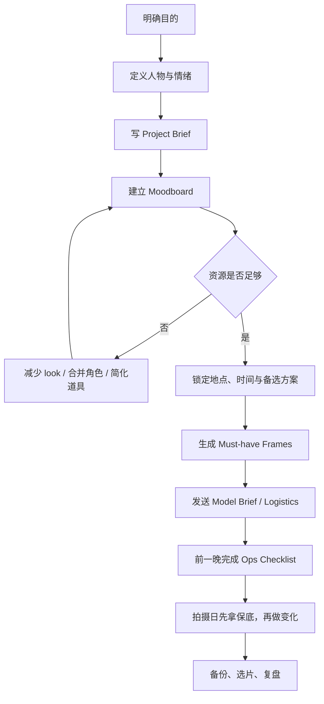

# 轻量化 Editorial Portrait 人像策划系统

这套方法适用于**个体摄影师**或**最多带一名助手的微型团队**。目标不是模拟大型 commercial / fashion production，而是把拍摄当天最容易失控的变量，提前压缩进少量、可复用、可快速查看的文件里，让注意力重新回到看光、看人、引导状态和抓瞬间。

> [!summary]
> 对独立人像摄影师来说，真正耐用的不是更复杂的制作流程，而是一个足够轻、足够硬的最小策划系统：先定义目的与人物，再用 `Brief + Moodboard + Shoot Pack + Model Brief` 把创意、沟通和执行锁住。

## 这套系统在解决什么

独立摄影师最大的风险，通常不是不会拍，而是以下几类问题同时发生：

- 概念只有风格词，没有人物和用途，所以现场越拍越散。
- 参考图很多，但没有拆成可执行的地点、服装、光线和动作提示。
- 地点、天气、服装、交通、授权、备份这些运营变量挤到拍摄当天才处理。
- 被摄者不熟悉镜头，摄影师却没有准备好情绪引导与保底画面。
- 所有信息分散在聊天记录、Pinterest、相册和脑子里，导致现场切换成本过高。

因此，轻量化的重点不是“少准备”，而是**把准备压缩成最关键的少数文件**。

## 核心判断：先意义，后风格，最后才是器材

Editorial Portrait 的起点，不该是“想拍得高级一点”，而应该先回答三件事：

1. 这组片为什么存在。
2. 镜头里这个人是谁。
3. 回看照片时，希望观者先感受到什么。

如果这三个问题不清楚，后面的 moodboard、location、wardrobe、lighting 都会变成松散拼贴。反过来，只要目的、人物和情绪先被定义，很多执行判断都会自然收敛：

- `purpose` 决定这是 portfolio、个人项目、客户委托，还是 campaign-like self assignment。
- `persona` 决定服装、动作、表情和场景关系。
- `mood` 决定色调、光线硬度、构图密度与节奏。

> [!tip]
> 比起写一串抽象风格词，更有效的起手式是写一句 `purpose statement`、一句 `persona statement`，再补 3 个情绪关键词。

## 最小文件系统

对个人摄影师而言，长期维护的重点不是“很多文件”，而是下面这套最小系统。

| 文件 | 必含内容 | 用途 | 拍摄当天怎么用 |
|---|---|---|---|
| `Project Brief` | 目的、人物设定、故事一句话、mood、usage | 锁定创意判断 | 用来校正“这组片到底在拍什么” |
| `Moodboard` | 色调、场景、服装、妆发、光感、姿态参考 | 把抽象感觉变成共同视觉语言 | 手机上快速对齐 look 与状态 |
| `Shoot Pack` | 地点、时间、路线、必拍画面、gear、备选方案 | 把执行信息压缩到一个入口 | 现场只看这一份即可推进 |
| `Model Brief` | 概念摘要、地点时间、服装建议、流程、边界、用途 | 降低紧张与误解 | 开拍前让对方心理有谱 |

如果想进一步简化，`Shoot Pack` 可以再拆成三部分，但在微型团队里通常没有必要：

- `Location & Call Sheet`
- `Must-have Frames`
- `Ops Checklist`

## 实战流程



## 四个核心策划模块

### 1. Project Brief：先把故事缩成一页

`Project Brief` 的价值不在排版，而在于它迫使摄影师先做选择。最少应回答：

| 字段               | 要回答什么                |
| ---------------- | -------------------- |
| Purpose          | 这组片为什么存在             |
| Persona          | 镜头里这个人是谁             |
| Narrative        | 这组片的场景或人物状态是什么       |
| Mood             | 想传递的 3-5 个情绪词        |
| Visual Direction | 光感、色调、服装、空间的大方向      |
| Usage            | 用于作品集、社交媒体、客户交付，还是投稿 |

写完后应该能一句话复述项目。如果还只能说“想拍得更 editorial 一点”，说明 brief 还没有完成。

### 2. Moodboard：把感觉变成可执行信息

Moodboard 是微型团队里最关键的一份文件，因为它同时承担了三种角色：

- 对齐创意预期
- 筛选协作者是否适配
- 为现场提供快速参考

高质量 moodboard 不只是“找好看的图”，而是至少覆盖以下模块：

| 模块 | 最低要求 |
|---|---|
| Color / Tone | 2-4 张能说明色调的参考 |
| Location | 2-4 张能说明空间关系的参考 |
| Wardrobe | 每套 look 至少 1-2 张参考 |
| Hair / Makeup | 妆发方向与 close-up 参考 |
| Lighting | 3-6 张能说明光感的参考 |
| Posing / Movement | 4-8 张姿态或动作提示 |
| Anti-reference | 1-3 条明确不要的方向 |

> [!warning] Moodboard 不是抄袭板
> 它应该传达的是气氛、光线结构、造型逻辑和人物状态，而不是要求现场逐帧复刻。

### 3. Shoot Pack：把执行压缩到一份可快速查看的包

真正到了拍摄日，摄影师不应该在多个文件间来回切。更实用的做法是把执行信息压缩成一个 `Shoot Pack`：

| 区块 | 关键字段 |
|---|---|
| Location | 地址、地图点位、最佳时段、备选点位、遮蔽物、停车 / 交通 |
| Timing | call time、黄金时段、换装顺序、结束时间 |
| Must-have Frames | 每个 look 的必拍画面、优先级、焦段、动作提示 |
| Lighting Notes | 主光感、替代光感、是否需要 reflector / flash / scrim |
| Ops Checklist | gear、电池、卡、release、道具、水、天气备选 |

这种做法的核心是：**创意归 brief 与 moodboard，执行归 Shoot Pack**。拍摄日只看执行包，就能显著减少切换成本。

### 4. Model Brief：把舒适度也纳入工作流

对 non-model、普通客户、第一次合作的模特来说，`Model Brief` 不是礼貌附件，而是成功率工具。

建议包含：

| 模块 | 作用 |
|---|---|
| 项目概览 | 让对方知道这次拍什么、为什么拍 |
| 参考方向 | 让抽象情绪可视化 |
| 地点与时间 | 降低 logistics 混乱 |
| 服装与妆发建议 | 避免现场偏离 aesthetic |
| 当天节奏 | 让对方知道会先 warm-up，再拍保底 |
| 边界与沟通 | 明确未经同意不触碰，调整衣物或站位会先说明 |
| 图片用途 | 避免 usage 误会 |

## 现场真正重要的不是复杂 shot list，而是保底画面

公开可见的个人摄影实践里，复杂电影式 shot list 并不常见，更常见的是：

- 一页 `must-have frames`
- 一组 `pose / movement prompts`
- 一份前夜 `ops checklist`

因此，比起写冗长镜头表，更适合长期复用的是一张压缩版表格：

| 优先级 | Look | 画面类型 | 焦段 / 构图 | 情绪或动作提示 | 光线方案 |
|---|---|---|---|---|---|
| 高 | Look A | 半身主视觉 | 50mm / 85mm | 直视镜头，克制 | 逆光或窗边侧光 |
| 高 | Look A | 环境人像 | 35mm | 缓慢行走 / 回头 | 自然光 |
| 中 | Look A | 细节 | 50mm 近景 | 手部、衣领、饰品 | 柔光 |
| 高 | Look B | 坐姿主图 | 50mm | 松弛、微侧脸 | 阴影区补光 |
| 中 | Look B | 动态帧 | 35mm | 转身、拨头发 | 侧光 |

判断标准很简单：

- 每个 look 都要有至少 2-4 个明确 deliverables。
- 先把关键图拍到，再去做实验。
- 前 20-30 分钟最好拿到一个“安全 look”。

## 地点、服装、光线：三者必须一起判断

独立摄影师选地点，不能只看“好不好看”，而要同时看四个因素：

- 是否符合故事与人物设定
- 光线在对应时段是否成立
- 到达、换装、天气、遮蔽是否可控
- 是否会让执行负担远大于创意收益

服装与妆发同理。微型团队不是忽视造型，而是把造型做成**少变量、高匹配**的版本：

- look 数量少，但每套都服务同一个人物逻辑
- 优先用高出画率的面料、轮廓和配色
- 尽量提前做全身试穿确认，不把判断留到现场
- 妆发重点是干净、稳定、与光感匹配，而不是复杂

光线参考也不必做成复杂灯位图。对 solo workflow 来说，更有效的是少量“可复现的光感参考”：

- back-lit
- side light
- direct sunlight
- window light
- shadow-heavy low-key

只要这些参考足够明确，现场就能更快判断站位、顺序与是否需要补光。

## 角色压缩是常态，但有边界

微型团队最常见的现实，不是角色消失，而是角色合并：

| 常被省略或合并的角色 | 通常由谁吸收 | 什么时候不该再省 |
|---|---|---|
| Producer / PM | 摄影师本人 | 多地点、多协作者、许可复杂 |
| Art Director | 摄影师本人 | 客户有强 branding consistency 要求 |
| Stylist | 摄影师、model、朋友 | 借衣与 look 数量变复杂时 |
| Hair + Makeup | 一个 HMUA 或自行准备 | beauty close-up、多 look 变妆时 |
| Location Manager | 摄影师本人 | 商业场地、陌生城市、permit 严格 |
| Assistant | 可省或只有一位 | 需要举灯、搬运、看安全、控器材时 |

> [!warning] 不要为了“轻量化”而误删安全和沟通
> 轻量化适用于去掉冗余流程，不适用于去掉 consent、时间管理、天气备选、授权和设备检查。

## 拍摄日执行 heuristics

可以把拍摄日理解成“先稳，再冒险”的过程：

1. 到场先确认主机位与备选机位。
2. 先用最容易建立信心的 look 或 setup 热身。
3. 每换一个 look，先拿一张保底主图。
4. 定时回看是否已经拿到关键帧，不要等回家才发现漏拍。
5. 收工前清点设备、道具、个人物品；收工后立即双备份。

如果被摄者不是职业模特，动作引导也应该从“可执行”而不是“精确复制”出发：

- 与其要求复杂姿态，不如给 movement prompt。
- 与其说“摆得高级一点”，不如给一个具体状态。
- 与其一直纠正细节，不如先建立节奏和舒适感。

## 第二篇里值得吸收的三项补充

第二份材料里有三块内容，适合作为这个系统的增强层，而不是主体。

### 客户问卷

如果是客户拍摄，前置问卷能显著减少现场试错。值得提前问清楚：

- 喜欢或避开的视觉风格
- 是否有偏好的脸侧、角度或身材顾虑
- 成片主要用途
- 是否有必须拍到的职业符号、服装或道具

### 移动端联机拍摄

在独立摄影场景里，`iPad + 联机预览` 的价值不是“更高级”，而是：

- 更早发现焦点、构图、衣物和表情问题
- 让客户或模特更快建立信任
- 减少返工和误判

如果场景允许，联机监看是非常值得加入的执行工具。

### AI 后期闭环

AI 更适合解决的是**机械性重复工作**，不是替代前期判断。更合理的定位是：

- 用 AI 做初筛、聚类、闭眼废片剔除
- 用 AI 做基础曝光、白平衡、风格统一
- 用 AI 做轻量瑕疵修复

真正影响成片上限的，仍然是前期的概念、光线、造型和引导，而不是把后期当补救系统。

## 可直接复用的最小模板

> [!example]- Project Brief 模板
> ```markdown
> 项目名：
> Purpose：
> Persona：
> Narrative：
> Mood 关键词：
> Visual Direction：
> Usage：
> 必须保留的元素：
> 明确排除的元素：
> ```

> [!example]- Moodboard 检查表
> ```markdown
> - [ ] 项目标题与日期
> - [ ] 一句 purpose
> - [ ] 3-5 个 mood 词
> - [ ] 人物设定
> - [ ] 色调参考
> - [ ] 场景参考
> - [ ] 服装参考
> - [ ] 妆发参考
> - [ ] 光线参考
> - [ ] 动作 / 姿态参考
> - [ ] Anti-reference
> ```

> [!example]- Day-of Ops Checklist
> ```markdown
> - [ ] 电池充满
> - [ ] 卡已格式化
> - [ ] 机身镜头清洁
> - [ ] moodboard / shot list / 地址可离线查看
> - [ ] 服装、配饰、道具分袋
> - [ ] release / 合同 / 付款信息
> - [ ] 天气与替代地点确认
> - [ ] 到场后先看主机位与备选机位
> - [ ] 每个 look 至少拿到一张保底主图
> - [ ] 收工后立即双备份
> ```

## 最终结论

对个体摄影师来说，Editorial Portrait 最有效的工作法不是把自己伪装成一支大制作团队，而是建立一个**小而硬的策划系统**：

- 用 `Brief` 锁定意义与人物。
- 用 `Moodboard` 对齐视觉语言。
- 用 `Shoot Pack` 压缩执行信息。
- 用 `Model Brief` 提高舒适度与成功率。

当这些文件存在时，摄影师在现场更像导演；当这些文件不存在时，摄影师就只能一边拍、一边想、一边补救。前者可复用，后者不可复用。
