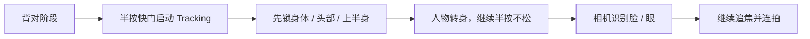

# Sony a7R V 人像动态对焦与半按快门体系

> [!summary]
> 不需要为了“专业”强行改成 AF-ON。已经习惯半按快门时，关键是把它分成两种明确用法：`AF-C + 半按不松` 用来追焦，`AF-S + 半按不松` 用来锁焦。半按快门只是启动方式，真正决定相机行为的是 Focus Mode、Focus Area、Subject Recognition 和拍摄动作。

这份笔记整理的是 Sony a7R V 拍动态人像、背对转身、跑动回头时的对焦逻辑。核心问题不是“半按快门落后于 AF-ON”，而是很多虚焦来自开始追焦太晚、Focus Area 太宽、只等 Eye AF 识别眼睛、快门速度不够，或者把 AF-C 和 AF-S 的半按逻辑混在一起。

## 一句话逻辑

拍“背对 -> 转身露出脸”的人物时，不要等正脸出现才对焦。

正确逻辑是：

Sony 的 Tracking 功能可以从指定 Focus Area 开始追踪；在 still image 模式下，如果 Focus Mode 是 `Continuous AF`，选择 `Tracking` 类 Focus Area 后，半按快门会启动 tracking。Subject Recognition 打开后，Human 目标可以在 eye、face、body 上显示识别框；识别到更精确目标时，相机会优先显示更精确的框。

所以背影阶段不要把问题理解成“没有眼睛所以无法对焦”。更实用的理解是：先让相机抓住这个人，脸回来之后再让识别系统切到脸或眼。

## 推荐基础配置：继续使用半按快门

| 项目 | 推荐值 | 用途 |
|---|---|---|
| Focus Mode | `Continuous AF` | 动态人像、跑动、回头、转身时持续追焦 |
| Focus Area | `Tracking: Zone` | 人物在画面中移动但主体明确时的默认选择 |
| 复杂背景 / 容易抓错人 | `Tracking: Expand Spot` 或 `Tracking: Spot M` | 先把追踪起点压在人身上，减少误抓背景 |
| Subject Recog in AF | `On` | 启用被摄体识别 |
| Recognition Target | `Human` | 针对人像识别 eye / face / body |
| Sbj Recog Frm Disp. | `On` | 方便观察相机到底在抓身体、脸还是眼 |
| AF Tracking Sensitivity | `3 Standard` 起步 | 先用中性设置，再按失败症状微调 |
| Priority Set in AF-C | `AF` 或 `Balanced Emphasis` | 虚焦多时先用 `AF`，熟练后再回到 `Balanced Emphasis` |
| Drive Mode | `Continuous Shooting: Hi` | 比只等“正脸一瞬间”更稳 |
| 快门速度 | 跑动 `1/1000s` 起，动作激烈 `1/1600s-1/2000s` | a7R V 高像素会放大轻微运动模糊 |

> [!tip]
> 半按快门用户的动作口诀：背对时先半按，半按不松跟住人，转身前开始连拍，脸出来后让相机从 body / face 切到 eye。

## 两种半按快门模式不要混用

| 你想要什么 | Focus Mode | 半按快门行为 | 适合场景 | 风险 |
|---|---|---|---|---|
| 追焦 | `AF-C` | 半按不松时持续对焦 | 跑动、向镜头靠近、背对转身、漫展抓拍 | 中途松开就停止持续追焦 |
| 锁焦 | `AF-S` | 对上后锁住焦点距离 | 原地转身、横向轻微走动、距离基本不变的情绪人像 | 人物前后移动会脱离焦平面 |

最容易出错的是：想追焦却用了 `AF-S`，或者想锁焦却用了 `AF-C` 还半按不松。半按快门不是问题，模式混淆才是问题。

## 背对转身的实拍流程

1. 人物还背对镜头时，就把 `Tracking: Zone` 或 `Tracking: Expand Spot` 放到人物上半身。
2. 半按快门，不要松。
3. 追人物的后脑、肩颈、背部上缘，不要只等眼睛出现。
4. 转身前约半秒开始连拍。
5. 脸出现后，观察识别框是否切到 face / eye。
6. 如果背景复杂、路人多、相机跳目标，把 Focus Area 从 `Tracking: Zone` 收紧到 `Tracking: Expand Spot` 或 `Tracking: Spot M`。

关键是把“对焦启动点”提前到背影阶段。等正脸出现后才半按，等于让相机在最短时间内同时完成识别、拉焦、确认和释放，成功率自然会下降。

## AF Tracking Sensitivity 怎么调

Sony 官方定义里，`5 Responsive` 更愿意响应不同距离的主体，`1 Locked on` 更倾向在有物体穿过主体前方时维持原主体。

| 失败症状 | 调整 |
|---|---|
| 相机经常从人跳到背景、路人、前景遮挡物 | 从 `3` 改到 `2` 或 `1 Locked on` |
| 人物突然转身、快速靠近，相机反应慢 | 从 `3` 试到 `4` |
| 画面多人且目标容易切错 | 先缩小 Focus Area，再考虑降低灵敏度 |
| 只是偶尔虚焦 | 不要先乱调灵敏度，先检查快门速度、半按时机和 Focus Area |

不要一上来就用极端值。`3 Standard` 是稳妥起点；`1` 和 `5` 都是在明确知道失败类型之后才用。

## AF-ON 和半按快门不是冲突关系

AF-ON 不是一种新的对焦模式。它只是把“启动自动对焦”从食指半按快门，改成拇指按 AF-ON。相机会继续应用当前 Focus Mode：`AF-C` 仍然是连续追焦，`AF-S` 仍然是单次锁焦。

真正的后键对焦通常会把：

- `AF w/ Shutter` 设为 `Off`
- `Pre-AF` 设为 `Off`
- AF-ON 保留为对焦启动按钮

这样快门只负责拍摄，AF-ON 负责对焦。Sony 官方也把这种方式描述为把 autofocus 和 shutter release 分离。

但如果已经习惯半按快门，不必强行切换。切换 AF-ON 的收益主要是控制权更清楚：按住追焦，松开停止对焦，快门不会再次触发 AF。代价是需要重建肌肉记忆，而且把相机交给别人时容易误操作。

## 什么时候用老派预对焦

预对焦 / 锁焦不是落后方法，它的本质是提前决定焦平面，让相机不要在关键瞬间重新判断。

适合：

- 原地转身
- 横向走动
- 背对后回头
- 站在固定点甩头发
- 距离基本不变的情绪人像

操作：

1. Focus Mode 设为 `AF-S`。
2. 半按快门对到模特所在距离。
3. 保持半按不松。
4. 等动作、表情、头发和身体节奏出现。
5. 完全按下快门。

> [!warning] 大光圈近距离风险
> `AF-S` 锁焦适合距离稳定的动作。85mm f/1.4、135mm f/1.8、近距离半身或特写时，轻微前后晃动都会明显偏焦。人物明显向你跑来时，不要用锁焦法，改用 `AF-C + 半按不松`。

## 常见虚焦原因

| 症状 | 更可能的原因 | 处理 |
|---|---|---|
| 转身时总是抓不到眼 | 只等 Eye AF，没有先追住 body / head | 背对阶段就启动 Tracking |
| 背景清楚，人虚 | Focus Area 太宽或追踪起点没压在人身上 | 从 `Wide` 改 `Tracking: Zone` / `Tracking: Expand Spot` |
| 每次正脸瞬间都慢一拍 | 对焦启动太晚 | 动作开始前就半按不松 |
| 看起来像虚焦，其实整体糊 | 快门速度不够 | 跑动至少 `1/1000s`，甩头发或强动作再提高 |
| 相机从人物跳到前景 | AF Tracking Sensitivity 太 responsive 或 Focus Area 太宽 | 先收 Focus Area，再试 `2` 或 `1 Locked on` |
| 情绪人像焦点忽前忽后 | `AF-C` 一直在重新判断 | 距离稳定时可改 `AF-S` 半按锁焦 |

## 最实用的配置分流

### 稳妥动态人像

- Focus Mode: `AF-C`
- Focus Area: `Tracking: Zone`
- Subject Recog in AF: `On`
- Recognition Target: `Human`
- AF Tracking Sensitivity: `3 Standard`
- Priority Set in AF-C: 先 `AF`，熟练后 `Balanced Emphasis`
- 拍法：半按不松，全程追焦，转身前开始连拍

适合跑动、靠近镜头、背对转身、漫展抓拍、商业交付。

### 情绪人像 / 距离稳定动作

- Focus Mode: `AF-S`
- Focus Area: `Spot M` 或 `Expand Spot`
- Subject Recog in AF: 可开
- 拍法：半按锁定距离，保持半按，等表情和动作

适合原地转身、横向轻动、回头、电影感动作。它追求的是稳定焦平面和抓瞬间，而不是让相机全程重新判断。

### 以后想尝试 AF-ON 时

- `AF w/ Shutter`: `Off`
- `Pre-AF`: `Off`
- Focus Mode: `AF-C`
- AF-ON: 按住追焦，松开临时锁住当前距离
- 快门：只负责拍

这不是必须升级，只是另一种控制方式。对当前习惯半按快门的人，先把半按体系练稳更重要。

## Sources

- [Sony ILCE-7RM5 Help Guide: Tracking subject (Tracking function)](https://helpguide.sony.net/ilc/2230/v1/en/contents/TP0002926822.html)
- [Sony ILCE-7RM5 Help Guide: Sbj Recog Frm Disp.](https://helpguide.sony.net/ilc/2230/v1/en/contents/TP1000669444.html)
- [Sony ILCE-7RM5 Help Guide: AF Tracking Sensitivity](https://helpguide.sony.net/ilc/2230/v1/en/contents/TP0002920004.html)
- [Sony ILCE-7RM5 Help Guide: Priority Set in AF-C](https://helpguide.sony.net/ilc/2230/v1/en/contents/TP0002911182.html)
- [Sony ILCE-7RM5 Help Guide: AF On](https://helpguide.sony.net/ilc/2230/v1/en/contents/TP0002887716.html)
- [Sony Customization Guide: Autofocus / AF On](https://support.d-imaging.sony.co.jp/support/ilc/custom/05/en/practice1.html)
