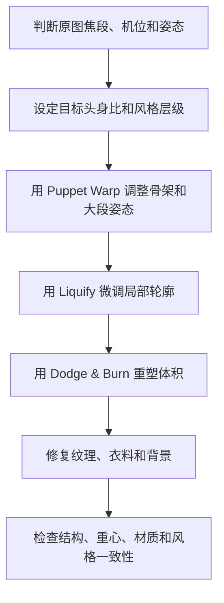

# 照片身材风格化修饰工作流

> [!summary]
> 照片身材修饰应先建立结构目标，再做局部轮廓。写实修饰要保留主体身份、纹理和重心逻辑；漫画化修饰可以更夸张，但必须同步处理骨架、明暗、背景和材质真实度。

## 修饰目标

照片身材修饰不是把真实身体套进单一模板，而是在授权、非贬损和可回滚的前提下，让比例、姿态、体积和视觉风格更接近成片目标。

常见目标分两类：

- **写实优化**：保留 6-7 头身附近的现实比例，通过姿态、腰臀线、腿部视觉线和肩颈关系增强观感。
- **漫画化风格**：用小头、长腿、细腰、明确肩颈线和更强曲线节奏制造风格化吸引，但仍需保持结构可信。

> [!warning] 使用边界
> 不要在没有授权的真实人物照片上做欺骗性身体改造；不要以未成年人、幼态角色或非自愿对象作为性感化修饰目标；不要把修饰结果写成现实身体优劣标准。

## 先判断照片，再决定比例

修饰前先读图，而不是直接进入 Liquify。

| 判断项 | 看什么 | 对修饰的影响 |
|---|---|---|
| 焦段 | 广角、长焦、边缘拉伸 | 判断头、手、脚和腿长是否受镜头影响 |
| 机位 | 仰拍、平视、俯拍 | 决定腿长、头身比和重心感 |
| 姿态 | 承重腿、放松腿、骨盆倾斜、肩线 | 决定是否能通过 Contrapposto 增强曲线 |
| 背景 | 墙线、地平线、门框、道具 | 判断液化是否会暴露背景畸变 |
| 材质 | 皮肤、衣料、发丝、纹理 | 决定修饰强度和频率分离需求 |

## 工具分工

| 工具 | 适合处理 | 不适合处理 | 失败症状 |
|---|---|---|---|
| Puppet Warp | 大段肢体方向、骨架姿态、整体站姿 | 软组织细节 | 关节折断、衣褶方向错乱 |
| Liquify | 腰臀、手臂、腿部、脸部等局部轮廓微调 | 大幅骨架重排 | 背景弯曲、纹理拉伸、关节变形 |
| Dodge & Burn | 体积、肌肉转面、腰腹过渡、腿部明暗 | 替代结构修正 | 明暗假、皮肤脏、体积不跟结构 |
| 频率分离 | 保留纹理并修复拉伸痕迹 | 过度磨皮 | 皮肤糊、衣料和皮肤质感不一致 |
| 遮罩与保护区 | 背景直线、衣服边缘、手脚、饰品 | 偷懒整体变形 | 人体变好但环境暴露修图痕迹 |

## 写实 6 头身优化

6 头身接近现实普通人比例，视觉暗示通常是亲和、真实、重心较低。如果目标是商业性感或更强姿态吸引，不应直接把身体拉到 8-10 头身，而应做克制的视觉补偿。

优先级：

1. 调整姿态：用承重腿、放松腿、骨盆倾斜和肩线反向平衡制造自然曲线。
2. 延展腿部视觉线：先考虑裤线、脚部位置、鞋型、脚踝线和裁切。
3. 微调腰臀：保留肋骨、腹部、骨盆、大腿根之间的过渡。
4. 保持纹理：液化后用频率分离或纹理层修复拉伸。
5. 检查背景：墙线、地平线、门框、家具和道具不能弯曲。

## 照片转漫画化

漫画化修饰追求的是“感知真实”，不是数学真实。观者需要感觉比例、姿态和体积自然，即使实际比例已经被风格化。

漫画化流程：

漫画化时，腿长感来自腰线、膝盖、脚踝、鞋型和相机裁切的共同作用；细腰必须保留肋骨、腹部和骨盆转折；明暗塑形往往比单纯收线更能建立漫画式体积。

## 决策规则

- 如果腿短，先调整视觉腰线、裤线、脚踝和裁切，再考虑轻度液化。
- 如果腰臀不自然，检查肋骨、骨盆、大腿根和腹部过渡，不要只收腰。
- 如果姿态缺乏曲线，优先修骨盆和肩线关系，而不是拉身体外轮廓。
- 如果背景有直线，先建立保护区，或在液化后局部重建背景。
- 如果纹理被拉伸，回退液化强度，并在纹理层修复。
- 如果真实材质和夸张比例冲突，要么降低夸张幅度，要么整体提高插画化程度。

## 质量检查

- [ ] 是否保留了原始图层、智能对象或可回滚备份？
- [ ] 是否先修骨架和姿态，再修轮廓和皮肤？
- [ ] 关节、手脚、肩颈和脊柱是否仍然成立？
- [ ] 腰臀曲线是否有腹部、骨盆和大腿根支撑？
- [ ] 背景线条、衣纹、道具和边缘是否暴露变形？
- [ ] 皮肤、衣料、发丝和纹理是否保持可信？
- [ ] 修饰幅度是否匹配成片风格？

## 不该做的事

不要用单一 Liquify 步骤完成全部修改；不要把真实照片直接拉到极端漫画比例；不要破坏骨骼连接、关节方向和重力逻辑；不要让身体修饰变成单一审美标准。

相关主题：[[人体结构、素体与透视拆解]]、[[漫画身材比例美学与风格化边界]]
