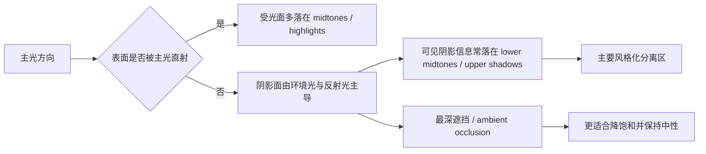
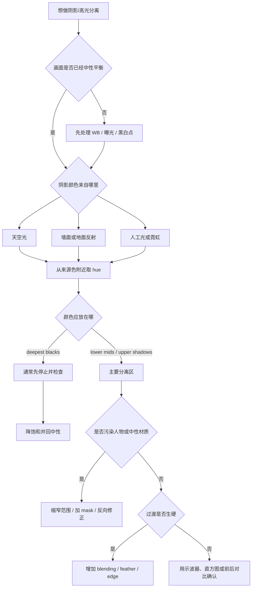

# 色调分离的光线逻辑与高光阴影调色

> [!summary]
> 好看的色调分离不是机械地给暗部加蓝、亮部加橙，而是先判断画面里的主光、环境光、反射光分别来自哪里，再把色彩放进正确的亮度区间。自然的阴影色通常主要存在于 lower midtones / upper shadows；最深黑位更适合保持中性、降低饱和度。

## 核心判断：软件亮度区间不等于真实受光关系

`Shadows / Midtones / Highlights` 是软件按像素亮度划分的区域，不知道画面中真实的光线方向。真实阴影面只是主光被遮挡，并不代表那里没有光；它仍会被天空光、墙面反射、地面反射、室内灯或其他彩色物体照亮。

因此，调色时要先区分两套语言：

| 问题 | 真实摄影语言 | 软件调色语言 | 常见误判 |
|---|---|---|---|
| 这里为什么亮 | 主光直射、反射、材质高反射 | 像素落在 highlights 或 midtones | 把白墙背光面误当作高光区域 |
| 这里为什么暗 | 主光被遮挡、材质吸光、曝光不足 | 像素落在 shadows 或 blacks | 把黑衣、黑发、瞳孔都当成“阴影光” |
| 阴影是什么颜色 | 主光消失后留下的环境光与反射光 | 某个亮度范围被色轮染色 | 给所有暗色材质统一涂蓝 |
| 最深黑位该如何处理 | ambient occlusion、深缝隙、最少受环境光影响 | 最低亮度端点 | 让黑位变成高饱和蓝墨水 |



## 阴影和高光没有固定冷暖

“暖高光、冷阴影”是常见结构，不是调色定律。晴天户外经常出现这个关系，是因为太阳直射光相对偏暖，而背光面和投影区主要由偏蓝的天空散射光照亮；但在室内、夜景、蓝调时刻或人工混光中，结构可以完全反过来。

更可靠的问题不是“高光该暖还是冷”，而是：

- 承担高亮度的主光是什么颜色？
- 阴影里剩下的环境光是什么颜色？
- 周围墙面、地面、天空、植被、霓虹或灯具会把什么颜色反射进暗面？
- 画面里哪些区域必须保留中性锚点和材质本色？

常见色彩结构可以这样判断：

| 色彩结构 | 常见光线逻辑 | 审美倾向 | 使用提醒 |
|---|---|---|---|
| 暖高光 + 冷阴影 | 太阳直射光 + 蓝天散射光 | 电影感、空间分离 | 冷色应低饱和，不要染死黑位 |
| 冷高光 + 暖阴影 | 冷窗光 + 室内钨丝灯或木质反射 | 内外冲突、叙事感 | 不要强行套暖高光公式 |
| 暖高光 + 暖阴影 | 夕阳、火光、木质室内、沙漠 | 怀旧、亲密、包裹感 | 通过明度和饱和度做层次，而不是靠冷暖对立 |
| 冷高光 + 冷阴影 | 蓝调、雨夜、雪景、临床空间 | 疏离、寂静、未来感 | 保留肤色、白点或黑点作为锚点 |
| 单侧染色，另一侧中性 | 商业人像、产品、时尚 | 克制、干净 | 经常比双向强染更高级 |
| 高光和阴影基本中性 | 自然肖像、肤色优先 | 写实、清透 | 色彩分离可交给背景、服装和光比 |

## 为什么冷阴影会出现塑料感

“蓝色塑料感”通常不是蓝色本身错误，而是范围、饱和、色相、过渡和锚点同时失控。

| 症状 | 根源 | 修复动作 |
|---|---|---|
| 黑衣、黑发、瞳孔、深色家具全部发蓝 | 把材质暗色误当成光线阴影 | 缩小亮度范围；用蒙版排除深色材质；只让有环境光依据的暗面吃色 |
| 最深黑位呈蓝墨水或紫墨水 | 低亮度饱和度过高 | 用 `Lum Vs Sat`、亮度蒙版或局部饱和度把 blacks 收回中性 |
| 白墙、灰衣、肤色边缘发青发绿 | hue 偏到 cyan/green，且没有保护中性和肤色 | 把冷色往 steel blue、deep blue 或微 magenta 方向收；对 skin / neutrals 做反向修正 |
| 暗部像被一层颜色覆盖 | 色相太纯、缺少灰度 | 降低饱和度，保留原材质色；用蓝灰、青灰、紫灰替代纯蓝 |
| 轮廓边缘突然变蓝 | shadows 与 midtones 过渡太窄 | 增加 `Blending`、`Feather`、软蒙版或 falloff |
| 画面只有冷色偏移，没有光线因果 | 没有主光、环境光和反射光的对应关系 | 回到场景：从天空、墙面、地面、窗外或灯具颜色提取 hue |
| 整体偏色，无法判断是否“高级” | 中性锚点丢失 | 先校正白平衡、曝光、黑白点，再做 split tone |

> [!tip]
> 自然阴影常见的层次是：纯黑接近中性，黑位以上出现轻微冷色，lower midtones 冷色最清楚，进入中间调后逐渐回到材质本色。

## 选择蓝色：Hue 是搜索区域，不是答案

冷阴影最好从画面已有颜色中找近邻，而不是从空白色轮里发明“电影蓝”。同一个 Hue 数值会被白平衡、相机 profile、色彩空间、对比曲线、原始材质、饱和度、`Blending` 和 `Balance` 改写，所以数值只能作为搜索区。

| 冷色方向 | 大致 Hue 区间 | 视觉特征 | 适合场景 | 风险 |
|---|---:|---|---|---|
| Cyan / Teal | 185-210 | 偏绿、明亮、现代、商业感强 | 青色天空、玻璃、混凝土、强 Teal & Orange | 容易让肤色、黑发和灰物体发绿，产生电子感 |
| Slate / Steel Blue | 210-235 | 灰蓝、钢蓝、沉稳 | 城市、阴天、人像、低饱和电影感 | 过量会变脏灰，需要保留黑白锚点 |
| Deep Blue / Indigo | 235-255 | 更深、更夜晚、偏蓝紫 | 蓝调时刻、夜景、想避开商业 teal | 过多会让肤色边缘偏紫或情绪过暗 |
| Blue-Violet | 255-280 | 梦幻、夜店、时尚、人工灯感 | 人工彩光、舞台、风格化人像 | 不适合作为自然阴影默认色 |

常用结构的起点可以这样理解：

| 目的 | 阴影 Hue 起点 | 高光 Hue 起点 | 重点 |
|---|---:|---:|---|
| 自然日光电影感 | 215-235 | 35-55 | 钢蓝 + 琥珀，饱和要低 |
| 商业 Teal & Orange | 185-205 | 20-40 | 分离强，污染肤色风险也高 |
| 蓝调夜景 | 225-255 | 中性或 200-230 | 整体冷，不必强行加暖高光 |
| 紫蓝时尚感 | 245-275 | 20-50 | 更像人工灯，不像自然天空光 |
| 复古胶片 | 70-110 或中性 | 35-65 | 橄榄、棕灰、米黄，未必需要蓝 |
| 冷窗光暖室内 | 高光 210-240 | 阴影 25-50 | 冷暖关系可以反向存在 |

## 可执行工作流

1. **先做没有风格的中性底片。** 完成白平衡、曝光、对比、黑白点、高光压缩、肤色基础和明显色偏修正。不要用 split tone 修复错误白平衡。
2. **识别主光与环境光。** 判断人物或主体由什么方向、什么颜色的光照亮；阴影里可能进入天空、墙面、地面、窗外、霓虹还是室内灯反射。
3. **决定色彩结构，而不是先决定两个色值。** 例如阳光停车场可用暖上中间调 + 钢蓝低中间调；木质室内窗边可用冷受光 + 暖环境填充；复古胶片可用米黄高光 + 橄榄棕灰阴影。
4. **临时提高饱和度找 hue。** 先把 Saturation 临时推到 25-40，让不同 hue 的差异容易看清；确定 hue 后再降回真实强度。
5. **把色彩从最深黑位移向 lower midtones。** 主要阴影色应该停在仍能看见材质和反射关系的区域；deepest blacks 更常用于深度和锚点。
6. **保护肤色和真实中性物体。** 脸部暗面可以略冷，但不能和水泥墙、黑布、金属、白衣阴影完全同色。
7. **最后用前后对比和缩略图判断。** 开启效果时应该觉得画面更完整；关闭效果时才发现原图更平，而不是开启后第一眼只看到“变蓝了”。



## 软件实现要点

### DaVinci Resolve

Resolve 更适合按镜头、节点、亮度分区和空间位置来做视频风格化。不要把 split tone 写死在一个大范围 `Lift/Gamma/Gain` 调整里，优先使用 `HDR Wheels`、`Log Wheels`、`Low/High Range`、`Lum Vs Sat`、`Qualifier`、`Power Windows` 和 `Tracker`。

```text
Node 1: Color Management / CST
Node 2: 白平衡、曝光、整体对比
Node 3: 主色彩结构与场景平衡
Node 4: HDR Wheels / Log Wheels 做色调分离
Node 5: Luma vs Saturation 控制黑位与高光饱和度
Node 6: 肤色、局部光线、环境修正
```

关键动作：

- 调整 shadow / light 区间的 range 与 falloff，而不是让颜色跨完整暗部。
- 用 `Lum Vs Sat` 轻微降低最低亮度饱和度，让黑保持黑。
- 用 `Qualifier` 依色相和亮度选区，再用 `Power Window` 限定空间位置。
- 人物、皮肤或局部光线需要跟随镜头时，配合 `Tracker` 或对象工具。
- 中性灰或肤色被污染时，用局部节点、Chroma Color Warper 的固定点或反向修正收回。

### Lightroom / Camera Raw

Lightroom 和 Camera Raw 的 `Color Grading` 适合快速建立整体冷暖关系，再用 `Masking`、`Color Range`、`Point Color / Color Mixer` 收口。`Blending` 决定阴影、中间调、高光之间的重叠和平滑程度；`Balance` 决定整体更偏向阴影效果还是高光效果。

可作为起点的轻量参数：

| 控件 | 起始范围 | 用途 |
|---|---:|---|
| Shadows Saturation | 4-12 | 给 upper shadows / lower mids 轻微方向 |
| Highlights Saturation | 3-10 | 让高光接近光源色，不把白点染脏 |
| Blending | 40-75 | 控制区间重叠，避免硬边 |
| Balance | -20 到 +20 | 根据画面明暗结构微调倾向 |
| 单个 tonal range Luminance | -10 到 +10 | 微调层次，不替代曝光调整 |

人像工作流里，通常先把人物和环境分开：背景阴影可以更冷，人脸阴影只保留一部分环境冷色；不要依赖一个全局 `Shadows` 色轮解决所有区域。

### Photoshop

Photoshop 更适合照片中的非破坏式分层控制。稳定路线是：先把底图转为 `Smart Object`，用 `Camera Raw Filter > Color Grading` 建立整体关系，再用调整层、蒙版、混合模式和不透明度收敛强度。

常用组合：

- `Color Balance`：在 `Shadows / Midtones / Highlights` 分别微推色彩，勾选 `Preserve Luminosity`，再用亮度蒙版限制范围。
- `Color Range + Layer Mask`：按颜色或 tonal range 建选区，避免全局染到肤色、白墙或黑发。
- `Gradient Map + Color` 混合模式：用渐变映射定义暗部到亮部的色相，再让底图保留原明度。
- `Blend If`：保护极端黑白、肤色或关键材质，避免端点被染脏。

`Gradient Map` 可这样设计：

```text
左端: 近黑、低饱和蓝灰
20%-35%: 稍明确的冷色
50%: 接近中性
70%-85%: 低饱和暖色
右端: 接近白或中性暖白
```

然后将图层混合模式设为 `Color`，不透明度先从 3%-15% 试起，再用 `Blend If` 或蒙版保护极端黑白与肤色。

## 验收测试

| 测试 | 通过状态 | 失败信号 |
|---|---|---|
| 关掉效果测试 | 开启时画面更完整，关闭后才觉得原图平散 | 开启时第一眼只看到“画面变蓝” |
| 黑位测试 | 最深区域仍像黑色，黑衣和黑发材质不同 | 黑位变成蓝墨水，暗部比中间调更鲜艳 |
| 灰色物体测试 | 灰墙、白衣、金属像受环境光影响 | 中性物体直接变成蓝色物体 |
| 肤色阴影测试 | 脸部暗面略冷但保留红血色、黄橙底色 | 鼻翼、眼周、颧骨与背景阴影同色 |
| 缩小图测试 | 冷暖关系帮助主体分离 | 画面变成两块明显滤镜色 |

## 最重要的结论

- 阴影不一定冷，高光不一定暖；冷暖关系必须来自场景光线。
- 阴影颜色取决于主光消失后剩下的环境光与反射光。
- 软件的 `Shadows` 是亮度区间，不是真实阴影区域。
- 自然的阴影色主要放在 lower midtones / upper shadows，最深黑位通常更应降低饱和度。
- 蓝色塑料感通常来自范围选错、饱和度过高、hue 太 cyan、过渡太硬和中性锚点消失。
- 最可靠的 hue 来自画面已有光源和环境色，不来自万能“电影蓝”数值。
- 高级感不是颜色更强，而是颜色与光线、材质、空间和叙事的因果关系更可信。
