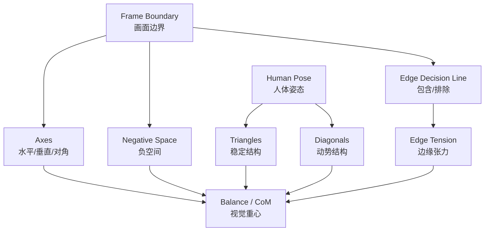
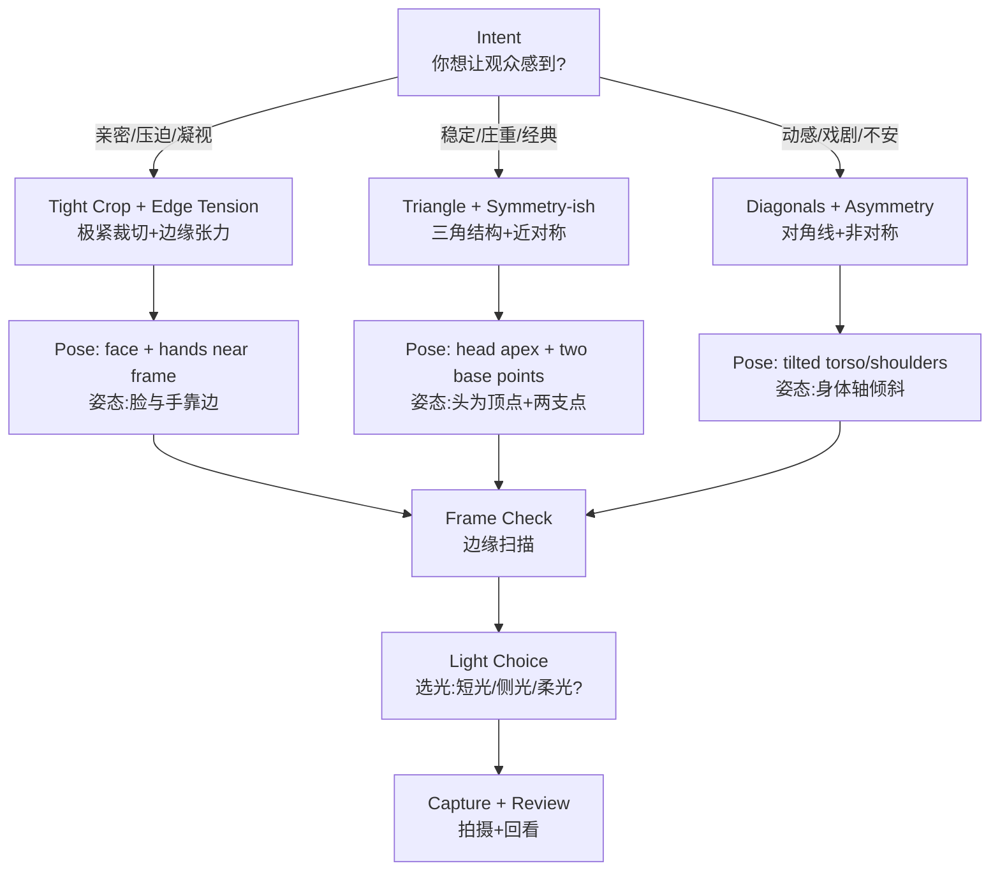

# 高级人像构图深度研究

> [!abstract] 核心结论
> 人像构图的关键不是增加画面元素，而是更精确地控制边界、轴线、群组关系、视觉重量与人体姿态之间的关系。

## 执行摘要
人像的“高级构图”往往不是更复杂的画面元素，而是更精确的**取舍**：你在取景框边界内保留什么、舍弃什么，以及你如何用人体姿态把线条与几何结构“写”进画面。基于博物馆/学术/专业机构材料的综合结论如下：有意识的**裁切**（尤其是对身体边界与关节的处理）能显著改变情绪信息密度与叙事范围；构图的“张力”很大程度来自**画面边缘的决策线**与元素对边界的“吸引/排斥”关系；而“平衡”并不等于居中，它更接近一种可被形式化讨论的**视觉重量/重心**问题（如中心轴、对角轴、以及画面中视觉质量分布）。
实践层面：
- **有意识身体裁切**：从“叙事信息量”出发设计裁切层级（环境→半身→极紧特写），并用暗房/后期的局部加深（burning）把注意力锁进脸部与关键细节。
- **三角形与对角线构图**：人体姿态可直接生成“稳定（三角）/动势（对角）”结构；对角线能带来更强的动感与戏剧性，适合情绪张力或时尚表达。
- **边缘张力（edge tension）**：当主体贴近边缘、留白方向与视线方向发生冲突时，会产生不安、压迫、悬置等叙事感；其本质是“边界内/外”的选择与边界对元素关系的重写。
- **视觉重量平衡**：可用“轴线与重心”的语言理解：许多高质量构图的视觉重心更贴近水平/垂直/对角轴；平衡既来自位置，也来自明暗、面积、对比与细节密度。
- **动态 vs 静态**：静态构图强调秩序、对称、垂直/水平；动态构图强调倾斜、对角、偏置、边缘张力与不完全交代。

## 理论框架与关键概念
构图理论在摄影里最“硬”的部分，是它可以被拆成**边界、轴线、群组关系与注意力分配**四个模块：
- **Gestalt 与群组知觉**：人眼倾向把元素组织成“整体”；闭合、相似、接近、对称、共同命运等原则常被用来解释“为什么这张看起来顺/不顺”。在学术讨论中，摄影构图常被放进“边界内的明暗/形状组织”这一更一般的视觉组织问题。
- **黄金比例/黄金矩形**：黄金比例约为 1.618，定义为“整体:长段 = 长段:短段”；黄金矩形可迭代生成近似螺旋，常被借用为构图分割与视觉引导工具。要把它当“偏好模型”而非硬规则：它提供一种可快速试错的分割逻辑。
- **三分法**：把画面分成 3×3，关键元素落在分割线或交点，用于快速获得“非居中但稳定”的布局；许多相机/手机可显示网格辅助。
- **对角线与引导线**：对角线倾向产生动感与戏剧性，能把视线“带过”画面；不同阅读方向文化会影响“更自然的对角方向”，但更重要的是“线条是否把眼睛引向你想强调的点”。
- **三角结构**：三角形常被用于制造“稳定的张力”：它比矩形更具指向性（顶点），比纯对称更富节奏；人像里三角常由“头—肩—手/肘/膝”或“脸—手—道具”形成。学术上，关于“轴线/重心”的研究也常把对角轴纳入“更平衡/更安定位置”的讨论。
- **负空间（negative space）**：大面积非主体区域并非“空”，而是叙事与注意力控制的一部分：它能制造孤独、克制、庄重，也能为动作/视线提供“呼吸与方向”。
- **边缘张力（edge tension）与“画面边界”**：摄影的构图核心是“包含/排除”，而决策线就是画面边缘；当主体或高对比细节靠近边缘时，会产生心理上的“拉扯”。
- **视觉重量与平衡（visual weight / balance）**：可把画面理解成“视觉质量分布系统”：元素的大小、明暗、对比、位置会改变“重心”；研究者用“中心轴与重心（centre of mass）”来讨论构图是否贴近水平/垂直/对角轴，以及裁切如何改变这种分布。

## 标注视觉例
下面每个例子都来自机构馆藏与其公开页面（可点击来源获取高清图/下载选项），并给出“你该看什么”与“如何复刻”。

### 有意识身体裁切：从“群像现场”到“极紧人脸”
- 例子：Dorothea Lange 的《Korean Child》（同一底片/语境下的不同呈现），由 National Gallery of Art 的文章追踪其从拍摄、接触样（contact sheet）到最终印相的裁切与暗房处理过程。该馆明确指出：她用“戏剧性裁切”把画面从课堂喧闹中“隔离”出孩子的安静瞬间，并通过裁切与局部加深（burning）增强情绪冲击。
- 可对照的三层信息密度：
  - “场景层”（群像/环境）：孩子被置于同学喧闹之中，主体并非唯一。
  - “肖像层”（中紧）：保留耳朵与衣领细节（含安全别针），叙事仍与“贫困/生活痕迹”相关。
  - “符号层”（极紧）：几乎只剩脸部，信息被压缩为“表情/质感/光影”，更接近“理想化童年”的抽象肖像。
- 你该看什么：
  - 裁切越紧，画面越从“事件叙事”转为“情绪符号”；同时边缘张力显著上升（额头/下巴与边界距离更敏感）。
- 如何复刻：
  - 同一场景连续拍 3 套构图（环境/半身/极紧），后期只允许做“裁切 + 局部加深/减淡 + 微量对比”，用最少变量观察“信息密度变化”带来的情绪转向。

### 暗房/后期裁切作为“二次构图”：从底片到成片的设计
- 例子：Arnold Genthe 的作品在 Library of Congress 的“Negative and the Print”专题中被用来展示：底片上可见裁切标记、修版与印相指令；专题明确说明裁切能让原本信息过载或重心分散的画面获得“戏剧焦点”，并展示他如何在负片与复制负片上裁切与修版以改变最终图像。
- 你该看什么：
  - “裁切”不是缩小画面，而是重写主次关系与叙事因果；尤其在人像里，它常把“道具/环境”从主语降为谓语，或直接删除。
- 如何复刻：
  - 先用更宽的构图保留环境，再在后期做 3 个不同裁切版本，分别测试“脸/手/道具”谁成为视觉主语。

### 对角线构图：用人体与场景线条生成动势
- 例子：André Kertész《Portrait of a Ballet Dancer, Paris》：模特站在楼梯结构中，画面主导线为楼梯扶手与栏杆形成的强对角线，人体姿态被“嵌入”对角结构中，从而获得自然动势。
- 理论支撑：对角线通常会增加动感与戏剧性、让静态场景更“有运动方向”。
- 如何复刻：
  - 找到一条明确对角线（楼梯、门框投影、窗光边缘），让模特身体主轴（肩线/脊柱线）与该对角线**同向或反向**（同向=顺势；反向=对抗更张力）。

### 三角结构与稳定张力：让“手—头—道具/膝”组成结构骨架
- 例子（可做三角分析练习）：NGA 的《Portrait of a Tailor》（19世纪蛋白相纸名片照），主体位于画面右侧，左侧道具与平台形成视觉支点；手臂与上身可读作“稳定三角”的一部分（头部为上顶点，手/道具为底边视觉锚）。
- 学术支撑：视觉平衡研究讨论了“重心更靠近水平/垂直/对角轴”的倾向；三角结构常与“轴线贴近/重心稳定”一起工作。
- 如何复刻：
  - 让模特的两只手与头形成三点（A=头，B=左手/肘，C=右手/膝/道具），再用镜头位置微调，让三点落在你想要的“稳定区”（偏中）或“张力区”（靠边/靠角）。

### 静态 vs 动态：同样是人像，结构语言完全不同
- 静态例子：Rudolf Arnheim 在其构图传统中用“单一元素+方形框”讨论平衡：当元素偏离中心，会出现“吸引/排斥”的拉扯感；静态人像往往利用对称、居中、水平/垂直稳定线来降噪。
- 可操作对照：NGA 的《Portrait of a Woman》（daguerreotype）呈现典型静态肖像：主体居中、姿态稳定、边界留量相对均匀，情绪更“被陈述”而非“被推动”。
- 动态例子：Kertész 的楼梯对角线肖像让结构本身产生运动方向，主体与框架形成“被切割的几何场”。

### 参考链接

- [NGA - Outside the Frame: How Dorothea Lange Created Her Iconic Photographs](https://www.nga.gov/stories/articles/outside-frame-how-dorothea-lange-created-her-iconic-photographs)
- [NGA - Korean Child](https://www.nga.gov/artworks/224794-korean-child)
- [NGA - Korean Child, tighter crop variant](https://www.nga.gov/artworks/225080-korean-child)
- [NGA - Portrait of a Ballet Dancer, Paris](https://www.nga.gov/artworks/103750-portrait-ballet-dancer-paris)
- [NGA - Portrait of a Tailor](https://www.nga.gov/artworks/227382-portrait-tailor)
- [NGA - Portrait of a Woman](https://www.nga.gov/artworks/169338-portrait-woman)
- [Library of Congress - Genthe Collection: The Negative and the Print](https://www.loc.gov/pictures/collection/agc/technique.html)
- [MoMA Press Archive - The Photographer's Eye](https://www.moma.org/docs/press_archives/3800/releases/MOMA_1966_July-December_0106_150.pdf)

## 技术拆解与现场操作
这一节按你要求的六个重点拆成“可执行步骤”，同时把模型口令（model direction）写成可直接上口的句式。

### 有意识身体裁切
- 先定“信息层级”，再定裁切线：
  - 环境层：交代地点/关系/事件；
  - 肖像层：保留关键身体语言（肩、手、道具）；
  - 符号层：极紧特写，几乎只留脸部或局部（眼、手、皮肤纹理）。
- 现场步骤：
  1) 先用更宽构图拍“安全版本”（包含手、肘、道具、环境关键字）。
  2) 再逐步逼近，每逼近一次只改变一个变量（距离或焦段其一）。
  3) 每次按下快门前做“边缘扫描”：四角、边缘是否切到手指、脚尖、发际线、肩线等敏感区域。
  4) 需要“更像特写但不压迫”时，优先**后退+长焦**而不是贴脸广角（否则面部透视更容易夸张）。这一点与景深/对焦距离的关系在技术上可用景深与对焦距离变化解释。
- 模型口令：
  - “把手停在脸旁边，但不要压脸，指尖放松。”（给你手部可裁切/可做三角支点）
  - “肩膀向我这边轻轻转 10 度，下巴向前一点点、再微微向下。”（让脸部更立体，也便于你控制边缘张力）

### 三角构图（用人体姿态造结构）
- 原理：三角形提供稳定，顶点提供指向；你要决定顶点落在“权力点”（三分交点附近）还是偏离制造张力。
- 现场步骤：
  1) 给模特一个“上顶点”：通常是头/眼睛。
  2) 给两个“底点”：手、肘、膝、道具的接触点。
  3) 把底边做成“可读的平面”：两手不要同高同距，制造轻微不对称以避免僵硬。
  4) 用“关节弯曲/90°手臂”把线条雕刻出来（不必追求精准 90°，重点是形成明确折线与节奏）。这一类“分解动作点”的训练式方法在系统化摆姿教学中被强调。
- 模型口令：
  - “左手放在胯上，右手轻扶椅背/道具，头回到我这边。”
  - “把离镜头近的手稍微抬高一点，形成一个‘底边’。”

### 对角线构图（用人体主轴制造动势）
- 原理：对角线强化运动与戏剧性；尤其当背景或道具本身有对角线（楼梯、窗光）时，把人体主轴嵌进去会更自然。
- 现场步骤：
  1) 先找结构对角线（建筑线、光影边、布光投影）。
  2) 再让人体产生第二条对角线（肩线、腿线、躯干倾斜）。
  3) 最后决定是“同向强化”还是“反向对抗”。
- 模型口令：
  - “身体靠在这条线（楼梯/墙）上，把重心压到一只脚，另一只脚放松往前一点。”（自然出现倾斜与节奏）

### 边缘张力（edge tension）构图
- 原理一：摄影的核心是“划边界”：画面边缘决定“什么被包含、什么被排除”；边界同时会制造形状关系。
- 原理二：视觉平衡理论把“元素与框边的关系”理解为一种吸引/排斥的心理力场，越靠近边缘越容易产生“拉扯”。
- 现场步骤：
  1) 先拍“常规安全构图”（充分头顶空间、视线方向留余量）。
  2) 再把主体推向边缘（只动相机，不动模特），每次移动 5–10% 画面宽度。
  3) 观察：当主体与边缘距离接近“一个眼睛宽度/一只手宽度”时，张力通常明显上升。
  4) 若主体有视线方向，决定是否遵守“留空间规则”：留=舒适叙事；不留=压迫、冲突。RPS 的人物影像规则把“运动方向留空间”当作一条构图原则，同时也说明裁切可用于获得更好的构图与背景语境。

### 视觉重量平衡（visual weight balance）
- 把画面当“杠杆”：元素的“重量”可来自更暗、更亮、更高对比、更细节、更饱和、更大面积；位置越远离中心，力矩越大（更容易让画面倾斜）。
- 学术视角：构图研究会计算图像“重心（CoM）”并观察其与水平/垂直/对角轴的关系，以及裁切如何系统性地改变这种关系。
- 现场步骤（最快可执行）：
  1) 关掉“人物意义”，只看明暗块：主体脸是最大高对比区吗？
  2) 把画面心里切成四象限：每块是否有“重量对冲”（脸在左上，右下是否需要道具/阴影/纹理平衡）？
  3) 曝光控制：不要让边缘出现比脸更亮/更锐的“逃逸点”（否则注意力被拽出画面）。

### 几何结构与负空间的耦合
- 几何结构给“眼睛走路的路线”，负空间给“路线的速度与停顿”。Adobe 的构图教学明确把负空间与平衡视为可共同设计的变量。
- 操作：
  - 用三分法先定“眼睛落点”，再用黄金比例/黄金矩形做二次微调（尤其适用于半身肖像中“脸 + 手 + 道具”的层次分配）。

## 器材、镜头、光线与参数
为避免“器材建议变成泛聊”，下面按你关注的六类技法给出对应的镜头/光线策略与可起步的参数范围（你可按风格再偏移）。

### 有意识裁切（尤其是极紧特写）
- 镜头与距离：越紧的裁切越考验“对焦距离 + 景深”的控制；浅景深能隔离信息，但也更容易把睫毛对上、眼睛虚掉。用景深概念理解：景深受光圈、对焦距离等影响。
- 光线：用“局部提亮”思路布光——让脸是最亮/最有层次的区域（呼应暗房 burning 的逻辑）。
- 起步参数（通用）：1/160–1/250（防微动）、f/2–f/4（背景控制）、ISO 100–800（按光线）。景深不足时优先收至 f/3.2–f/5.6，并用更近的灯与更大的光源保持柔和。

### 三角结构（稳定但有方向）
- 镜头：中长焦更容易把三点结构“压扁”成清晰平面（头—手—道具关系更可读）。
- 光线：
  - 若想更正式：主光更接近相机轴，减少阴影断裂；
  - 若想更有雕塑感：侧光或短光（short lighting）增强面部立体与视觉重量差。短光被专业灯光教学视为更具塑形与“瘦脸”倾向的模式之一。

### 对角线/动势构图
- 镜头：适当广一点可把对角线结构（楼梯/引导线）收入画面，但要警惕近距离广角带来的面部比例变化；如果是环境人像，广角常更有叙事张力。
- 光线：让对角线“可见”——利用侧光/斜逆光制造阴影边界，或用硬光创造更锋利的线条。对角线与引导线在构图教学中被反复强调为“引导注意力”的手段。

### 边缘张力
- 镜头：避免让边缘张力被“景深过浅的糊边”削弱——当你需要观众明确感到边缘的压迫时，适当增加景深（如 f/4–f/8）可以让边界更“硬”。
- 光线：若你把主体推到边缘，务必控制边缘高亮，否则高亮会把视线拖出画面（典型“边缘逃逸”）。

### 视觉重量平衡
- 暴力有效的三招：
  1) 脸部比背景更亮或更有局部对比；
  2) 背景的高亮点压暗；
  3) 让最锐的细节落在你要的“重量点”。Adobe 的构图材料把“用负空间与色彩/饱和度制造视觉重量并维持平衡”作为核心训练方向之一。

### 动态 vs 静态
- 静态：用对称/居中/垂直线，减少斜线；光线可更均匀，情绪更“陈述”。
- 动态：用对角线、偏置、边缘张力；光线可更方向性（短光、侧光），让结构更“推人”。对角线“增加动感”的观点在主流构图教程中非常一致。

## 常见坑与故障排除
### 裁切相关
- 坑：裁切变“无意识截断”——最典型是手指/脚尖/关节附近被切得尴尬，观众会感到“肢体被剁”。RPS 的人物影像规则明确把“肢体裁切”作为需要注意的项，并强调要么完整，要么在关节处做清晰决策（避免“被肢解感”）。
- 修法：
  - 现场：多留一档安全边界（特别是手指）；
  - 后期：裁切要么更大胆（进入“符号层”），要么更克制（回到“肖像层”），不要停在含糊的“半截信息”区。

### 三角/对角结构相关
- 坑：线条存在但不可读——对角线被杂乱背景打断，或者人体姿态没有形成明确主轴。
- 修法：把“结构线”变成画面里最清晰的对比边界：用光影（侧光投影）、用景深（背景简化）、用位置（让线条从画面边缘进入并指向脸）。

### 边缘张力相关
- 坑：张力没出来，只有“构图失误感”——通常是因为边缘处出现无意义高亮点、或主体贴边但画面没有叙事动机。
- 修法：先回答一句话：“我为什么要把他/她推到边缘？”如果答案是“孤独/压迫/对抗/窥视感”，那就同时配套：
  - 不给视线方向留空间（制造压迫）；或反过来留巨大空间（制造孤独）。

### 视觉重量平衡相关
- 坑：画面“歪”但不是“有张力”——重心被边缘杂物偷走，或脸部层次不足。
- 修法：用“重心/轴线”检查：
  - 你的主重量是否靠近某条轴（水平/垂直/对角）？
  - 若不靠近，你是否刻意追求失衡叙事？

## 对比表、现场清单与注释书目
下表把六类技法压缩成可用于策划与现场沟通的参数化提示（综合自博物馆出版物、学术论文与专业协会/厂商教学材料）。

| 技法 | 目的 | 典型视觉效果 | 推荐姿态 | 推荐取景/裁切 | 镜头倾向 | 光线倾向 | 难度 |
|---|---|---|---|---|---|---|---|
| 有意识身体裁切 | 控制信息密度与情绪强度 | 亲密、压迫、符号化 | 手靠近脸/道具做“第二焦点” | 环境→半身→极紧三套版本 | 中长焦更可控；极紧需管景深 | 脸部为最高层次；可局部压暗背景 | 中 |
| 三角构图（姿态） | 稳定但有方向 | 稳、贵、可读性强 | 头为顶点，手/肘/膝为底点 | 让三点落在三分交点或附近 | 50–135 等效 | 短光/侧光更塑形 | 中 |
| 对角线构图（姿态+环境线） | 制造动势与戏剧性 | 动、冲突、时尚感 | 躯干倾斜、肩线斜、借楼梯/栏杆 | 对角线从边缘进入指向脸 | 35–85 等效；环境人像可更广 | 侧光/硬边阴影强化线条 | 中偏高 |
| 边缘张力（edge tension） | 让观众“不安/被推着看” | 压迫、悬置、对抗 | 视线朝边缘/身体贴边 | 主体贴边或留巨大负空间 | 视叙事而定；注意边缘变形 | 控边缘高亮，防“逃逸点” | 高 |
| 视觉重量平衡 | 让复杂画面仍可控 | 稳定、可引导、耐看 | 姿态服务“重量点”（脸/手） | 四象限平衡、轴线/重心检查 | 任意 | 脸部层次>背景；压暗干扰点 | 中偏高 |
| 几何结构（网格/黄金比例/三分） | 快速建立秩序与节奏 | 清晰、经典、易复用 | 姿态配合网格落点 | 三分交点/黄金分割线安排 | 任意 | 让结构线可见（明暗/色彩/清晰度） | 低到中 |
| 动态 vs 静态（选择题） | 精准匹配叙事 | 静=秩序；动=张力 | 静：正面/对称；动：倾斜/扭转 | 静：居中/水平垂直；动：对角/偏置/贴边 | 静：中长焦；动：更灵活 | 静：柔和均匀；动：方向性更强 | 低到高 |

### 现场清单（拍摄前—拍摄中—拍摄后）
- 拍摄前（意图）：我今天要的是“亲密/庄重/冲突/孤独/力量/脆弱”哪一个？对应选择裁切层级（环境/肖像/符号）与结构（静态/动态）。
- 拍摄中（结构）：
  - 边缘扫描：四角是否有高亮/杂线把眼睛拖出？
  - 轴线检查：主体的“重量点”（脸/眼）落在三分交点还是刻意偏离？
  - 姿态骨架：是否至少存在一条明确主轴（肩线/脊柱/腿线）或一个三角？
  - 空间规则：运动/视线方向是否留空间？若不留，是否为刻意制造压迫？
- 拍摄后（版本）：同一场景至少保留 2 个裁切版本（信息多/信息少），以便在选片时按叙事强度做决策。

### 注释书目（优先原始/专业来源，精简版）
- The Museum of Modern Art 新闻稿（1966）：介绍 John Szarkowski 的 The Photographer's Eye，把摄影的“边界/取舍”作为核心问题，并给出“画面边缘是内外决策线”的经典表述。
- Denman Ross 与视觉平衡传统：SAGE 论文以“重心/轴线”形式化讨论视觉平衡，并回溯到 Arnheim 与 Ross 的“力场/重心”隐喻与可计算框架。
- NGA 的“Outside the Frame”案例文章：以 Lange 为例，把“接触样→裁切→暗房局部加深”串成完整工作流，非常适合作为“裁切是二次构图”的教学模板。
- LoC “Negative and the Print”（Genthe 专题）：展示负片裁切标记与修版痕迹，强调裁切/修版如何改变最终叙事与视觉焦点。
- Royal Photographic Society 人物影像规则（FRPS 资料）：对现场实战非常友好，包含肢体裁切、留空间、视点、肤色与处理等检查项。
- Simon Street 的 RPS PDF：把“肢体裁切”和“留空间规则”等以评分规则形式写得极可执行，适合作为现场 checklist。
- Professional Photographers of America：整理多种经典人像布光模式（含短光/宽光等）及其效果倾向，适合作为“构图—光线同构”的起步参考。
- Profoto：以商业封面案例解释短光等模式的塑形与适配理由，适合把“构图意图”落到具体灯位语言。
- Nikon 与 Canon 的构图教学：三分法、引导线、负空间等基础原则的相机端表达（网格线、取景思路）很实用。
- Adobe 构图材料：把“负空间、平衡、视觉重量、对角线/引导线”写成可训练的检查框架，适合快速复盘。
- Encyclopaedia Britannica：黄金比例/黄金矩形的数学定义与基本结构说明，可用于你在拍摄前做几何草图与分割预案。
