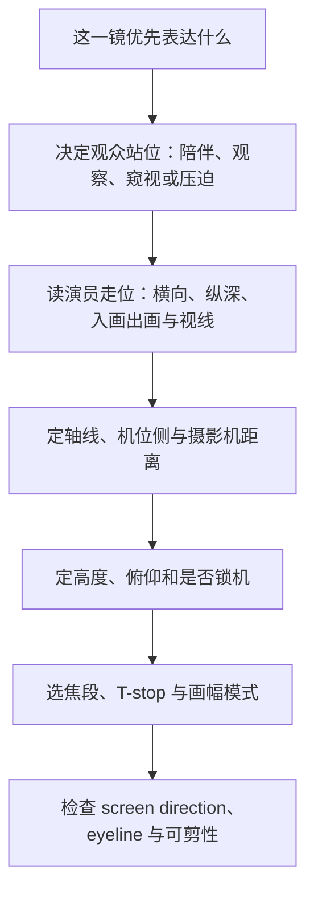

# 镜头与空间基础

摄影机位置先决定观众站在哪里、近远关系如何被看见；焦段随后决定从这个位置取多少画面。先选焦段、再让演员和空间迁就它，常会把本应由距离、机位高度和调度解决的问题误判成“镜头选择”。

> [!summary]
> 先定叙事对象、观众距离、动作轴线与摄影机位置；再选焦段、高度和画幅；最后补足可剪的 coverage。景别不是焦段号，同一景别也不等于同一种空间关系。

## 先拆开变量

| 变量 | 主要改变什么 | 不自动改变什么 | 容易混淆的说法 |
| --- | --- | --- | --- |
| 景别 `shot size` | 主体在画面中的占比、信息优先级 | 焦段、透视 | “close-up 就是 85mm” |
| 摄影机距离 | 近大远小、人物与背景相对尺度、观众的身体距离 | 焦段自身 | “距离只影响拍得近不近” |
| 焦段 `focal length` | 固定机位下的视角、取景范围、边缘使用 | 透视关系 | “长焦本身压缩空间” |
| 摄影机高度与俯仰 | 身体比例、地面/天花占比、视线与权力阅读 | 轴线本身 | “低机位永远显强” |
| 人物与背景距离 | 分层、背景尺度、离焦条件 | 摄影机视点 | “浅景深就是空间深度” |
| 传感器与画幅 | 同焦段视角、横纵容纳量、后期裁切余地 | 透视关系 | “大底自动更有 compression” |

**透视由视点决定。** 相机不动时，从 28mm 换到 85mm 只会缩小视角；近景被裁走、背景被放大到画面里，但人物与背景、鼻尖与耳朵的几何比例不变。为了维持同一景别而后退，视点才改变，空间才会变平。

| 同一全画幅景别 | 28mm | 35mm | 50mm | 85mm |
| --- | --- | --- | --- |
| 所需距离的相对值 | 1.00 | 1.25 | 1.79 | 3.04 |
| 空间读法 | 贴近、近远差强、环境展开 | 贴身且仍有环境 | 平衡、稳定 | 观察、隔离、背景更贴 |
| 主要风险 | 脸、手或边缘物被过度前推 | 仍会因过近显夸张 | 容易变成无意图的中性 | 人物与空间脱节、纵深动作变弱 |

这是相对关系，不是镜头处方。紧景可以用 28mm，也可以用 85mm：前者让观众进入角色的身体空间，后者让观众在较远处观察角色。二者都能“拍紧”，却在讲不同的戏。

## 现场决策顺序

1. **定叙事对象。** 这一镜首先服务人物、关系、动作，还是环境？不要让一条镜头同时承担所有任务。
2. **定观众距离。** 是贴着人物、看着人物，还是隔着门框/人群窥视人物？这一步先于焦段。
3. **定空间规则。** 标出角色连线与主要运动方向；对话确认双方 screen left / right 和 eyeline。
4. **定摄影机距离与侧位。** 距离决定透视，侧位决定面部塑形、关系位置与是否越轴。
5. **定高度和运动。** 高低机位是身体比例和观看态度，不是“强/弱”按钮；相机运动要改变信息或心理距离。
6. **最后选焦段与格式。** 焦段负责把既定空间装进画面；Open Gate 是重构弹性，不是把现场构图留给后期的理由。

> [!warning] 把口诀当定律
> “低机位显强、高机位显弱”“85mm 更电影”“前景遮挡更高级”都只是特定语境里的常见读法。距离、表演、构图、声音、调度和前后镜头都能改写它们。

## 空间如何进入画面

### 景别、轴线与视线

- **wide / medium / close** 是 coverage 分工，不是画面大小竞赛。wide 负责空间坐标和动作；medium 同时保留面部与身体语言；close 把注意力压到情绪与细节。
- **180-degree rule** 是空间清晰的默认协议：保持在轴线同侧，角色左右关系稳定；在线上可重置；越轴可以制造失衡，但须先让观众知道原来的 geography。
- **eyeline** 决定观众是否像在参与对话。镜头越接近人物看向对手的线，亲近感通常越强；正对脸中心又缺乏动机时，画面可能过平。
- **入画、出画与 screen direction** 是剪辑前的剪辑。人物的左右移动或视线若在相邻镜头中无故反转，观众会失去方向。

### 高度、前景和调度

| 工具 | 它能表达什么 | 常见误用 |
| --- | --- | --- |
| 眼平 | 交流、平视、日常的观看合同 | 当成没有选择的默认值 |
| 略低或略高 | 身体比例、心理距离、环境压迫或暴露 | 只为套“权力”标签 |
| 前景 | 遮挡、窥视、选择性阅读、画框中的画框 | 无信息的杂物挡住主体 |
| 前/中/后景 | 同时组织关系、反应与环境压力 | 只把背景虚掉，丢弃空间戏 |
| two-shot | 绑定、对抗、错位或共同节奏 | 仅为减少 setup 而不处理关系 |
| OTS | 让观众站在某一方身边 | 机械地把肩膀放进前景 |

单人镜头要先回答“陪他还是看他”：负空间、前景、frame 内/外 eyeline 和进出画都会改变答案。双人镜头要先回答“联盟、对抗还是分离”：并排 two-shot 绑定双方，前后层 two-shot 可以建立等级；把相机置于两人之间，可能让观众贴得很近，却让两人被画面分开。

### 相机运动与画内运动

| 方法 | 主要作用 | 适用时机 |
| --- | --- | --- |
| 横移 / truck / slide | 跟随、并置、横向 reveal | 人物并行、场景横向展开 |
| 推近 / 拉远 | 改变观众与角色距离，重排空间层级 | 领悟、压迫、孤立、关系转折 |
| zoom | 不改视点，只改视角 | 风格化注意力转移、媒介感 |
| 锁机 + 演员调度 | 把变化交给表演、入画出画和景深层次 | 对话、群戏、权力在画内重组 |

不要因为器材能动就动。若运动没有新信息、没有重排关系，也没有改变心理距离，优先测试锁机与更好的 blocking。

## 格式与 Open Gate

- 传感器尺寸改变的是同一焦段的 `angle of view`。为了匹配同构图而换镜头时，只要机位不动，透视仍不变。
- 全画幅、Super35 等效的作用是把“同一视角”翻译到不同画幅；不要把实际毫米数直接横比。
- 画幅比例不改透视，却改变横向关系、headroom 和可容纳的环境信息。4:3 更易强调垂直关系；宽画幅更便于组织横向距离和空位。
- Open Gate 的价值是上下冗余、稳定/重构空间与多版本交付。现场仍应显示最终交付的 frameline；先构图，再保留额外画幅。

## 受控 A/B 练习

一次只改一个变量。每次拍完先盲看，再对照设置表复盘。

| 练习 | 固定条件 | 改变条件 | 观察重点 |
| --- | --- | --- | --- |
| 同机位换焦段 | 三脚架、人物位置 | 28 / 35 / 50 / 85mm | 视角变了，透视是否真的没变 |
| 同景别换焦段 | 人物画面大小 | 焦段与机位距离 | 脸部比例、背景尺度、纵深运动 |
| 高度微调 | 焦段、距离、构图 | 眼平 / 略高 / 略低 | 身体比例与观看态度，不只看“强弱” |
| 轴线测试 | 同一对话与表演 | 同侧 / neutral / 越轴 | screen direction 何时清楚、何时被有意扰乱 |
| 锁机调度 | 机位与焦段 | 前景、人物层次、进出画 | 画内是否已能产生戏剧变化 |
| 16:9 与 Open Gate | 同一场景 | 硬 16:9 / Open Gate 加保护线 | 上下冗余真正帮到哪里，哪里会在后裁时失效 |

### 三周训练节奏

1. **第一周：视点。** 做同机位与同景别两组测试；只记录透视、背景和身体比例。
2. **第二周：关系。** 用两位演员拍 two-shot、OTS、轴线内外和不同高度；剪出一版空间清晰、一版有意失衡。
3. **第三周：调度。** 先锁机完成一段 20 秒表演，再只在一个有动机的节点加入推近或横移；比较哪版更需要运动。

## 看片时的提问

| 片例 | 可观察的空间问题 |
| --- | --- |
| 《The King’s Speech》 | 近距离广角如何把不适与拘束推给观众 |
| 《Late Spring》 | 低机位如何形成稳定、非主观的观看系统 |
| 《Citizen Kane》 | 深焦与前/后景如何让空间层次同时承载信息 |
| 《The Shining》 | 低位跟拍、走廊纵深与儿童视角如何共同作用 |
| 《In the Mood for Love》 | 门框、走廊、楼梯、遮挡和重复机位如何组织距离 |
| 《Mommy》 | 相机置于人物之间时，亲近与分离如何同时发生 |

这些不是可直接照抄的模板。看片时逐镜问：**若相机改到另一个位置，画面会失去什么？** 答案应能落到亲近、隔离、权力、空间清晰、层次、屏幕方向或某个表演节点，而不是“会没那么电影感”。

## 片场速查

- [ ] 这一镜的 POV 是什么：陪谁、看谁，还是窥视谁？
- [ ] 人物关系和主要动作轴线是否明确？
- [ ] 当前距离在改变什么透视与心理距离？
- [ ] 为什么是这个高度、这个侧位、这个景别？
- [ ] eyeline、screen direction、入画出画能否接到前后镜头？
- [ ] 前景、背景与空位是否提供信息，而非装饰？
- [ ] 这次运动改变了什么；锁机是否反而更强？
- [ ] 最终 deliverable frameline 是否已在现场确认？
- [ ] 这个 setup 是否给剪辑留下建立空间、推进动作和进入情绪的余地？

